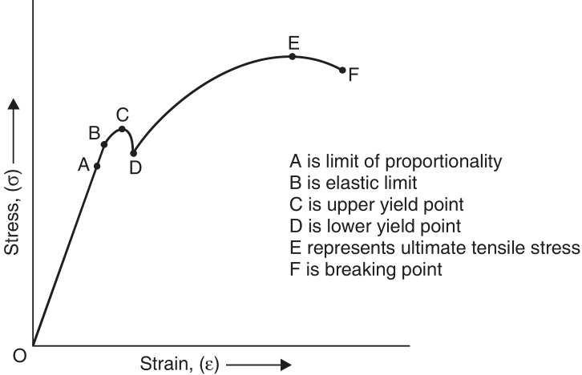
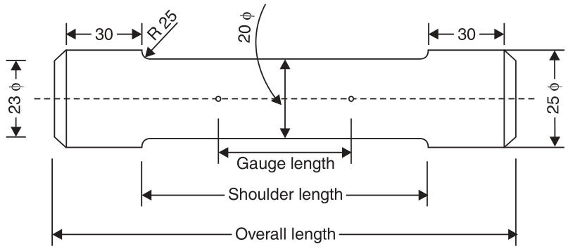
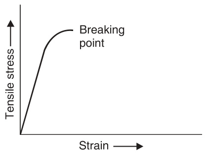
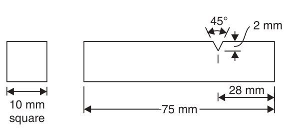
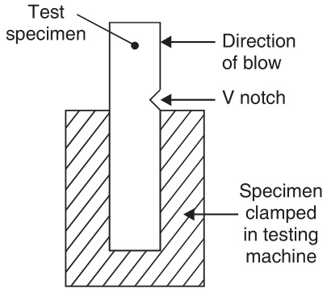
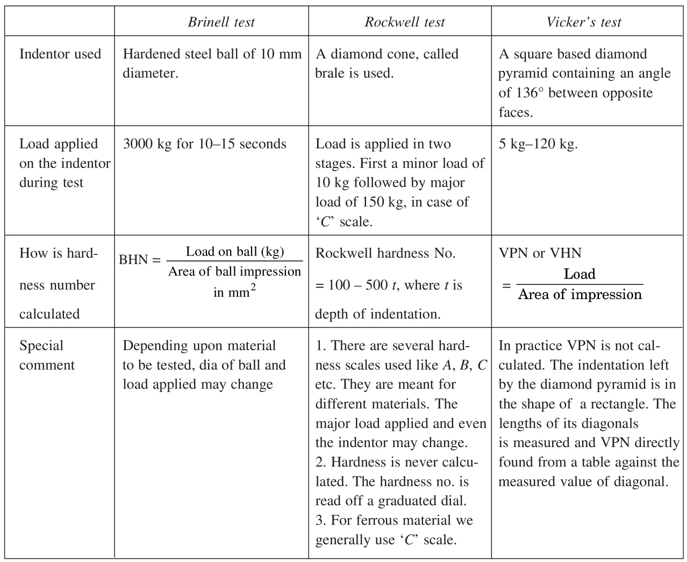
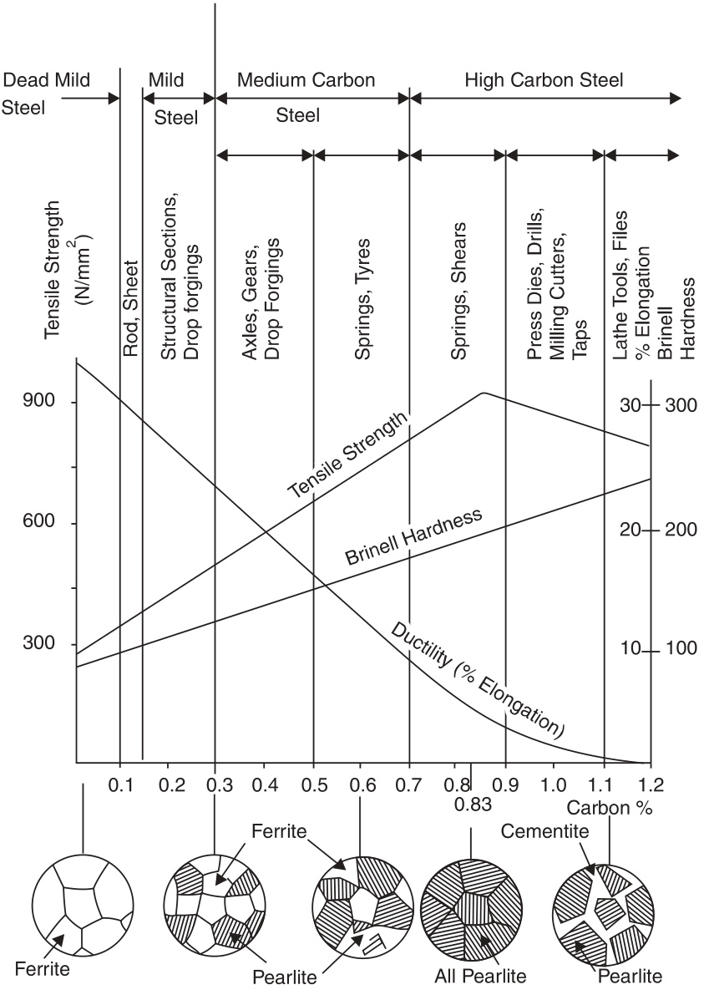
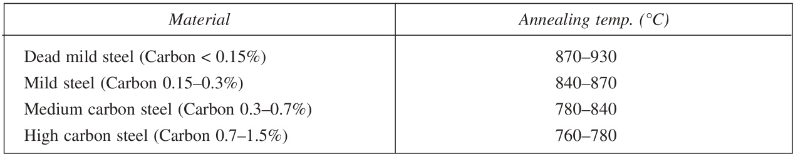
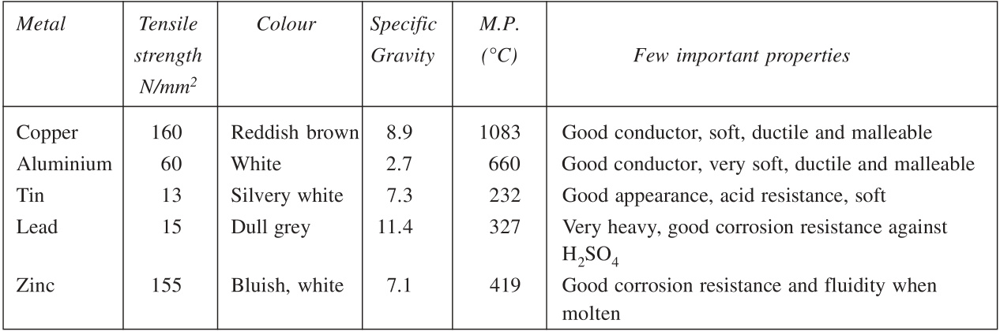

SECONDEDITION  

# MANUFACTURING PROCESSES  

H.N. Gupta · R.C. Gupta · Arun Mittal  

# MANUFACTURING PROCESSES  

This page   
intentionally left   
blank  

# MANUFACTURING PROCESSES  

(SECOND EDITION)  

# H.N. Gupta  

B.Sc., G.l. Mech.E (London), FIE VisitingProfessor   
Department of Mechanical Engineering   
1.E.T., Lucknow, U.P. Technical University R.C. Gupta B.Sc., B.E., M.Tech., Ph.D. ProfessorandHead   
Department of Mechanical Engineering   
1.E.T., Lucknow, U.P. Technical University  

# Arun Mittal  

SeniorFaculty Department of Mechanical Engineering I.E.T., Lucknow, U.P. Technical University  

NEW AGE INTERNATIONAL (P) LIMITED, PUBLISHERS New Delhi $\bullet$ Bangalore $\bullet$ Chennai $\bullet$ Cochin $\bullet$ Guwahati $\cdot$ Hyderabad Jalandhar $\bullet$ Kolkata $\bullet$ Lucknow $\bullet$ Mumbai $\bullet$ Ranchi Visit us at www.newagepublishers.com  

Copyright $\copyright$ 2009, New Age International (P) Ltd., Publishers Published by New Age International (P) Ltd., Publishers  

All rights reserved.  

No part of this ebook may be reproduced in any form, by photostat, microfilm, xerography, or any other means, or incorporated into any information retrieval system, electronic or mechanical, without the written permission of the publisher. All inquiries should be emailedtorights@newagepublishers.com  

ISBN (13) : 978-81-224-2844-5  

PUBLISHINGFORONEWORLD  
NEWAGEINTERNATIONAL(P)LIMITED,PUBLISHERS  
4835/24, Ansari Road, Daryaganj, New Delhi - 110002   
Visit us at www.newagepublishers.com  

# Preface to the Second Edition  

The authors of the book “Manufacturing Processes” are thrilled at the speed with which the first edition of the book has been snapped up and exhausted within four months of its publication necessitating a reprint. This proves that the book has been found useful both by teachers and the students. This is extremely gratifying.  

It has been felt that to make the text of the book even more useful, certain changes have been made. Therefore the text of the Unit I and Unit IV has been completely rewritten in the second edition of the book. However, the essential features of the book have not been altered. The text is in simple narrative style and does not presume any preliminary knowledge of the subject matter. The text is neither too detailed, nor has any essential information been left out. The text is amply illustrated.  

To make the book even more useful, the question bank has been widened and a number of questions of objective type have been added unitwise at the end of each unit.  

It is the author's belief that this second edition of the book will be found extremely useful by both the faculty and the students.  

This page   
intentionally left   
blank  

# Preface to the First Edition  

The ‘driving force’ behind a “technological revolution’ has always been a certain ‘material'. There would have been no \*industrial revolution’ without ^steel and no ^electronic/computer revolution’ without ^semiconductor'. Similary the “key' behind ‘socioeconomic development' is the \*manufacturing' which is done by certain manufacturing processes using certain materials. Moreovers, the primary duty of engineers is to make life-style of people more easy and comfortable, engineers do this by ‘making’ certain tools and things through certain manufacturing processes using certain material of desirableproperty.  

The present book on Manufacturing Processes’ is what every engineer, irrespective of branch or specialization, should know. Note that this book is not a book on \*Workshop? Technology'. \*Workshop Technology’ is usually taught as “Workshop-Practice’ usually with 0-1-3. L-T-P, meaning by 3-lab hours and 1 hour for tutorial (or lecture) for the theory of workshop tools & processes.  

The book on “Manufacturing Proceses? covers a wide overview of 'material', manufacturing processes’ and other ‘misc. topics'.  

Unit-I deals with Basic-Metals & alloys: Properties and Applications. Units-II and II cover major manufacturing processes such as Metal Forming & Casting and Machining & Welding. The last Unit-IV covers misc. and left-over but relevant topics. The details of topics are given in the syllabus and on the content pages.  

The book is intended for engineers of any specialization to present an overview of manufacturing process and the material used in it. The book would be useful as a core-course to B.Tech. students of all branches and all universities throughout the world.  

The book is considered to be useful universally, specially in view of syllabus of Manufacturing Processes.  

This page   
intentionally left   
blank  

# Contents  

Preface to the Second Edition Preface to the First Edition. vii  

# Unit I  

# BASICMETALSANDALLOYS:PROPERTIESANDAPPLICATIONS  

PROPERTIES OF MATERIALS3-10  

Introduction . 2 Properties of Materials   
Stress-Strain Diagram...   
Malleability and Ductility .   
Brittleness ...   
Stiffness and Resilience   
Toughness and Impact Strength   
Hardness   
Fracture of Material 8 Fatigue Failure 9 Creep Failure . 9 Questions 10  

# 2 FERROUS MATERIALS 11-18  

Introduction ... 11   
Iron and Steel. 11   
Classification of Steels . 11   
Wrought Iron 13   
Cast Iron . 13   
Alloy Steels .15   
Heat Treatment of Carbon Steels .17   
Questions 18   
Introduction 19   
Properties and Uses of Non-Ferrous Metals 19   
Alloys of Copper.... 20   
Cupro-Nickels. 22   
Aluminium Alloys .... 22   
Alloys of Nickel 22   
Questions 23   
Objective Type Questions .24-25  

# Unit II  

# INTRODUCTIONTOMETALFORMINGANDCASTINGPROCESS  

# 1 BASIC METAL FORMING PROCESSES AND USES  

29-33  

Introduction... 29   
Advantages of Mechanical Working Processes 29   
Difference Between Hot and Cold Working .... .30   
Advantages and Disadvantages of Cold and Hot Working Processes... ... 31   
Classification of Metal Forming Processes According to Type of Stress Employed ...32   
Questions .33  

# 2 FORGING 34-44  

Introduction . 34   
Classification of Forging . 34   
Die Forging with Power Hammers 40   
Open Die Forging .... 40   
Impression Die Forging ....·· 41   
Closed Die Forging ... 41   
Drop Stamping or Drop Forging Hammers 41   
Some Important Considerations Leading to Sound Forgings 42   
Forging Presses ... 42   
Machine Forging 42   
Forging Defects . 43   
Heat Treatment of Forgings 43   
Cold Forging 44   
Questions 44  

# 3 ROLLING 45-56  

Introduction. 45   
Nomenclature of Rolled Products 46   
Mechanism of Rolling . 46   
Types of Rolling Mills . 48   
Rolls and Roll Pass Design 50   
Ring Rolling ······ 51   
Cold Rolling .... 52   
Rolling Defects 53   
Questions 56  

# 4 EXTrUSIoN, WirE DrAWinG, TUBE DRAWiNG AND MaKInG 57-65  

Extrusion Processes .... 58   
Machines for Extrusion 62   
Extrusion Defects 62   
Wire Drawing ... 62   
Tube Drawing... 63   
Tube Making 64   
Questions 65  

# 5 PRESS WORK AND DIE-PUNCH ASSEMBLY 66-72  

Tools 66   
Other Operations Performed with Presses. 68   
Bending ..... 68   
Deep Drawing . 69   
Coining and Embossing ...... 70   
Coining .... 70   
Guillotine Shear. 71   
Questions 72  

# 6 CASTING PROCESS 73-85  

Introduction . 73   
Patterns 74   
Pattern Allowances 74   
Types of Patterns.... 74   
Moulding Sand and its Properties 76   
Mould Making Technique . 77   
Cores . .79   
Core Prints. 79   
Gates, Runners and Risers .80   
Cupola 81   
Construction 81   
Operation of Cupola 82   
Casting Defects 82   
Die Casting ... 83   
Steps in Die Casting... 84   
Questions .... 85   
Objective Type Questions 86-87  

# Unit IlI  

# INTRODUCTION TO MACHINING AND ITS APPLICATIONS  

# 1 LATHE  

91-99  

Introduction .. 91   
Centre Lathe... 92   
Cutting Tools Used on the Lathe 94   
Holding the Work Piece in the Chuck and Centering 95   
Taper Turning .... 96   
Profile or Form Turning 98   
Questions 99  

# 2 SHAPERS AND PLANERS  

100-105  

Introduction... 100   
Shaping Machines or Shaper . ..· 100   
Drive .... 101   
Cutting Tools Used in Shaping g........ .102   
Operations Performed on Shapers 102   
Planer or Planning Machine . 104   
Principle of Working . 104   
Questions .... 105  

# 3 DRILLING MACHINES 106-110  

Twist Drill 106   
Drilling Machines . 107   
Questions 110  

# 4 MILLING PROCESS 111-119  

Introduction. 111   
Basic Milling Process.... . 111   
Types of Milling Processes... 112   
Peripheral Milling ... 113   
Face Milling 115   
End Milling ... 116   
Milling Machines .. 117   
Horizontal Milling Machine 117   
Questions 119   
Introduction . 120   
Choice of Abrasives. 120   
Classification of Wheels .121   
Grit121  
Bond and Grade 121   
Wheel Struscture .... .121   
Wheel Shapes.... 122   
Mounting a Wheel on Machine, Balancing, Truing and Dressing 123   
Grinding Operations and Grinding Machines . 123   
Coolant .... .126   
Questions ... 126  

# 6 WELDING PROCESS  

# 127-141  

Classification. 127   
Gas Welding Process ... 127   
Equipment Needed for Gas Welding . 128   
Types of Flames .... . 130   
Welding Operation 130   
Use of Filler Rods and Fluxes 133   
Oxyacetylene Cutting.... 133   
Arc Welding ..... 133   
Striking an Arc ...... .134   
Heat Affected Zone . 135   
Arc Blow . 135   
Welding Positions.... 135   
Arc Welding Defects. .136   
Electric Resistance Welding .136   
Soldering and Brazing .140   
Soldering Process 140   
Brazing Process 140   
Questions 141   
Objective Type Questions 142-143  

# IMPORTANCE OF MATERIALS AND MANUFACTURING 147-153  

Introduction 147   
Proper Selection of Material 147   
Importance of Materials 148   
Historical Perspective ...... 149   
Materials as Driving-Force Behind Technological Developments 149   
Direct and Indirect Linkages Among Materials, Manufacturing,   
Technological Development and Socioeconomic Improvement .152   
Conclusion. .152   
Questions... .153  

# 2 LOCATION AND LAYOUt OF PLANTS, PRODUCTION ANDPRODUCTIVITY 154-157  

Introduction ...... 154   
Location of Plants. 154   
Layout of Plants.... 155   
Advantages of a Good Layout ...155   
Types of Layouts ... 155   
Types of Production . 156   
Production and Productivity .157   
Questions 157  

# 3 NON-METALLIC MATERIALS 158-167  

Common Types and Uses of Wood. 158   
Uses of Wood 159   
Cement Concrete 159   
Ceramics ...... 160   
Rubbers 160   
Plastics 162   
Composite Materials 165   
Questions 167  

# 4 MISCELLANEOUS PROCESSES 168-173  

Powder Metallurgy Process 168   
Plastic Products Manufacturing Processes . .169   
Galvanising Process... .171   
Electroplating Process . .172   
Faraday's Laws of Electrolysis .173   
Questions .. .173   
Objective Type Questions 174-175  

# QUESTION PAPER 177-179  

# UNIT I  

Basic Metals and Alloys : Properties and Applications  

This page   
intentionally left   
blank  

# Properties of Materials  

# INTRODUCTION  

Materials are the driving force behind the technological revolutions and are the key ingredients for manufacturing. Materials are everywhere around us, and we use them in one way or the other. The materials and the manufacturing process employed, could be better appreciated if one understands various types of materials and its properties.  

# PROPERTIESOFMATERIALS  

Properties of materials include mechanical properties (such as strength, hardness, toughness), thermal properties (conductivity), optical properties (refractive index), electrical properties (resistance) etc. Here, however, we shall concentrate only on mechanical properties which are most important in manufacturing processes and also in everyday life and we use these terms quite often. To understand the mechanical properties, it is useful to first understand the behaviour of the material when subjected to a force which causes deformation; this could be understood with the \*stress-strain diagram'.  

# STRESS-STRAIN DIAGRAM  

Consider a rod of initial length $L_{0}$ and area $A_{0}$ which is subjected to a load $F_{\mathrm{.}}$ The stress $\upsigma$ is the force per unit area, and strain ε is the change in length (8) divided by the initial length. Thus,  

$$
\begin{array}{r}{\mathrm{Stress}\ \sigma=F/A_{0}}\\ {\mathrm{Strain}\ \varepsilon=\delta/L_{0}}\end{array}
$$  

The O-e curve for a material (say mild steel) is shown in the Fig. 1.1. Up to the proportionality point $A$ , the stress-strain variation is linear. Up to this point Hooke's law holds good.  

i.e., $\begin{array}{l}{\mathtt{C}\propto\mathtt{E}}\\ {\upsigma=E\mathrm{\mathrm{g}}}\end{array}$ or  

where $E$ is the Young's modulus commonly called modulus of elasticity.  

Beyond point $A$ and up to point $B$ , material remains elastic i.e., the material returns to its original condition of the forces acting on it is removed.  

  
Fig. 1.1 Stress-strain curve for ductile material  

If the specimen is stressed beyond point $B$ permanent set takes place and we enter plastic deformation region. In the plastic deformation region, the strain does not get fully removed even with the removal of the force causing it. If the force is increased further, point $^{\prime}C^{\prime}$ is reached where the test specimen stretches even when the stress is not increased. This point is called yield point. Infact, there are two yield points $C$ and $D$ which are called upper and lower yield points respectively.  

With further straining, the effect of a phenomenon called strain hardening or work hardening takes place.\* The material becomes stronger and harder and its load bearing capacity increases. The test specimen is therefore able to bear more stress. On progressively increasing the force acting on the specimen,point $E$ is reached. This point is the highest point in the stress-strain curve and represents the point of maximum stress. It is, therefore, called ultimate tensile strength (UTS) of the material. It is equal to the maximum load applied divided by the original cross-sectional area $(A_{0})$ of the test specimen.  

Here, we must consider the effect of increasing load on the cross-sectional area of the test specimen. As plastic deformation increases, the cross-sectional area of the specimen decreases. However for calculation of the stress in the stress-strain graph, the original cross-sectional area is considered. It is for this reason, that the point of breakage $F$ seems to occur at a lower stress level than the UTS point $E$ AfterUTS point $E_{\cdot}$ . a sharp reduction in cross-sectional area of the test specimen takes place and a "neck" is formed in the centre of the specimen. Ultimately the test specimen breaks in two pieces as the neck becomes thinner and thinner. The actual breaking stress is much higher than the UTS, if the reduced cross-sectional area of the test specimen is taken into account.  

The measure of the strength of a material is the ultimate tensile strength ( $\ \ {\boldsymbol{\upsigma}}$ at point $E$ ).However, from the point of view of a design engineer, the yield point is more important as the structure designed by him should withstand forces without yielding. Usually yield stress ( $\upsigma$ at point $D$ ) is two-thirds of the UTS and this is referred to as yield-strength of the material.  

In actual practice, to determine UTS, a tensile test is carried out on a tensile testing or a universal testing machine. In order that tests conducted in different laboratories on the same material may give identical test results, the test piece used for the tensile test has been standardised. A standard test piece is shown in Fig. 1.2.  

  
Note: Gauge, shoulder and overall lengths according to IS : 210-1978.   
Fig. 1.2 Dimensions of a standard tensile test-piece  

A stress-strain curve for brittle material is obtained by subjecting a test bar of such material in a tensile testing machine. The tensile load is gradually increased and the extention of the test piece is recorded. The stress-strain curve for a brittle material shows some marked differences as compared to the curve obtained for a ductile material. A typical stress-strain curve for a brittle material is shown in Fig.1.3.  

  
Fig. 1.3 Stress-strain curve for brittle material  

This curve displays no yield point, and the test specimen breaks suddenly without any appreciable necking or extension. In the absence of a yield point, concept of “"proof-stress"” has been evolved for measuring yield strength of a brittle material. For example, $0.2\%$ proof-stress indicates the stress at which the test specimen \*suffers’ a permanent elongation equal to $0.2\%$ of initial gauge length and is denotedby $\upsigma_{0.2}$  

The tensile test and the stress-strain curve has been described above in some detail, because a lot of useful information with regard to other properties of material can be gleaned from it. It may be noted that most tensile testing machines are provided with equipment to carry out a compressive strength test aswell.  

# MALLEABILITYANDDUCTILITY  

Both these properties relate to the plasticity of the material. Malleability refers to the ability of plastic deformation under compressive loads, while ductility refers to plastic deformation under tensile loads. A malleable material can be beaten into thin sheets and even thinner foils. A ductile material can be drawnintowires.  

A measure of ductility is “percentage elongation". Before the tensile test begins two punch marks are made on the stem of the tensile test piece. Distance between these marks is noted and is known as gauge length $(l_{0})$ . After the tensile test piece fractures in two pieces, the two pieces are retrieved and placed together as close to each other as possible. Now the distance between the two punch marks is measured and noted again. Let this distance be $l_{1}$ .The $\%$ elongation is calculated as  

$$
\frac{l_{1}-l_{0}}{l_{0}}\times100\
$$  

High values of percentage elongation indicate that material is very ductile. Low values indicate that material is brittle and has low ductility. For mild steel, the percentage elongation usually is $20\%$ Or more.  

# BRITTLENESS  

Brittleness can be thought of as opposite of ductility. It is a property which is possessed in great measure by glass and other ceramics. A piece of glass, if dropped on a hard surface shatters and is broken in many pieces. The real cause of brittleness is inability of the material to withstand shock loads. Of course, glass is an extreme case of brittle material.  

# STIFFNESSANDRESILIENCE  

A material with high value of modulus of elasticity is said to be stiff and a material with low value of modulus of elasticity is said to be resilient. Consider a material undergoing tensile stress within the elastic range. If the material possesses a high value of Young's modulus (which is the modulus of elasticity corresponding to tensile stress), the material will not stretch much. It will behave as a “stiff " material. In this case, the slope of the line $O A$ (Fig. 1.1) will be more. Resilience is a property which is totally opposite to stiffness. A beam made of stiff material will deflect to a lesser extent as compared to another made of resilient material under identical loading condition.  

# TOUGHNESSANDIMPACTSTRENGTH  

Toughness and impact strength are allied or similar properties (although these are some differences as mentioned later). They represent the ability of the material to absorb energy before actual failure/ fracture occurs. Refer to Fig. 1.1. If the scale of $y$ -axis is changed and if force is plotted on this axis and, if actual elongation is plotted on $x_{\mathrm{{}}}$ -axis instead of strain, we shall obtain a force-elongation curve instead of stress-strain curve. The shape of curve will remain the same; only scales of $x$ and $y$ axes will change. Now the area under this curve will represent energy required to fracture the material. Higher the energy, higher is the toughness of material. Toughness comes from a combination of strength and percentage elongation. Since this property enables a material to withstand both elastic and plastic strains, it is considered very important.  

Higher impact strength goes with higher toughness. In actual impact testing, loads used are dynamic loads and the load is directed to the specimen through a sharp notch. Two tests have been standardised to measure the impact strength of a material (as also its toughness). These tests are called (i) IZOD test, and (i) Charpy test. IZOD test is described below in brief.  

A standardised test specimen is shown below in Fig. 1.4 (a).  

  
Fig. 1.4 (a) IZOD test specimen  

  
Fig. 1.4 (b) Specimen fixed in IZOD testing machine  

This specimen is fixed in the IZOD testing machine in a vertical position as shown in Fig. 1.4 (b). A blow from a swinging pendulum falling from a specified height is then struck on the test specimen $22~\mathrm{mm}$ above the notch. The mass of the pendulum is known. Since height from which pendulum descends down to strike the blow is also known, we know the energy stored in the pendulum (m.g.h.).  

After striking the test piece and fracturing it at the notch, the pendulum moves on and the height to which it rises on the otherside of the test piece is noted and measured. Thus the energy still left in the pendulum can be calculated. The difference between the original energy in the pendulum and the energy left over after breaking the test specimen is assumed to have been used up in breaking the test specimen. This is taken as the impact strength of the material of the specimen. A correction factor for friction at pendulum bearing is applied to get accurate result.  

A brittle material has low impact strength and poor toughness.  

# HARDNESS  

Hardness is a very important property of materials. Hardness indicates wear-resistance and resistance against abrasion or scratching. A hard material also offers resistance to penetration by another body. In the olden days, a scale of hardness was established and diamond, which is the hardest known material was put on top of this scale. Glass and other materials were put lower down on this scale. The criterion used was a simple scratch test. If a material could scratch another material, then the former was considered harder than the latter material and was placed higher in the scale of hardness.  

In modern times, several tests for hardness have been devised. The most popular ones are called (i) Brinell hardness test, (ii) Rockwell hardness test, and (ii) Vicker's hardness test. All these tests are based on resistance of the material under test against penetration by a specially designed and manufactured “indentor” into the surface of the test specimen under specified load. A harder material offers more resistance and therefore the indentor cannot penetrate its surface to the same depth as it would, if the test specimen were of softer material. Thus the depth of the impression made by the indentor into the test specimen or the area of the impression left by the indentor into the specimen is used to measure the hardness of the material.  

It is beyond the scope of this book to give detailed test procedures. However, the essential information is given in Table 1.1.  

Table 1.1   

  

# FRACTUREOFMATERIAL  

If a specimen is subjected to high stress beyond its strength, it fails and ultimately fractures in two or more parts. During the description of the tensile test, we have already come across fractures of ductile and brittle material. The ductile fracture occur after considerable plastic deformation and shows a  

characteristic reduction in the cross-sectional area near the fractured portion. Brittle fracture occurs suddenly when a small crack in the cross-section of the material grows resulting in a complete fracture. But such fracture does not show much plastic deformation.  

Actually, by a careful examination of the fractured surface and the macro and micro metallurgical examination of the fractured specimen, much interesting information as to the probable cause of its failure can be deduced by an experienced metallurgist.  

Apart from the ductile and brittle type of fractures, we also have fractures caused by FATIGUE and CREEP of material.  

# FATIGUEFAILURE  

It has been noticed that materials often fail or fracture at a stress level far below their strength, if the stress is either $(i)$ alternating type or $(i i)$ it is varying periodically. What is meant by alternating stress? An example will make this clear. Consider an axle fitted with two wheels. The axle bears the weight of the vehicle and at the same time it rotates along with wheels. Because of weight, the axle under goes a little deflection causing compressive stress in its top half and tensile stress in bottom half of the crosssection. But since it is rotating, with every $180^{\circ}$ rotation, the bottom half becomes the top half and vice versa. Thus the nature of stress at any point in the axle keep alternating between compression and tension due to its rotation.  

A varying stress cycle means that the magnitude of the stress keeps reducing and increasing periodically although its sign does not change. If the material is subjected to several million cycles of either the alternating or varying stress, it gets fatigued and fails even though the magnitude of such stresses may be far lower as compared to its strength.  

Fortunately, there is a level of alternating and varying stress, which the material is able to withstand without failure even if it is subjected to infinite number of cycles. This is called the ENDURANCE LIMIT. A designer ensures that a component subject to fatigue in service is so designed that its actual stress level remainsbelowthe endurance limit.  

The visual examination of a fatigue fracture shows three distinct zones. These are:  

(i) The point of crack initiation, it is the point from where the crack may have originated e.g. a notch like a key way or some materials defect like an impurity, or even a surface blemish.   
(ii) The area of crack propagation during service. This area is usually characterised by circular ring-like scratch marks with point of crack initiation as the centre.   
(ii) Remaining area of cross-section showing signs of sudden breakage. As a result of crack propagation with time, a stage comes, when the remaining cross-sectional area becomes too small to sustain the stress and fractures suddenly.  

# CREEPFAILURE  

Failure of material can take place even under steady loads within the strength of the material. This happens if the subjected components remain under steady loads for a very longtime especially when they are subjected to high temperature conditions. Some common examples are stays in boilers, steam  

turbine blades, furnace parts etc. Such failures are termed creep-failures due to the fact the material continues to deform plastically under such conditions although at a very very slow rate. But over long periods of time, the effect of creep can become appreciable resulting in ultimate failure of the component.  

# QUESTIONS  

1. Draw a stress-strain curve for a ductile material. In what respects, a similar curve for a brittle material will be different?  

2.  What do you understand by the following terms ? (i) Limit of proportionality (ii) Yield-point  

(ii) Ultimate tensile strength.  

3. Explain the meaning of the following terms:  

(i) Stiffness, (ii) Toughness, and (ii) Hardness.  

4. Differentiate between failure of material due to fatigue and creep.  

5. What do you understand by percentage elongation? What does a high percentage elongation value signify?  

6. Name three common “"hardness” tests. Describe anyone of them.  

# Ferrous Materials  

# INTRODUCTION  

Ferrous material refers to those materials whose main constituent is iron; while non-ferrous materials are those which do not contain iron in any appreciable quantity. Ferrous materials are usually stronger and harder and are used extensively in our daily lives. One very special property of ferrous materials is that, their properties can be significantly altered by heat treatment processes or by addition of small quantities of alloying elements. Ferrous materials are relatively cheap but suffer from a great disadvantage. They are subject to corrosion and rusting.  

# IRON AND STEEL  

Most common engineering materials are ferrous materials such as mild steel and stainless steel which are alloys of iron. It is truly said that gold is metal for kings and iron is king of metals. Otto Von Bismark of Germany once said that “for development of a nation, lectures and meetings are not important, but what is important are blood and steel". Incidentally, what is common in blood and steel is “iron". Though iron is important, but it is mostly used in the form of its alloy, namely steel.  

To a layman, words iron and steel convey the same meaning. But iron and steel are two different things. Iron is the name given to the metal, whose chemical symbol is Fe and refers to pure (or almost pure iron). Pure iron is relatively soft and less strong. Its melting point is about $1540^{\circ}\mathrm{C}$ .In industry, wrought iron is the material which is nearest to iron in purity; but is rarely used these days.  

Steel, on the other hand, is an alloy of iron and carbon; the percentage of carbon theoretically varies from O to $2\%$ . However in actual practice, carbon rarely exceeds $1.25{-}1.3\%$ . Carbon forms an inter-metallic compound called cementite $\mathrm{(Fe}_{3}\mathrm{C)}$ , which is very hard, brittle and strong. The presence of cementite in steel makes steel much stronger and harder than pure iron.  

# CLASSIFICATION OF STEELS  

Steel can be classified into $(i)$ plain carbon steel, and $(i i)$ alloy steel. Plain carbon steel is that steel in which the only alloying element present is carbon. In alloy stel, apart from carbon, other alloying elements like chromium, nickel, tungsten, molybdenum, and vanadium are also present and they make an appreciable difference in the properties of steel.  

Before we go further, readers must note that in steels, besides iron and carbon, four other elements are always present. These are S, P, Mn and Si. Removing these elements from steel is not a practical proposition. However, the effect of sulphur and phosphorus on the properties of steel is detrimental and their percentage is generally not allowed to exceed $0.05\%$ . Similarly, the usual percentage of manganese and silicon in steel is kept below 0.8 and $0.3\%$ , although their effect is not detrimental to the properties of steel. In fact, manganese counters the bad effect of sulphur. The presence of these four elements to the extent indicated does not put plain carbon steel into the category of alloy steel. However, if higher percentages of Mn and Si are intentionally added to steel in order to alter its properties, then the resulting steels come within the category of alloy steels.  

# Plain Carbon Steels  

Since the properties of plain carbon steels are so dependent upon their carbon percentage, these steels are further classified into following categories on the basis of carbon percentage only:  

(i) Low carbon or dead mild steel having carbon below $0.15\%$ ，  
$(i i)$ Mild steel having carbon between $0.15–0.3\%$ ，  
(ii) Medium carbon steel having carbon between $0.3–0.7\%$ , and   
$(i\nu)$ High carbon steels having carbon content above $0.7\%$ (the higher practical limit of $C\%$ is $1.3\%$  

As the carbon percentage increases, the strength and hardness of plain carbon steel increases while ductility decreases. Reference is invited to Fig. 2.1 (see figure on next page), which shows the effect of increasing carbon percentage on certain mechanical properties of carbon steels.  

# Applications and Uses of Plain Carbon Steel  

Dead mild steel. It has got very good weldability and ductility. Hence, it is used in welded and solid drawn tubes, thin sheets and wire rods, etc. It is also used for those parts which undergo shock loading but must have good wear-resistance. To increase its wear-resistance, the parts have to undergo case hardening process; which provides a hard surface, while the core remains soft and tough.  

Mild steel. It is used very extensively for structural work. It retains very good weldability if carbon percentage is limited to $0.25\%$ . Forgings, stampings, sheets and plates, bars, rods and tubes are made of mild steel.  

Medium carbon steel. It has little weldability but is stronger and has better wearing property than mild steel. It is used for railway axles, rotors and discs, wire ropes, steel spokes, marine shafts, carbon shafts, general agricultural tools etc.  

High carbon steels. It is used for hand tools like cold chisels, cold working dies, hammers, boiler maker's tools, wood working tools, hand taps and reamers, filers, razors, shear blades etc. High carbon steels can be hardened by the process of quenching and being hard can be used for cutting tools which are not used in hot condition. If they become hot (above $150^{\circ}\mathbf{C}_{\iota}$ 0, they begin to lose their hardness andbecomeblunt.  

  
Fig. 2.1 Microstructure, mechanical properties, and uses of plain carbon steels  

# WROUGHT IRON  

It is the purest form of iron; although it may contain traces of carbon. It is usually made by ^puddling process’ and besides iron contains a small quantity of slag. It is very costly and its use has been almost totally replaced by cheaper steel. However, for some components like chain-links and chain-hooks wrought iron is still the preferred raw material. In old havelis/houses, one can still see iron railings and gates made of wrought iron.  

# CAST IRON  

Cast irons contain more than $2\%$ carbon, which is the theoretical limit for steels. However, in actual practice, carbon content of most cast irons is between 3 to 4 per cent. One characteristic of cast irons (except white cast iron) is that much of the carbon content is present in free form as graphite. It is this fact, which determines, largely, the properties of cast iron.  

Cast iron is generally produced in coke-fired cupola furnaces by melting a mixture of pig iron, scrap cast iron and a small percentage (usually not exceeding $5\%$ ) of small sized steel scrap. Melting point of cast iron is much lower than that of steel. Most of the castings produced in a cast iron foundry are of grey cast iron. These are cheap and widely used.  

There are many varieties of cast iron. These are listed below: (i) Grey cast iron,   
(ii) White cast iron,   
(iii) Malleable cast iron,   
(iv) Nodular cast iron, and   
(v) Alloy cast iron.  

As already mentioned, Grey cast iron is very widely used in the form of castings. In fact, it is so widely used that the term cast iron has come to mean grey cast iron. If a finger is rubbed on a freshly fractured surface of grey cast iron, the finger will get coated with grey colour due to the graphite present in the cast iron. Grey cast iron has good compressive strength, but is weak in tension. It is relatively soft but brittle. It is very easy to machine and the resulting surface finish is good. It is self lubricating due to presence of graphite and has good vibration damping characteristics. Compared to steel, it resists corroSion.  

Due to these properties, it is used extensively for making machine beds, slides, gear-housings, steam engine cylinders, manhole covers, drain pipes etc.  

White cast iron and malleable cast iron. White cast iron has 2 to $2.5\%$ carbon and most of it is in the form of cementite. If molten cast iron is cooled very quickly and its chemical composition lacks graphite-promoting elements like Si and Ni, then carbon remains in combined form as $\mathrm{Fe}_{3}\mathrm{C}$ However, white cast iron does not have much use as such. It is very hard and shows white coloured fracture. Only crushing rolls are made of white cast iron. But it is used as raw material for production of malleable cast iron.  

Malleable cast iron is manufactured by a complex and prolonged heat treatment of white cast iron castings. Grey cast iron is brittle and has no or very little elongation. Malleable cast iron castings loose some of grey iron's brittleness and become useful even for those applications where some ductility and toughness is required.  

(Note: “Mottled iron’ is a name given to cast iron whose structure shows part grey and part white cast iron characteristics.)  

Nodular cast iron. This cast iron is also known under the name of spheroidal graphitic cast iron. If a little bit of magnesium $(0.5\%)$ is added to molten cast iron, the graphite, which is normally present in grey iron in the form of graphite flakes, changes its shape to small balls/spheres and remains distributed throughout the mass of cast iron. This change in the shape of graphite particles has a very big effect on the properties of resulting castings and their mechanical properties improve considerably. The strength increases, yield point improves and brittleness is reduced. Such castings can even replace some steel-components.  

Alloy cast iron. The properties of cast iron can be improved by addition of certain alloying elements like nickel, chromium, molybdenum and vanadium, etc. Alloy cast irons have higher strength, heat-resistance and greater wear-resistance etc. Such enhanced properties increase the application and uses of cast irons. I.C. engine cylinders, cylinder liners, piston rings etc. are made of alloy cast irons.  

# ALLOY STEELS  

Just as the properties of cast iron can be improved by adding some alloying elements to its composition, so can the properties of plain carbon steels be improved tremendously by addition of alloying elements. In fact, in the case of steels, the effect of alloying is much more marked. The main object of alloying in steelsare:  

(i) Alloy steels can be hardened by heat treatment processes to greater depth and with less distortion and less chance of cracking.   
(ii) Alloying develops corrosion resisting property as in stainless steels.   
(ii) Alloying develops the property of red hardness as in cutting tool.   
$(i\nu)$ Alloying develops the strength and toughness of steels as in high strength low alloy (HSLA) steels.   
(v) Some alloy steel show a marked resistance to grain growth and oxidation at high temperatures etc.  

Main alloying elements used are chromium, nickel, tungsten, molybdenum, vanadium, cobalt, manganese and silicon. Alloy steels are available in a great variety, each one has been developed for a specific purpose. We shall study them by grouping them in $(i)$ stainless steels, $(i i)$ tool steel and (ii)special steels.  

Stainless steels. These steels are called stainless because they do not corrode or rust easily. Main alloying elements used are chromium and nickel. Stainless steels are further divided into the following three categories:  

(i) Ferritic stainless steel. These steels contain a maximum of $0.15\%$ carbon, $6–12\%$ chromium, $0.5\%$ nickel besides iron and usual amounts of manganese and silicon. These steels are stainless and relatively cheap. They are also magnetic. These days, one and two rupee coins are made from such steels. These steel are essentially Iron-chromium alloys and cannot be hardened by heat treatment. Main usage for such steel is in manufacture of dairy equipment, food processing plants, chemical industry etc.  

(ii) Martensitic stainless steel. These stainless steels have $12{-}18\%$ chromium but contain higher carbonpercentage $(0.15{-}1.2\%)$ . These steels can be hardened by heat treatment, but their corrosion resistance is reduced. These steels are used for making surgical knives, hypodermic needles, bolt, nut, screws and blades etc.  

(ii) Austenitic stainless steels. These are the most important and costliest among all stainless steels. In these steels, besides chromium, nickel is also added. Nickel is a very strong austenite stabiliser and therefore the microstructure of these steels is austenitic at room temperature. The most common amongst stainless steel is 18/8 steel. Its composition is $18\%$ chromium, $8\%$ nickel, $0.08–0.2\%$ carbon, manganese $1.25\%$ maximum and silicon $0.75\%$ maximum.  

Such steels have extremely good corrosion resistance but they cannot be hardened by heattreatment. However, they are very susceptible to “strain-hardening’'. In fact, due to strain hardening, their machining becomes very difficult. It is used extensively for household utensils and in chemical plants and other places where high corrosion resistance is required.  

Tool steels. The requirements in a tool steel are that it should be capable of becoming very hard and further, that it should be able to retain its hardness at high temperatures commonly developed during cutting of steel and other materials. This property is called “red hardness’'. Further tool steel should not be brittle and should have good strength.  

High speed steel (HSS) is the name given to a most common tool steel. Its name implies that it can cut steel at high cutting speeds. At high cutting speed, the temperature rise is higher but high speed steel tools can retain their hardness up to $600{-}625^{\circ}\mathrm{C}.$ The property of red hardness comes from addition of tungsten. A typical composition of H.S.S. is tungsten $18\%$ , chromium $4\%$ ,vanadium $1\%$ ,carbon $0.75–1\%$ , rest iron.  

Tungsten is a costly metal. It has been found that molybdenum can also impart “red hardness" to steel and actually half per cent of molybdenum can replace one per cent of tungsten. Molybdenum is far cheaper than tungsten. H.S.S. with tungsten are known as $T\cdot$ -series and H.S.S. with molybdenum are known as $M\cdot$ -series steels. A very useful H.S.S. has a composition of tungsten $6\%$ , molybdenum $6\%$ ，chromium $4\%$ and vanadium $2\%$ , besides iron and carbon.  

Another version of H.S.S. is called super high speed steel. It is meant for heavy duty tools and has about $10{-}12\%$ cobalt, $20{-}22\%$ tungsten, $4\%$ chromium, $2\%$ vanadium, $0.8\%$ carbon, rest iron.  

These days, tools are made of tungsten carbide and other materials, besides H.S.S.  

# Special Alloy Steels  

(i) Manganese steels. All steels contain small amounts of manganese to mitigate the bad effects of sulphur. The true manganese alloy steels contain much larger amounts of Mn. They have work hardening properties. They are used for railway points and crossings, and with usage, they become morewear-resistant.  

(ii) Nickel steels. Nickel can be added in steels up to $50\%$ . Nickel makes the steel highly resistant to corrosion, non-magnetic, and having very low coefficients of thermal expansion. Such steels are used for turbine blades, internal combustion engine valves etc.  

(ii) Chromium steels. Chromium makes steel corrosion resistant, and increases its UTS. and IZOD strength. Very often alloy steels are used with both chromium and nickel being added. Ni-Cr steel wires are often used in furnaces, toasters and heaters.  

$(i\nu)$ Silicon steels. A steel containing $0.05\%$ carbon, about $0.3\%$ Mn and $3.4\%$ of silicon possesses extremely low magnetic hysteresis and is used widely for making laminations of electrical machines. Silico-manganese steels are also used frequently for making springs.  

# HEAT TREATMENTOFCARBONSTEELS  

Object of heat treatment. Metals and alloys are heat treated to improve their mechanical properties, to relieve internal stresses or to improve their machinability. The properties of carbon steels can also be altered significantly by subjecting them to heat treatment processes.  

Heat treatment consists of three basic steps:   
(i) Heat the metal/alloy to a predetermined temperature. This temperature will, ideally, depend upon the actual composition of carbon steel (i.e. carbon percentage),   
(ii) Soaking or holding the metal/alloy at that temperature for some time, so that the temperature across the entire cross-section becomes uniform, and  

(ii) Cooling the metal/alloy at a predetermined rate in a suitable medium like water, oil or air. The rate of cooling is the most important factor.  

# Kinds of Heat Treatments Given to Carbon Steels  

Carbon steels are subjected to the following four basic heat-treatment processes:  

(i) Annealing,   
(i) Normalising,   
(ii) Hardening, and   
(iv) Tempering.   
We shall now describe these processes very briefly.  

Annealing. The purpose of annealing is to soften the material. Along with softening, the internal stresses, if any, will also get removed.  

The approximate temperatures to which the stel-sample should be heated will depend upon its carbon content. The recommended temperatures are shown in the following table:  

Table 2.1   

  

Soaking time may be given at the rate of 3-4 minutes for everyone mm thickness of the crosssection of material.  

In annealing, the work piece is allowed to cool inside the furnace only after switching off electrical power or oil supply to the furnace. This ensures that the work piece cools at a very slow rate. This process results in softening of material and increase in ductility due to grain growth.  

Normalising. Normalising entails heating to the same temperatures as recommended for annealing (except for high carbon steel specimens, which are to be heated to much higher temperatures than for annealing particularly as carbon percentage in sample increases), soaking and then cooling the sample in still air. Main object of normalising is getting rid of internal stresses and grain-refinement.  

Hardening. Hardening involves heating (to the same temperatures as in case of annealing) and soaking. Thereafter, the work piece is taken out of the furnace and quickly cooled at a very fast rate in a tank of cold water or oil, agitating the water/oil vigorously. (This cooling operation is called "quenching.") The result is hardening of the work piece. However, in order to harden, the carbon content in the work piece should be at least $0.25\%$ . Therefore, dead mild steel cannot be hardened in this way. Mild steel will also harden slightly for specimens containing over $0.25\%$ carbon. Higher the carbon percentage, higher will be resulting hardness.  

Hardened pieces become brittle and their extreme brittleness becomes a great disadvantage. They tend to fail in-service. Therefore hardening process is invariably followed by a tempering process.  

Tempering. Tempering means giving up a certain amount of hardness but shedding a great deal of brittleness acquired in the process of hardening. It is a trade off between hardness and brittleness, so that hardened component may give useful service without failure.  

Tempering involves heating the carbon steel part to a temperature varying from $150^{\circ}–600^{\circ}\mathrm{C}$ (depending upon how much trade off is required) and cooling the component in an oil or salt bath or even in air.  

Case hardening. As mentioned above, only those carbon steels can be hardened whose carbon content is about $0.25\%$ or more. How do we harden dead mild steel? The answer is by case hardening. In this process, the work piece is packed in charcoal and heated as in annealing. It is kept at that high temperature for a few hours. The result is that carbon enters into the surface of the work piece to the depth of a mm or two depending upon the heating time.  

The work piece now has a case where carbon percentage is as per requirement for hardening. It is then heated and quenched in the usual manner. The result is a component whose surface acquires hardness, but core remains soft and tough.  

# QUESTIONS  

1. What is the importance of ferrous materials in our daily lives?   
2.  What is steel? How is it different from iron? Differentiate between plain carbon steels and alloy steels.   
3. What are the characteristic properties of cast iron?   
4. Describe the object of annealing. How is it different from “'normalising”?   
5. Describe the process of hardening steel. Why are hardened objects subjected to tempering treatment after hardening them?   
6. Write a brief note about stainless steels. What constituent of such steels render them corrosionresistant.   
7. What are different types of cast irons?   
8. What is the object of alloying steels?  

# Non-Ferrous Metals and Alloys  

# INTRODUCTION  

Non-ferrous metals and alloys do not contain any significant quantity of iron. The most common nonferrous metals used in engineering applications are copper, aluminium, tin, lead and zinc. Nickel, magnesium and antimony are also used for alloying the aforesaid non-ferrous metals.  

# PROPERTIES ANDUSES OF NON-FERROUS METALS  

Copper. Copper is a corrosion resistant metal of an attractive reddish brown colour. It is an extremely good conductor of heat and electricity. It can also be drawn in wires, beaten into sheets and plates. Hence, it is extensively used in electrical industry for making armature coils, field coils, current carrying wires, household utensils etc. But its great usefulness lies in the fact that it alloys with zinc, tin and nickel to yield brass, bronze and cupro-nickels respectively which are widely used in engineering industry. Copper, as such, is used for many decorative items.  

Not much of copper is available in India. We import at least $50–60\%$ of our requirement every year.  

Aluminium. Aluminium metal is difficult to extract from its main ore called bauxite. However, bauxite is available in India very plentifully and we have a thriving aluminium industry. Aluminium is also very corrosion resistant (because an adherent oxide layer protects it from further oxidation). It is again a very good conductor of heat and electricity (although not as good as $\mathrm{Cu}$ ). It is ductile and malleable and is much cheaper than copper. Hence, it has all but replaced copper wires for transmission of electricity. It is also used for household utensils including pressure cookers. However, since it can be converted into thin foils, it is now extensively used for beverage cans and in packaging industry. Its density is about a third of steel, hence it is also used for aircraft and helicopter frames and in transport vehicles.  

Sometime ago, in India, 1, 2, 5, 10 and 20 paisa coins were made of an aluminium-magnesium alloy. Aluminium forms a series of alloys with magnesium, which are harder and stronger than pure aluminium.  

Tin. It has an attractive silvery white colour. It has very good resistance to acid corrosion. Before the advent of plastic tin coated steel sheets of thin gauge were used for manufacture of tin-containers for storage of ghee, mustard and other oils. Today tin is mostly used for alloying purposes. Tin and lead melted together give a series of soft-solders. Tin has a low melting point.  

Lead. Lead is a heavy metal with dull grey appearance. It has good corrosion resistance and has got good malleability. In Europe, it was extensively used for roof protection. It was also used in plumbing. It can withstand sulphuric acid and previously this acid used to be stored in lead lined vessels. It has self lubricating properties. It was therefore used in lead-pencils.  

Sometimes, a small quantity of lead is added to steel and tin bronze to impart fre cutting properties.  

Zinc. Zinc possesses a bluish grey metallic appearance. It has high corrosion resistance. In fact, steel sheets are often covered by a thin coating of zinc. Such zinc coated sheet are known as galvanised iron sheets (G.1. sheets). The zinc coating provides protection to steel sheets from corrosion for many years.  

Zinc has a low melting point and high fluidity making it suitable for items to be produced by diecasting process. Zinc is incidentally much cheaper than either copper or tin; making brass, an alloy of copper and zinc much cheaper than copper or tin-bronze. Zinc is also used in torch light batteries.  

In the following table, colour, tensile strength, melting point-specific gravity and important properties of some non-ferrous metals are given.  

Table 3.1   
Note: For comparison, tensile strength of Iron is $270\;\mathrm{N/mm}^{2}$   

  

# ALLOYS OF COPPER  

# Brass  

Brass is an alloy of copper and zinc. Commercially, two types of brasses are most important:  

1. Alpha brass. It contains up to $36\%$ zinc and remainder is copper.  

2. Alpha-Beta brass. It contains from $36\%$ to $46\%$ Zn, remainder is copper.  

Alpha and Beta are names given to different phases of brasses. Alpha-Beta brass contain both alpha and beta phases.  

The tensile strength and ductility of brass both increase with increasing Zn content up to $30\%$ zinc. If zinc content increases beyond $30\%$ , the tensile strength continues to increase up to $45\%$ Zn, but there is a marked drop in ductility of brasses. ${\upbeta}$ -phase is much harder and stronger but less ductile than $\upalpha.$ phase. $\upalpha$ -phase has excellent cold-formability and is used where the parts are wrought to shape. The mechanical properties of $\upalpha$ -brasses also change with the amount of cold-work done on them. $\alpha{-}\beta$ brasses are fit for hot working.  

$\upalpha$ -brasses can be sub-divided into two groups$(i)$ red-brasses containing up to $20\%$ Zn, and $(i i)$ yellow brasses containing over $20\%$ Zn.  

Red brasses are more expensive and are primarily used where their colour, greater corrosion resistance or workability are distinct advantages. They have good casting and machining properties and are also weldable. One well-known red-brass is “gilding-brass" or gilding metal with $5\%$ Zn. It is used for decorative work.Yellow brasses are most ductile and are used for jobs requiring most severe cold forging operations. The cartridges are made from a $70\%$ Cu, $30\%$ Zn brass by a deep drawing process, hence this composition of yellow brass has come to be known as cartridge brass.  

Other famous compositions of brasses are: Admirability brass containing $29\%$ Zn, $1\%$ Tin, remaining copper. Muntz’ metal contains $40–45\%$ Zn, remainder is copper. Naval Brass contains $39\%$ Zn, $1\%$ Tin, remainder is copper.  

Admiralty brass, naval brass and muntz metal are all used for ships-fittings, condenser tubes, preheaters, heat exchangers etc.  

# Bronzes  

Bronze is an alloy of copper and tin although commercial bronzes may contain other elements besides tin. In fact, alloys of copper with aluminium, silicon and beryllium, which may contain no tin are also known as bronzes.  

Tin bronzes are of a beautiful golden colour. As in brasses, both tensile strength and ductility of bronzes increase with increases in tin content. However, more that $10\%$ tin is not used in bronze as it results in the formation of a brittle intermetallic compound, $\mathrm{Cu}_{3}\mathrm{Sn}$ . Addition of tin to copper up to $10\%$ increases the strength, hardness and durability to a much greater extent than the addition of zinc to copper.  

The following varieties of tin bronzes are commonly used:  

(i) Phosphor-Bronze.Addition of $0.5\%$ phosphorous to tin bronze results in production of phosphorous bronze. Phosphorous increases fluidity of molten metal and fine castings can bemade.  

(ii) Leaded-Bronze. Addition of lead to tin bronze, results in production of leaded bronze. Lead is actually a source of weakness, but adds to machinability and has self lubricating properties. Usually, lead percentage does not exceed $2\%$  

(ii) Gun-metal. It contains $2\%$ zinc, $10\%$ tin and $88\%$ copper. It is a very famous composition. This bronze is used for bearing bushes, glands, pumps, valves etc.  

$(i\nu)$ Bell-metal. It is a tin bronze but having a very high percentage of tin $(20{-}25\%)$ . It gives a good tinkling sound on being struck with a hammer.  

Bronzes having no tin. The following bronzes contain no tin and are commercially well-known:   
(i) Aluminium bronze. Composition: $14\%$ Aluminium, rest copper. It possesses good strength and good corrosion resistance. Colour: golden yellow. Often used for costume jewellery.   
(i) Silicon bronze. Composition: $1\mathrm{-}4\%$ Silicon, rest mainly copper. Possesses extremely good corrosion resistance. Can be cold worked and strain-hardened. Used for boiler fitting and marine fittings.   
(ii) Manganese bronze. Composition: $40\%$ zinc and $55–60\%$ copper with $3{-}5\%$ manganese. It is essentially a brass to which manganese has been added. It is used for ship's propellers.   
$(i\nu)$ Beryllium bronze. Beryllium is very costly. So is this alloy. It contains about $2\%$ Be. It has very good mechanical properties and can be cold worked and age-hardened. It is mainly used for bellows, bourdon gauge tubes etc.  

# CUPRO-NICKELS  

Cupro-nickels are alloys of copper and nickel. Copper and nickel, when melted together in any proportion are perfectly miscible and dissolve each other. When the alloy solidifies, the solubility continues forming a solid solution.  

Cupro-nickels are silvery white in colour and have extremely good corrosion-resistance. They are extensively used for marine fittings. They also possess good strength, hardness and ductility. Coins of rupee five are made of $75\%$ copper and $25\%$ nickel. However, another alloy containing $45\%$ Ni and $55\%$ copper is called “constantan”. It is used for manufacture of thermocouples, low temperature heaters and resistors.  

# ALUMINIUM ALLOYS  

Aluminium as such is a soft metal of relatively low strength. Most of the alloys of aluminium are made by alloying it with various percentages of magnesium; these are harder and stronger. These alloys known as L-M series alloys can be extruded and are used extensively for structural work.  

A famous alloy of Aluminium containing $4\%$ copper, $0.5\%$ magnesium, $0.5\%$ manganese, a trace of iron and rest aluminium is called DURALUMIN. It has high strength and a low specific gravity. However, its corrosion resistance is much lower as compared to pure aluminium. Sometimes, duralumin is covered or clad by thin aluminium layer on all sides. Such material is called ALCLAD and is used in aircraft industry.  

If $5{-}15\%$ silicon is alloyed with aluminium, we get alloys which are temperature resistant. Castings made of Al-Si alloys are used for manufacture of pistons of two wheelers on a large scale.  

# ALLOYS OF NICKEL  

(i) German silver. It is a cupro nickel to which zinc has been added. A typical composition is $60\%$ copper, $30\%$ nickel and $10\%$ zinc. Addition of zinc brings down the cost. Its colour is silvery with a slight pale tinge. It is very ductile and malleable and corrosion resistant. It is used for making electrical contacts, costume jewellery and high quality taps etc. Before the advent of stainless steel, it was also used for household utensils and coinage.  

(ii) Monel metal. Its composition is $68\%$ nickel, $30\%$ copper, $1\%$ iron, remainder manganese etc.  

(i) Nichrome. Alloy of nickel and chromium, which is used as heat resistant electrical wire in furnaces, and electrical heating devices like geysers, electric iron etc.  

$(i\nu)$ Inconel and incoloy. Alloys principally containing, nickel, chromium and iron. Used in electrical industry.  

# QUESTIONS  

1. Differentiate between ferrous and non-ferrous materials.   
2. What are characteristic properties of copper and aluminium, which make them useful to mankind?   
3. Differentiate between bronzes and brasses. Mention two applications of each.   
4. Write a short note on aluminium and its alloys.   
5. What are the different types of brasses you know? Distinguish between Naval and Admiralty brass.   
6. What are cupro nickel? What are their main properties and applications?  

# Objective Type Questions  

# Pick out the most appropriate option:  

1. Mild steel is an alloy of iron and carbon with percentage of carbon ranging from $(a)$ up to $0.2\%$ (b) 0.15-0.3 (c)03-0 5 (d) ahove 0 5  

(a) hardness (b) ductility (c) impact-strength (d) grain size.  

3. Copper is used for making electrical conductors because it is (a) ductile (b) resists corrosion (c) has low resistance (d) cheap.  

4. Brass is an alloy of (a) copper and zinc $(b)$ tin and zinc (c) copper and tin (d) copper and Al.  

5. A small amount of phosphorous is present in  

(a) all bronzes (b) phosphor-bronze (c) tin bronze (d) beryllium bronze.  

6. Which test measures hardness?  

(a) Brinell test (b) Rockwell test (c) Vicker's test (d) All of these tests.  

7. The object of ‘normalising’ a steel specimen is  

$(a)$ to reduce hardness $(b)$ to relieve stresses (c) to refine structure $(d)$ to improve ductility.  

8. The melting point of steel increases with $(a)$ reduced carbon content $(b)$ increased carbon content (c) none of these.  

9. The strength of steel increases with increasing carbon $\%$ age in the range  

(a) $0{-}0.8\%$ (b) $\AA)~0.8–1.2\%$ (c) $1.2{-}2\%$ (d) all of these ranges.  

10.  Aluminium alloys find use in aircraft industry because of  

(a) high strength (b) low sp. gravity (c) good corrosion resistance (d) good weldability.  

# Indicate, if following statements are True or False:  

11. It is possible to ascertain the value of Young's modulus of elasticity from the results of a tensile  

test. 12. Toughness depends upon the ductility of a material. 13. Higher the value of modulus of elasticity for a material, higher is its stiffness. The hardness in steel is basically due to presence of cementite. 15. The tensile strength of cast iron is as good as that of mild steel. 16. Nickel-silvers are alloys of Nickel and silver. 17. The red-hardness is high speed steel is due to addition of chromium in such steels. 18.1 Many stainless steels cannot be hardened by heat treatment process. 19. Tempering is the reverse of hardening.  

20.  Aluminium bronze contains copper, tin and aluminium.  

1. (b) 2. (c) 3. (c) 4. (a) 5. (a)   
6. (d) 7. (c) 8. (a) 9. (a) 10. (b)   
11. T 12. T 13.T 14.T 15.F   
16. F 17.F 18. T 19. T 20.F  