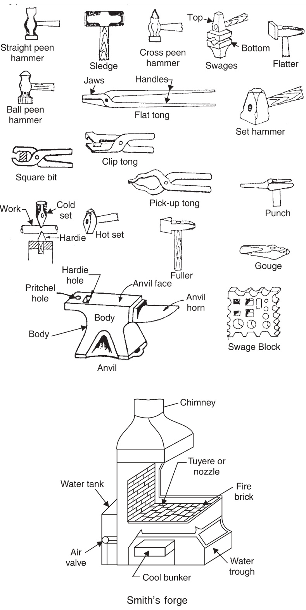
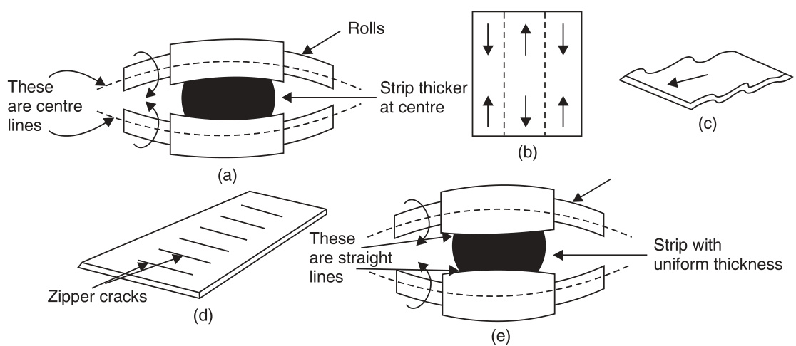

# UNIT II  

# Introduction to Metal Forming and Casting Process  

This page   
intentionally left   
blank  

# Basic Metal Forming Processes and Uses  

# INTRODUCTION  

Metal forming processes, also known as mechanical working processes, are primary shaping processes in which a mass of metal or alloy is subjected to mechanical forces. Under the action of such forces, the shape and size of metal piece undergo a change. By mechanical working processes, the given shape and size of a machine part can be achieved with great economy in material and time.  

Metal forming is possible in case of such metals or alloys which are sufficiently malleable and ductile. Mechanical working requires that the material may undergo “plastic deformation” during its processing. Frequently, work piece material is not sufficiently malleable or ductile at ordinary room temperature, but may become so when heated. Thus we have both hot and cold metal forming operations.  

Many metal forming processes are suitable for processing large quantities (i.e., bulk) of material, and their suitability depends not only upon the shape and size control of the product but also upon the surface finish produced. There are many different metal forming processes and some processes yield a better geometry (i.e., shape and size) and surface-finish than some others. But, they are not comparable to what can be achieved by machining processes. Also cold working metal forming processes result in better shape, size and surface finish as compared to hot working processes. Hot working results in oxidation and decarburisation of the surface, formation of scales and lack of size control due to contraction of the work piece while it cools to room temperature.  

# ADVANTAGESOFMECHANICALWORKINGPROCESSES  

Apart from higher productivity, mechanical working processes have certain other advantages over other manufacturing processes. These are enumerated below:  

1. Mechanical working improves the mechanical properties of material like ultimate tensile strength, wear resistance, hardness and yield point while it lowers ductility. This phenomenon is called “'strain hardening"'.  

2. It results in grain flow lines being developed in the part being mechanically worked. The grainflow improves the strength against fracture when the part is in actual use. This is best explained by taking illustration of a crankshaft. If the crankshaft is manufactured by machining from a bar of large  

cross-section, the grain flow lines get cut at bends whereas in a crankshaft which is shaped by forging (which is a mechanical working process), the grain flow lines follow the full contour of the crankshaft making it stronger. This is illustrated in Fig. 1.1.  

  
Fig. 1.1 Comparison of grain flow  

During mechanical working, the grains of the metal get deformed and lengthen in the direction of metal flow. Hence they offer more resistance to fracture across them. Hence mechanically worked components have better mechanical strength in a certain orientation i.e., across the grain flow.  

# DIFFERENCE BETWEEN HOTANDCOLDWORKING  

Cold working (or cold forming, as it is sometimes called) may be defined as plastic deformation of metals and alloys at a temperature below the recrystallisation temperature for that metal or alloy. When this happens, then the strain hardening which occurs as a result of mechanical working, does not get relieved. Infact as the metal or alloys gets progressively strain hardened, more and more force is required to cause further plastic deformation. After sometime, if the effect of strain hardening is not removed, the forces applied to cause plastic deformation may infact cause cracking and failure of material.  

Hot working may be explained as plastic deformation of metals and alloys at such a temperature at which recovery and recrystallisation take place simultaneously with the strain hardening. Such a temperature is above recrystallisation temperature. Properly done hot working will leave the metal or alloy in a fine grained recrystallised structure.  

A word about recrystallisation temperature will not be out of place here. Recrystallisation temperature is not a fixed temperature but is actually a temperature range. Its value depends upon several factors. Some of the important factors are:  

(i) Nature of metal or alloy: It is usually lower for pure metals and higher for alloys. For pure metals, recrystallisation temperature is roughly one third of its melting point and for alloys about half of the melting temperature.  

(ii) Amount of cold work already done: The recrystallisation temperature is lowered as the amount of strain-hardening done on the work piece increases.  

(i) Strain-rate: Higher the rate of strain hardening, lower is the recrystallisation temperature.  

For mild steel, recrystallisation temperature range may be taken as $550{-}650^{\circ}\mathrm{C}$ .Recrystallisation temperature of low melting point metals like lead, zinc and tin, may be taken as room temperature. The effects of strain hardening can be removed by annealing above the recrystallisation temperature.  

# ADVANTAGES ANDDISADVANTAGES OF COLD ANDHOT WORKING PROCESSES  

(i) Since cold working is practically done at room temperature, no oxidation or tarnishing of surface takes place. No scale formation is there, hence there is no material loss. In hot working opposite is true. Besides, hot working of steel also results in partial decarburisation of the work piece surface as carbon gets oxidised as $\mathrm{CO}_{2}$  

(ii) Cold working results in better dimensional accuracy and a bright surface. Cold rolled steel bars are therefore called bright bars, while those produced by hot rolling process are called black bars (they appear greyish black due to oxidation of surface).  

(ii) In cold working heavy work hardening occurs which improves the strength and hardness of bars, but it also means that high forces are required for deformation increasing energy consumption. In hot working this is not so.  

$(i\nu)$ Due to limited ductility at room temperature, production of complex shapes is not possible by cold working processes.  

(v) Severe internal stresses are induced in the metal during cold working. If these stresses are not relieved, the component manufactured may fail prematurely in service. In hot working, there are no residual internal stresses and the mechanically worked structure is better than that produced by cold Working.  

$(\nu i)$ The strength of materials reduces at high temperature. Its malleability and ductility improve at high temperatures. Hence low capacity equipment is required for hot working processes. The forces on the working tools also reduce in case of hot working processes.  

(vii) Sometimes, blow holes and internal porosities are removed by welding action at high temperatures during hot working.  

(vii) Non-metallic inclusions within the work piece are broken up. Metallic and non-metallic segregations are also reduced or eliminated in hot working as diffusion is promoted at high temperatures making the composition across the entire cross-section more uniform.  

# Typical Hot Working Temperatures  

Steels 650-1050°C Copper and alloys $600{-}950^{\circ}\mathrm{C}$ Aluminium and alloys 350-485°C  

# CLASSIFICATION OF METAL FORMING PROCESSES ACCORDING TO TYPE OFSTRESSEMPLOYED  

Primary metal working processes are those in which the bulk material in the form of ingots, blooms and billets is broken down to required shapes and sizes by processes such as forging, rolling, extrusion etc. These processes can be categorised on the basis of the kind of stress employed in the material, that is:  

(i) Mainly compression type, (Examples: forging, rolling, extrusion etc.).   
$(i i)$ Mainly tension type (Example: drawing).   
(ji) Combined compression and tension type, (Examples $:$ deep drawing, embossing etc.).   
Many of these processes are shown schematically in Fig. 1.2.  

  
Fig. 1.2 Typical metal working processes  

# QUESTIONS  

1.1 Explain the meaning of the expression ‘metal forming'. Mention the names of five metal forming processes.   
2. What is the difference between hot forming and cold forming ?   
3。 .What is the significance of “'recrystallisation” temperature in metal forming ?   
4. What do you understand by “grain flow ? How is it connected with the strength of machine parts ?  

# Forging  

# INTRODUCTION  

In forging, metal and alloys are deformed to the specified shapes by application of repeated blows from a hammer. It is usually done hot; although sometimes cold forging is also done. The raw material is usually a piece of a round or square cross-section slightly larger in volume than the volume of the finished component. Depending on the end use of the component, the forged part may be used as such or (more frequently) it has to be machined to correct size to close tolerances. The initial volume of material taken must, therefore, allow for loss due to scaling and the machining allowance.  

# CLASSIFICATION OF FORGING  

Forging is done by hand or with the help of power hammers. Sometimes hydraulic presses are also used for forging.  

(a) Hand Forging: Under the action of the compressive forces due to hammer blows, the material spreads laterally i.e., in a direction at right angles to the direction of hammer blows. Obviously brittle material like cast iron cannot be forged as it will develop cracks under the blows from hammer. An ordinary blacksmith uses an open-hearth using coke (or sometimes steam coal) as fuel for heating the metal and when it has become red-hot, blacksmith's assistant (called striker on hammerman) uses a hand held hammer to deliver blows on the metal piece while the blacksmith holds it on an anvil and manipulates the metal piece with a pair of tongs. This type of forging is called “hand forging"” and is suitable only for small forgings and small quantity production.  

A blacksmith's hearth, ancillary equipment and tools used by the blacksmith are shown in Fig. 2.1.  

Basic forging operations employed in giving required shape to the work piece are described below:  

(i) Upsetting: It is the process of increasing the cross-section at expense of the length of the workpiece.  

(i) Drawing down: It is the reverse of upsetting process. In this process length in increased and the cross-sectional area is reduced.  

  
Fig. 2.1 Tools used in smithy and smith's forge  

(ii) Cutting: This operation is done by means of hot chisels and consists of removing extra, metal from the job before finishing it.  

$(i\nu)$ Bending: Bending of bars, flats and other such material is often done by a blacksmith. For making a bend, first the portion at the bend location is heated and jumped (upset) on the outward surface. This provides extra material so that after bending, the cross-section at the bend does not reduce due to elongation.  

(v) Punching and drifting: Punching means an operation in which a punch is forced through the work piece to produce a rough hole.The job is heated, kept on the anvil and a punch of suitable size is forced to about half the depth of the job by hammering. The job is then turned upside down and punch is forced in from the otherside, this time through and through.  

Punching is usually followed by drifting i.e, forcing a drift in the punched hole through and through. This produces at better hole as regards its size and finish.  

$(\nu i)$ Setting down and finishing: Setting down is the operation by which the rounding of a corner is removed to make it a square. It is done with the help of a set hammer. Finishing is the operation where the uneven surface of the forging is smoothened out with the use of a flatter or set hammer and round stems are finished to size with the use of swages after the job has been roughly brought to desired shape and size.  

$(\nu i i)$ Forge welding: Sometimes, it may become necessary to join two pieces of metal. Forge welding of steel is quite common and consists of heating the two ends to be joined to white heat $(1050^{\circ}\mathrm{C}-1150^{\circ}\mathrm{C})$ . Then the two ends of steel are brought together having previously been given a slight convex shape to the surfaces under joining. The surfaces are cleaned of scale. They are then hammered together using borax as flux. The hammering is started from centre of the convex surface and it progresses to the ends. This results in the slag being squeezed out of the joint.  

Hammering is continued till a sound joint is produced. Several types of joints can be made viz., butt joint, scarf joint or splice joint.  

Various forging operations described above and forge welding joints are shown in Figs. 2.2 and 2.3.  

(b) Forging with Power Hammers: The use of hand forging is restricted to small forgings only. When a large forging is required, comparatively light blows from a hand hammer or a sledge hammer wielded by the striker will not be sufficient to cause significant plastic flow of the material. It is therefore necessary to use more powerful hammers. Various kinds of power hammers powered by electricity, steam and compressed air (i.e., pneumatic) have been used for forging. A brief description of these hammers is now given.  

  
(a) Job placed on anvil and punched half-way on one side (b) Job turned upside down, being punched through using a bolster (c) Job turned upside down, being punched through using Pritchel hole (o) Operation of drifting  

  
Fig. 2.2 Some common hand forging operations   
Fig. 2.3 Welded joints and end preparations  

(i) Spring hammer: It is a light hammer powered by an electric motor and gives repeated blows when it is operated by a foot operated treadle. This type of hammer is now obsolete and was best suited for small forgings. Though various designs of this hammer were in use, a typical spring hammer is shown in Fig. 2.4.  

  
Fig. 2.4 A spring hammer  

In this design, an electric motor rotates a pair of pulleys, a loose and another fast pully. The loose pulley rotates idly on its shaft. The fast pulley is fastened on its shaft by means of a key, so that when fast pulley rotates, it rotates the shaft as well. The shaft carries an eccentric sheave on it with the result that when the electric motor rotates the fast pulley, the eccentric sheave also rotates with it and imparts vertical reciprocatory motion to the connecting rod. This upper end of the connecting rod is connected to one end of a laminated bearing spring. The other end of this spring is connected to a ram which can slide up and down in a vertical guide provided in the machine frame at the front of the machine. To this ram, a tup (and a die, if required) is fitted. Also resting vertically below the ram and tup is an anvil resting on a base. The electric motor is normally connected to the loose pulley, but when the hammer operator depresses the treadle with his foot, the motor gets connected to the fast pulley and when the connecting rod moves up, the front end of the spring moves down, the spring buckle in the centre of the spring being pivoted. When the connecting rod moves down, the ram moves up. Thus rotation of motor causes up and down motion of ram and tup which is used for hammering the work piece kept on the anvil.  

Usually there is an arrangement for shifting the position of the pivot. If the pivot is shifted towards the connecting rod, the vertical movement of ram and tup increases and so does the severity of the hammering action. When the pressure of foot is removed from the treadle, the motor gets connected to the loose pulley and a brake applies automatically stopping the hammering action instantly. Spring hammers were made in various capacities with tups weighing from 30 to $250\,\mathrm{kg}$ and having a capability of running up to 300 blows per minute.  

$(i i)$ Pneumatic power hammers: A typical form of pneumatic hammer is shown in Fig. 2.5.  

  
Fig. 2.5 Pneumatic power hammer  

An electric motor rotates a crank which in turn moves a connecting rod $(D)$ to and fro i.e., the rotary motion of the crank is converted into a reciprocating motion. This reciprocating motion is delivered to a piston working inside cylinder $^\bullet C^{\bullet}$ . The cylinder and piston assembly is provided with suitable air inlet ports, so that the entire assembly acts as a reciprocating air compressor. The compressed air can be delivered to another cylinder piston assembly $B$ , through the air-valve A. This air valve $A$ is operated by the hammerman or the person operating the hammer by means of the handle shown $H$ in the figure.  

When the air valve $A$ is fully closed, it disconnects the supply of air to cylinder $B$ and the piston of cylinder $B$ rests in the bottom position. At this juncture the tup attached to the piston through a piston rod $(P)$ rests on the anvil. However when the air valve $\mathbf{\nabla}^{\leftarrow}A\,\mathbf{\dot{\Pi}}$ is opened, the air compressed in cylinder $C$ is delivered to cylinder $B$ , which is a double acting cylinder. The compressed air first enters below the piston lifting the piston up and then it enters above the piston forcing it downwards with great force. This upward and downward motion of the piston in cylinder $B$ is delivered to the tup  which moves in a vertical guide V provided in the frame of the power hammer and the tup strikes on the work piece kept on the anvil below it.  

By regulating the opening of air valve $A$ , the severity of the blows can be controlled from very light to very heavy. The capacity of the hammer is characterised by the weight of moving parts including the tup in cylinder $B$ . Pneumatic hammers are available in capacities varying from quarter of a ton to five tonnes.  

(ii) Steam hammers: These hammers differ from the pneumatic hammer described above in that for raising steam, a separate boiler is required. Thus in a steam hammer, cylinder $^\bullet C^{\bullet}$ of the pneumatic hammar is not required. The piston in cylinder $B$ is powered by the steam drawn from the boiler and operated by a simple slide valve mechanism. The cylinder $B$ is double acting and since the steam pressure is higher than the air pressure in pneumatic hammers, the striking force in steam hammers is higher than for similar size of pneumatic hammer.  

# DIE FORGING WITH POWER HAMMERS  

The tools used for power hammers are similar in shape to the tools used in hand forging but are larger and more robust. As far as possible, effort is made to finish the shape required in one heat only. Usually the bottom surface of the tup and the top of the anvil is flat as in the case of hand forging, but to increase production and cutdown cost, dies are often used. The top die, is fastened securely to the tup and the bottom die is fitted securely on the anvil. One half of the impression of the finished job is sunk in the top die, while in the bottom die, the other half of impression is sunk. The correct volume of raw material is heated in the furnace and a rough shape is first given to it. Thereafter it is placed on the bottom die and blows are given with the tup and top die. The material spreads to fill all the vacant space in the impressions sunk in the dies. Such a method of forging is called die forging.  

Three types of die forging methods are prevalent. These are (i) Open die forging (i) Impression die forging and $(i i i)$ Closed die forging.  

# OPEN DIE FORGING  

In this type of forging, the metal is never completely enclosed or confined on all sides. Most open dies forgings are produced on flat, V or swaging dies. Swaging dies are usually round but may also be of other shapes e.g., double V. (Refer to Fig. 2.6).  

  
Fig. 2.6 Open dies  

The common “upsetting” operation done on a hammer can also be considered as an example of open die forging with two flat dies as shown in Fig. 2.7.  

  
Fig. 2.7 Upsetting with open dies  

Advantages claimed for open die forging are (i) Simple to understand and operate $(i i)$ Inexpensive tooling and equipment as no die-sinking is involved and (ii) Wide range of work piece sizes can be accommodated. The main disadvantage is low volume of production and difficulty in close size control.  

# IMPRESSIONDIEFORGING  

Here half the impression of the finished forging is sunk or made in the top die and other half of the impression is sunk in the bottom die. The process of cutting the impression in a die is called die-sinking and is performed on a special kind of machine called die sinking machine.  

In impression die forging, the work piece is pressed between the dies. As the metal spreads to fill up the cavities sunk in the dies, the requisite shape is formed between the closing dies. Some material which is forced out of the dies, is called “flash". The flash provides some cushioning for the dies, as the tup strikes the anvil.  

The flash around the work piece is cut and discarded as scrap. For a good forging, the impression in the dies have to be completely filled by the material. This may require several blows of the hammer, a single blow may not be sufficient. To facilitate the production of good forgings, the work piece may be given a rough shape by hand forging before die forging is done.  

# CLOSED DIE FORGING  

Closed die forging is very similar to impression die forging, but in true closed die forging, the amount of material initially taken is very carefully controlled, so that no flash is formed. Otherwise, the process is similar to impression die forging. It is a technique which is suitable for mass production.  

# DROPSTAMPING ORDROPFORGINGHAMMERS  

Very often, for closed die or impression die forging, a modified version of power hammer is used. It is called a drop stamping or drop forging hammer and gives better results. In this case, the tup is not an integral part of the piston and the piston rod assembly, but is separate. The tup, to which the upper half of die is fixed is lifted by means of flexible ropes or a flexible canvas belting. It is then dropped on to the anvil to which the lower half of die is attached. Its downward movement is a gravity controlled free fall guided by the vertical guides provided in the frame of the hammer. The flexible ropes ensure, that after striking the anvil, the tup is free to rebound. Usually one fall of the tup may complete the forging. The metal piece is given a rough shape before being drop stamped.  

# SOMEIMPORTANTCONSIDERATIONSLEADINGTOSOUNDFORGINGS  

Hot forgings calls for work pieces to be heated to the correct forging temperature as mentioned before. In case the cross-section of the material to be forged is thick, we should allow enough “soaking” time for the heat to travel from the surface to the core of material. A thumb rule is to allow a soaking time of 30minutesforevery $12–15\;\mathrm{mm}$ of cross-sectional thickness. It is important that the entire cross-section should get heated to uniform temperature.  

Good forging practice calls for a reduction of cross-section by roughly $40\%$ .It is not correct to choose a cross-section for work piece material which is close to the finished size and forge it lightly or superficially to the required shape. If this is done, the mechanical properties of the forging leave much to be desired. One should remember that forging is not only a process for altering the shape of raw material to that required but this process can result in improved mechanical strength of the forged component aswell.  

One more point about good forging practice is to use as few “heats”’ for completion of forging as possible. It is also important to finish forging/hammering operations when the jobs has acquired a sufficiently low temperature; leaving forging at a high temperature will result in grain growth and will reduce the mechanical strength of the forged part. For mild steel, stop forging when the work piece has cooleddowntoabout $450{-}500^{\circ}\mathrm{C}$ . To continue to hammer a cold work piece will only result in wasted effort and may even induce cracks in the material.  

# FORGING PRESSES  

Occassionally, high capacity hydraulic presses are used for forging and the metal is shaped by squeezing action of the press rather than hammering action of hammer. Closed dies are used with impressions sunk in both dies, the upperdie is fixed on the ram and the lower die is fastened to the platen of the press. Presses are usually of a vertical configuration. Presses produce forgings of a superior structural quality.  

# MACHINE FORGING  

For specific jobs like mass manufacture of bolts and nuts from bar stock, special forging machines have been developed. These machines work alongside a furnace in which one end of bar is heated for some length. The heated end of bar is than fed into the machine. With the help of dies and a heading tool, the hexagonal head of the bolt is forged by “upsetting". These machines are in reality horizontal mechanical presses which can be operated by a foot pedal. The die consists of two halves and a heading tool. The sequence of operations can be understood from Fig. 2.8.  

  
Fig. 2.8 Upset forging on machine  

After the bolt head is forged, the bolt of required length can be had by shearing the bar at an appropriate place. The bar is then again inserted into the furnace for heating and the whole process is repeated.  

# FORGING DEFECTS  

The common forging defects can be traced to defects in raw material, improper heating of material, faulty design of dies and improper forging practice.  

Most common defects present in forgings are:   
1. Laps and Cracks at corners or surfaces lap is caused due to following over of a layer of material over another surface. These defects are caused by improper forging and faulty die design.   
2. Incomplete forging—either due to less material or inadequate or improper flow of material.   
3. Mismatched forging due to improperly aligned die halves.   
4. Scale pits—due to squeezing of scales into the metal surface during hammering action.   
5. Burnt or overheated metal—due to improper heating.   
6. Internal cracks in the forging which are caused by use of heavy hammer blows and improperly heated and soaked material.   
7. Fibre flow lines disruption due to very rapid plastic flow of metal.  

# HEATTREATMENTOFFORGINGS  

The forged components may be subjected to severe stresses in service. To improve service life, to improve properties, to remove internal stresses and sometimes to improve the machinability, forgings may be given a suitable heat treatment after completing forging operations. Most common heat treatment given is normalising.  

# COLD FORGING  

Limited formability at room temperature restricts the use of cold forging to low and medium carbon steels and for products where not much deformation is required to obtain final form. Usually the stock is in the form of wire or thin rods at one end of which a head is formed in a cold upsetting operation. Usually a mechanical press is used. Some typical products include nails, small diameter rivets pins, brassboltsetc.  

# QUESTIONS  

1. Describe the process of “"forge welding” in brief.  

Explain the following processes connected with forging: (ii) Drawing down (ii) Swaging. 3. How is a drop stamping hammer different from other power hammers ? 4. What do you understand by “die forging"” ? Explain the difference between open and closed die forging techniques. 5. Describe some common forging defects and their causes.  

# Rolling  

# INTRODUCTION  

In this process, metals and alloys are plastically deformed into semifinished or finished products by being pressed between two rolls which are rotating. The metal is initially pushed into the space between two rolls, thereafter once the roll takes a “bite" into the edge of the material, the material gets pulled in by the friction between the surfaces of the rolls and the material. The material is subjected to high compressive force as it is squeezed (and pulled along) by the rolls. This is a process to deal with material in bulk in which the cross-section of material is reduced and its length increased. The final cross-section is determined by the impression cut in the roll surface through which the material passes and into which it is compressed. The essentials of the rolling process can be understood from the Fig. 3.1.  

  
Fig. 3.1 Rolling Process  

Rolling is done both hot and cold. In a rolling mill attached to a steel plant, the starting point is a cast ingot of steel which is broken down progressively into blooms, billets and slabs. The slabs are further hot rolled into plate, sheet, rod, bar, rails and other structural shapes like angles, channels etc. Conversion of steel into such commercially important sections is usually done in another rolling mill called merchant mill.  

Rolling is a very convenient and economical way of producing commercially important sections. In the case of steel, about three-fourth's of all steel produced in the country is ultimately sold as a rolled product and remaining is used as forgings, extruded products and in cast form. This shows the importance of rolling process.  

# NOMENCLATURE OF ROLLED PRODUCTS  

The following nomenclature is in common usage:  

(i) Blooms: It is the first product obtained from the breakdown of Ingots. A bloom has a crosssection ranging in size from $150\;\mathrm{mm}$ squareto $250\;\mathrm{mm}$ square or sometimes $250\times300\;\mathrm{mm}$ rectangle.  

$(i i)$ Billet: A billet is the next product rolled from a bloom. Billets vary from $50~\mathrm{mm}$ square to $125~\mathrm{mm}$ square.  

(ii) Slab: Slab is of rectangular cross-section with thickness ranging from 50 to $150~\mathrm{mm}$ and is available in lengths up to $1\frac{1}{2}$ metres.  

$(i\nu)$ Plate: A plate is generally $5\;\mathrm{mm}$ or thicker and is 1.0 or 1.25 metres in width and 2.5 metres in length.  

(v) Sheet: A sheet is up to $4\;\mathrm{mm}$ thick and is available in same width and length as a plate.  

$(\nu i)$ Flat: Flats are available in various thickness and widths and are long strips of material of specified cross-section.  

(vii) Foil: It is a very thin sheet.  

(vi) Bar: Bars are usually of circular cross-section and of several metres length. They are common stock (raw material) for capstan and turret lathes.  

$(i x)$ Wire: A wire is a length (usually in coil form) of a small round section; the diameter of which specifies the size of the wire.  

# MECHANISM OFROLLING  

Refer to Fig. 3.2. Each of the two rolls contact the metal surface along the arc $A B$ ,which is called arc of contact. Arc $A B$ divided by the radius of rolls will gives angle of contact (α). The rollers pull the material forwards only due to the friction existing between roll surface and the metal. At the moment of the bite, the reaction at the contact point $A$ will be $R$ acting along radial line $O_{1}A$ and frictional force will be acting along tangent at $A$ at right angles to $O_{1}A$ . In the limiting case,  

$$
\upmu=\mathrm{tan}~\upalpha\quad\mathrm{or}\quad\upalpha=\mathrm{tan}^{-1}~\upmu
$$  

$\upalpha$ is greater than $\tan^{-1}\upmu$ , the material would not enter the rolls unaided.  

  
Fig. 3.2 Rolling process  

As will be seen, cos $\upalpha=\frac{r-\frac{1}{2}\,(h_{0}-h_{1})}{r}$ , where $h_{0}$ is the thickness of material, $h_{1}$ the gap between the two rollers at the narrowest point and $r$ is the radius of rollers. For a given diameter of rollers and gap between them the value of $h_{0}$ is limited by the value of $\upmu$ which in turn depends upon the material of rolls and job being rolled, the roughness of their surfaces and the rolling temperature and speed.  

In case of hot rolling when maximum reduction is cross-section per pass is aimed at, it may be necessary to artificially increase the value of $\upmu$ by “ragging” the surface of rolls. Ragging means making the surface of rolls rough by making fine grooves on the roll-surface. However, in cold rolling which is a finishing operation and cross-section reduction is limited, ragging of rolls is neither required nor desirable. In fact, in that case, some lubrication is resorted to in addition to giving a fine finish to the rolls. Another reason for making do with a lower coefficient of friction in cold rolling is that in this process, very high pressures are used and even with a low value of $\upmu$ , adequate frictional force becomes available.  

The usual values of biting angles employed in industry are:  

$2{-}10^{\circ}$ for cold rolling of sheets and strips;   
$15{-}20^{\circ}$ for hot rolling of sheets and strips;   
$24-30^{\circ}$ for hot rolling of heavy billets and blooms.  

In the rolling process, although the material is being squeezed between two rolls, the width $(b_{0})$ of the material does not increase or increases only very slightly. Since volume of material entering the rolls is equal to the volume of material leaving the rolls, and the thickness of material reduces from $h_{0}$ to $h_{1}$ , the velocity of material leaving the rolls must be higher than the velocity of material entering the rolls. The rolls are moving at a uniform r.p.m. and their surface speed remains constant. The rolls are trying to carry the material into the rolls with the help of friction alone, there is no positive grip between rolls and the material. On one side, therefore, i.e., point $A$ where contact between the rolls and work material starts, the rolls are moving at faster surface speed than the work material. As the material gets squeezed and passes through the rollers, its speed gradually increases and at a certain section $C C$ (Fig. 3.2) called neutral or no slip section, the velocity of metal equals the velocity of rolls. As material is squeezed further, its speeds exceeds the speed of the rolls. The angle subtended at the centre of the roll at the neutral section is called angle of no slip or critical angle (angle $B O_{1}C)$  

The deformation zone to the left of the neutral section is called lagging zone and the deformation zone to the right of the neutral section is termed leading zone. If $V_{r}$ is the velocity of roll surface, $V_{0}$ the velocity of material at the entrance to the deformation zone and $V_{1}$ at the exit of the rolls, we have  

Forward $\mathrm{slip}=\frac{V_{1}-V_{r}}{V_{r}}\,\times100\$ per cent, and Backward $\mathrm{slip}={\frac{V_{r}-V_{0}}{V_{r}}}\times100\$ per cent  

The value of forward slip normally is $3{-}10\%$ and increases with increase in roll dia and coefficient of friction and also with reduction in thickness of material being rolled.  

Some other useful terms associated with rolling are explained below:   
Absolute draught $\Delta h=(h_{0}-h_{1})\,\mathrm{m}$ m,   
Rel ${\mathrm{ative~draught}}={\frac{\Delta h}{h_{0}}}\times100\;{\mathrm{per~cent}}$   
Absolute elongation, $\Delta l=$ Final length - Original length of work material Final length   
Coefficient of elongation $=$ Original length   
Absolute spread $=$ Final width of work material - Original width of material   
(Note: During cold working absolute spread may be taken as nil.)  

# TYPES OF ROLLING MILLS  

Different types of rolling mills are described below in brief:  

(i) Two high mills: It comprises of two heavy rolls placed one over the other. The rolls are supported in bearings housed in sturdy upright frames (called stands) which are grouted to the rolling mill floor. The vertical gap between the rolls is adjustable. The rolls rotate in opposite directions and are driven by powerful electrical motors. Usually the direction of rotation of rolls cannot be altered, thus the work has to be fed into rolls from one direction only. If rolling entails more than one ‘pass’ in the same set of rolls, the material will have to be brought back to the same side after the first pass is over.  

Since transporting material (which is in red hot condition) from one side to another is difficult and time consuming (material may cool in the meantime), a “two high reversing mill has been developed in which the direction of rotation of rolls can be changed. This facilitates rolling of material by passing it through back and forth passes.  

A two high rolling mill arrangement is shown in Fig. 3.3(a).  

  
Fig. 3.3 Rolling mill types  

(i) Three high mills: A three high rolling mill arrangement is shown in Fig. $3.3(b)$ .Itconsists of three rolls positioned directly over one another as shown. The direction of rotation of the first and second rolls are opposite as in the case of two high mill. The direction of rotation of second and third rolls are again opposite to each other. All three rolls always rotate in their bearings in the same direction. The advantage of this mill is that the work material can be fed in one direction between the first and second roll and the return pass can be provided in between the second and third rolls. This obviates the transport of material from one side of rolls to the other after one pass is over.  

(ii) Four high mills: As shown in Fig. 3.4, this mill consists of four horizontal rolls, two of smaller diameter and two much larger ones. The larger rolls are called backup rolls. The smaller rolls are the working rolls, but if the backup rolls were not there, due to deflection of rolls between stands, the rolled material would be thicker in the centre and thinner at either end. Backup rolls keep the working rolls pressed and restrict the deflection, when the material is being rolled. The usual products of these mills are hot and cold rolled plates and sheets.  

  
Fig. 3.4 Four high mil  

(iv) Cluster mills: It consists of two working rolls of small diameter and four or more backing rolls. The large number of backup rolls provided becomes necessary as the backup rolls cannot exceed the diameter of working rolls by more than 2-3 times. To accommodate processes requiring high rolling loads (e.g., cold rolling of high strength steels sheets), the size of working rolls becomes small. So does the size of backup rolls and a stage may be reached that backup rolls themselves may offer deflection. So the backup rolls need support or backing up by further rolls. In the world famous SENDZIMIR MILL, as many as 20 backup rolls are used in the cluster. This mill is used for rolling stainless steel and other high strength steel sheets of thin gauge.  

# ROLLS AND ROLL PASS DESIGN  

Two types of rolls—Plain and Grooved are shown in Fig. 3.5. Rolls used for rolling consists of three parts viz., body, neck and wabbler. The necks rest in the bearings provided in the stands and the starshaped wabblers are connected to the driving shaft through a hollow cylinder. Wabbler acts like a safety device and saves the main body of the roll from damage if too heavy a load causes severe stresses. The actual rolling operation is performed by the body of the roll.  

  
Fig. 3.5 Types of rolls  

The rolls are generally made from a special variety of cast iron, cast steel or forged steel. Plain rolls have a highly finished hard surface and are used for rolling flats, plates and sheets. Grooved rolls have grooves of various shapes cut on their periphery. One-half of the required shape of rolled product is sometimes cut in the lower roll and one-half in the upper roll, so that when the rolls are assembled into its stands, the required shape in full will be produced on the work material, once it passes (i.e., rolled) through the groove in question. However it should be understood that the desired shape of the rolled section is not achieved in a single pass. The work material has to be rolled again and again through several passes and each pass brings the cross-section of the material closer to the final shape required. These passes are carefully designed to avoid any rolling defect from creeping in. Rolling is a painstaking process as would be noticed from the scheme of passes shown in Fig. 3.6 for conversion of a steel billet into a round bar.  

  
Fig. 3.6 Various stages of rolling and number of passes for converting a steel billet into a round bar  

Various passes fall into the following groups: (i) Breakdown or roughing passes,   
(ii) Leader passes, and   
(ii) Finishing passes.  

Breakdown passes are meant to reduce the cross-sectional area. The leader passes gradually bring the cross-section of the material near the final shape. The final shape and size is achieved in finishing passes. Allowance for shrinkage on cooling is given while cutting the finishing pass grooves.  

# RING ROLLING  

Seamless (i.e., without a joint) rings find wide application in industry. The inner and outer races of ball and roller bearings, steel tyres for railway wheel are some such applications. These rings are made by a special rolling process called ring rolling. The starting work piece is a thick walled circular piece of metal in whose centre a hole has been made by drifting and piercing. The work piece is heated until it becomes red hot and then placed between two rolls $A$ and $B$ which rotate in opposite directions. The arrangement of rolls and the ring is shown in Fig. 3.7.  

  
Fig. 3.7 Ring rolling  

The pressure roll $B$ exerts pressure on the material from inside. Caught between rolls $A$ and $B$ the ring rotates. At the sametime, the inside and outside dia of ring progressively increase and the wall thickness keeps on reducing. In order to ensure that the ring is circular, two guide rolls are suitably placed on the outer surface of the ring. When the outer and inner dia of the ring increase to the size required, the rolling is stopped.  

# COLD ROLLING  

Hot rolled steel products look an unattractive greyish-black in colour. Non-ferrous materials also develop a tarnished colouring due to oxidation of outer surface. The surface finish is rough and the finished sizes of hot rolled products are far from satisfactory. In case of steel, the oxidation of carbon present in the surface leads to decarburisation. However hot rolling is very economical as due to increased plasticity, large reductions in cross-section are quickly achieved with low energy consumption. A great deal of hot rolled \*black" bars and sheets/plates of steel are used in construction industry for fabrication of structures.  

Thinner gauges, better surface finish, tighter size control and “bright”’ surfaces are obtained in cold rolling process. These products also develop greater strength and wear resistance due to strain hardening.  

The effect of mechanical work done (i.e., strain hardening) is automatically nullified in hot rolling process, as recrystallisation in the hot worked material keeps on taking place simultaneously. This is shown schematically in Fig. 3.8.  

  
Fig. 3.8 Effect of both cold working and hot working on themicrostructureofmetals  

Thus the actual process employed in the industry for production of small gauge material is hot rolling to slightly above finished size required, cleaning/removing the oxidised surface by machining pickling or some other suitable process and finally using cold-rolling of work-material to finished sizes.  

# ROLLING DEFECTS  

To understand the causes and remedies of rolling defects, we shall divide them in two classes:  

1. Surface defects, and 2. Structural defects.  

Surface defects include rusting and scaling, surface scratches, surface cracks, pits left on the surface of due to subsequent detachment or removal of scales which may have been pressed into the surface.  

Structural defects are more important rolling defects some of which are difficult to remedy. These defects include the following:  

(i) Wavy edges (i) Zipper cracks (ii) Edge cracks (iv) Centre split (v) Alligatoring (vi) Folds (vi) Laminations.  

Wavy edges and zipper cracks: These defects are caused due to bending of rolls under the rolling pressure. A roll can be considered as a beam supported in its stands. Under rolling pressure, the rolls deflect in the manner shown in Fig. 3.9. Consequently the work material becomes thinner at the two edges and thicker in the central portion. In other words, it means that material becomes longer as measured along the edges than in centre. This causes tensile stress in the centre and compressive stress in the edges. The former causes zipper cracks in the centre and the latter causes wavy edges.  

  
Fig. 3.9 Rolling defects  

Remedy for zipper cracks and wavy edges lies in provide a “camber? to the rolls. They are made slightly convex in the central portion to offset the effect of deflection under rolling loads.  

Edgecracks and centre split: These defects are caused due to non homogeneous plastic deformation of metal across the width. As the work piece passes through the rolls, under the rolling pressure its height decreases while its length increases. Some lateral spread i.e., increase in width also takes place. However the lateral spread is more towards the edges than in the centre as there is little resistance to lateral spread towards the edges. In the centre lateral spread is resisted by friction and the adjacent layer of material. Hence decrease in lateral spread in the central portion of work material results in greater increase in length in this region as compared to the edges. This effect is shown in Fig. 3.10.  

  
Fig. 3.10 Rolling defect  

It can be realised that under such non homogeneous deformation of work material, the edges experience a tension (as the central portion tries to pull it due to continuity of material) and the central portion experience a compressive stress. Such a distribution of stress may result in edge crack or in severe cases, it may even lead to a split along the central portion.  

Alligatoring: As pointed out earlier, rolling entails a reduction in the height with consequent increase in length. But due to friction present at the interface of the rolls and upper and lower surfaces of the work material, the elongation on the top and bottom surfaces is less than the material located at the centre of thickness of the work piece. If conditions become severe, it may cause a defect called "alligatoring” i., rupture of material along the length into an upper half and a lower half resembling the open mouth of an alligator. The defect is illustrated in Fig. 3.11.  

  
Fig. 3.11 Rolling defect (alligatoring)  

Folds: This defect is encountered when the reduction per pass is very low.  

Laminations: Laminations mean layers. If the ingot is not sound and has a piping or blow holes and during rolling they donot get completely welded (e.g., if the piping has got oxidised material or non-metallic inclusions it will not get welded), it will cause a defect called laminations. Very often in the ingot, there are non metallic inclusions; during rolling they will get lengthened along with sound material. This may also cause laminations.  

These defects can only be remedied by discarding the portion of the ingot where piping and other defects are present and selecting only good metal portion for rolling.  

# QUESTIONS  

1. Describe the process of rolling. llustrate your answer with a suitable explanatory sketch.   
2. How is cold rolling done ? What are the differences between hot rolled and cold rolled products ?   
3. Bring out the difference between two-high, three-high and four high rolling mills.   
4. Describe the process of ring rolling. Name some typical parts manufactured by this process.   
5. Describe some common rolling defects. How can they be remedied ?  

# Extrusion, , Wire Drawing, Tube Drawing and Making  

Extrusion is a process in which the metal is subjected to plastic flow by enclosing the metal in a closed chamber in which the only opening provided is through a die. The material is usually treated so that it can undergo plastic deformation at a sufficiently rapid rate and may be squeezed out of the hole in the die. In the process the metal assumes the opening provided in the die and comes out as a long strip with the same cross-section as the die-opening. Incidentally, the metal strip produced will have a longitudinal grain flow.  

The process of extrusion is most commonly used for the manufacture of solid and hollow sections of nonferrous metals and alloys e.g., aluminium, aluminium-magnesium alloys, magnesium and its alloys, copper, brass and bronze etc. However, some steel products are also made by extrusion.  

The stock or the material to be extruded is in the shape of cast ingots or billets. Extrusion may be done hot or cold. The cross-sections of extruded products vary widely. Some of these sections are shown in Fig. 4.1.  

  
Fig. 4.1 Type of extrusions  

Some advantages of extrusion process are described below:  

(i) The complexity and range of parts which can be produced by extrusion process is very large. Dies are relative simple and easy to make.  

(ii) The extrusion process is complete in one pass only. This is not so in case of rolling, amount of reduction in extrusion is very large indeed. Extrusion process can be easily automated.  

(ii) Large diameter, hollow products, thin walled tubes etc. are easily produced by extrusion process.  

$(i\nu)$ Good surface finish and excellent dimensional and geometrical accuracy is the hall mark of extruded products. This cannot be matched by rolling.  

Pressure required for extrusion depends upon the strength of material and upon the extrusion temperature. It will reduce if the material is hot. It will also depend upon the reduction in cross-section required and the speed of extrusion. There is a limit to the extrusion speed. If extrusion is done at a high speed, the metal may crack. The reduction of cross-sectional area required is also called “extrusion ratio". There is a limit to this also. For steel extruded hot, this ratio should not exceed $40:1$ ,butfor aluminium extruded hot it can be as high as $400:1$  

# EXTRUSION PROCESSES  

Extrusion processes can be classified as followed:  

(A) Hot Extrusion (i) Forward or Direct extrusion. (ii) Backward or Indirect extrusion.   
(B) Cold Extrusion (i) Hooker extrusion. (ii) Hydrostatic extrusion. (iii) Impact extrusion. $(i\nu)$ Cold extrusion forging.  

# A. Hot Extrusion Processes  

(i) Forward or direct extrusion process: In this process, the material to be extruded is in the form of a block. It is heated to requisite temperature and then it is transferred inside a chamber as shown in Fig. 4.2. In the front portion of the chamber, a die with an opening in the shape of the cross-section of the extruded product, is fitted. The block of material is pressed from behind by means of a ram and a follower pad. Since the chamber is closed on all sides, the heated material is forced to squeeze through the die-opening in the form of a long strip of the required cross-section.  

  
Fig. 4.2 Forward or direct extrusion  

The process looks simple but the friction between the material and the chamber walls must be overcome by suitable lubrication.  

When extruding steel products, the high temperautre to which the steel has to be heated makes it difficult to find a suitable lubricant. The problem is solved by using molten glass as a lubricant. When lower temperatures are used, a mixture of oil and graphite is used as a lubricant.  

At the end of the extrusion process, a small piece of metal is left behind in the chamber which cannot be extruded. This piece is called butt—end scrap and is thrown away. To manufacture a tubular rod, a mandrel of diameter equal to that of tube—bore is attached to the ram. This mandrel passes centrally through the die when the material is extruded. The outside diameter of the tube produced will be determined by the hole in the die and the bore of tube will be equal to mandrel diameter. The extrusion process will then called “tubular extrusion".  

(ii) Backward or indirect extrusion: This process is depicted in Fig. 4.3. As shown, the block of heated metal is inserted into the container/chamber. It is confined on all sides by the container walls except in front; where a ram with the die presses upon the material. As the ram presses backwards, the material has to flow forwards through the opening in the die. The ram is made hollow so that the bar of extruded metal may pass through it unhindered.  

  
Fig. 4.3 Backward or indirect extrusion  

This process is called backward extrusion process as the flow of material is in a direction opposite to the movement of the ram. In the forward extrusion process the flow of material and ram movement were both in the same direction. The following table compares the forwards (direct) and backwards (indirect extrusion process):  

Table 4.1   

  

# B. Cold Extrusion Processes  

(i) Hooker extrusion process: This process is also known as extrusion down method. It is used for producing small thin walled seamless tubes of aluminium and copper. This is done in two stages. In the first stage the blank is converted into a cup shaped piece. In the second stage, the walls of the cup one thinned and it is elongated. The process can be understood by referring to Fig. 4.4. This process is a direct extrusion process.  

  
Fig. 4.4 Hooker extrusion  

(ii) Hydrostatic extrusion: This is a direct extrusion process. But the pressure is applied to the metal blank on all sides through a fluid medium. The fluids commonly used are glycerine, ethyl glycol, mineral oils, castor oil mixed with alcohol etc. Very high pressures are used - 1000 to $3000\ \mathrm{MPa}$ Relatively brittle materials can also be successfully extruded by this method.  

(ii) Impact extrusion: In this process, which is shown in Fig. 4.5 the punch descends with high velocity and strikes in the centre of the blank which is placed in a die. The material deforms and fills up the annular space between the die and the punch flowing upwards. Before the use of laminated plastic for manufacturing tooth paste, shaving cream tubes etc., these collapsible tubes containing paste were and are still made by this process. This process is actually a backward extrusion process.  

  
Fig. 4.5 Impact extrusion  

$(i\nu)$ Cold extrusion forging: This process is depicted in Fig. 4.6. This is generally similar to the impact extrusion process; but there are two differences:  

1. In this process the punch descends slowly, and  

2. The height of extruded product is short and the side walls are much thicker than the thin walled products produced by the impact extrusion process. In essence, this process is one of backward extrusion.  

  
Fig. 4.6 Cold extrusion forging  

Comparison between Hot and Cold Extrusion This is given in the following table?  

Table 4.2   

  

# MACHINES FOR EXTRUSION  

Both hydraulic and mechanical presses of horizontal and vertical configuration are used for extrusion. They should be capable of exerting high forces and their rams should have long strokes. To reduce friction between metal and extrusion chamber walls, lubricants are used. The dies and punches are made from good quality alloy steels which are known as hot and cold die steels.  

Extrusion speed is of the order of $0.5\;\mathrm{m/sec}$ for light alloys and $4.5\;\mathrm{m/sec}$ for copper alloys.  

# EXTRUSION DEFECTS  

Sometimes the surface of extruded metal/products develop surface cracks. This is due to heat generated in the extrusion process. These cracks are specially associated with aluminium, magnesium and zinc alloy extrusions.  

The extruded product can develop internal cracks also. These are variously known as centre burst, centre cracking and arrowhead fracture. The tendency for centre cracking increases with increasing die angles and material impurities.  

# WIRE DRAWING  

Wire drawing is a simple process. In this process, rods made of steel or non ferrous metals and alloys are pulled through conical dies having a hole in the centre. The included angle of the cone is kept between8to $24^{\circ}$ . As the material is pulled through the cone, it undergoes plastic deformation and it gradually undergoes a reduction in its diameter. At the sametime, the length is increased proportionately. The process is illustrated in Fig. 4.7.  

  
Fig. 4.7 Wire drawing process  

The dies tend to wear out fast due to continuous rubbing of metal being pulled through it. Hence they are made of very hard material like alloysteel, tungsten carbide or even diamond. In one pass, the reduction in cross-sectional area achieved is about $25{-}30\%$ . Hence in a wire drawing plant, the wire has to pass thorugh a number of dies of progressively reducing diameter to achieve the required reduction in diameter. However as the wire passes through dies and undergoes plastic deformation, it gets strain hardened. Its strength increases and capacity to further undergo plastic deformation decreases. Therefore during the entire run of the wire, from time to time, it has to be heated (and cooled) to remove the effect of work-hardening. This process is called “in process annealing". The aim is to make the material soft and ductile again so that the process of drawing may be smoothly carried out.  

The metal rods to be drawn into wires must be absolutely clean. If necessary, they are pickled in an acid bath to dissolve the oxide layer present on the surface. Its front end is then tapered down so that it may pass through the hole in the die which is firmly held in the wire drawing machine. The wire is drawn by means of a number of power driven spools or rotating drums.  

During wire drawing, a great deal of heat is generated due to friction between the wire rod and the die. To reduce friction, dry soap or a synthetic lubricant is used. But despite reducing friction, the dies and drums may have to be water cooled.  

The preferred material for dies is tungsten carbide but for drawing fine wire, use of ruby or diamond dies is preferred.  

The drawing machines can be arranged in tandem so that the wire drawn by the previous die may be collected (in coil form) in sufficient quantity before being fed into the next die for further reduction in diameter. As the diameter becomes smaller, the linear speed of wire drawing is increased.  

The major variable in wire drawing process are (1) Reduction ratio (2) Die angle and (3) Friction. Improper control of these parameters will cause defects in the drawn material. Defects include centre cracking (as in extrusion and for the same reasons) and formation of longitudinal scratches or folds in the material.  

# TUBE DRAWING  

The ^drawing’ process can also be used for tube drawing. Tube drawing does not mean manufacturing a tube from solid raw material. It means lengthening a tube reducing its diameter. Various arrangements used for tube drawing are shown in Fig. 4.8.  

  
·Method (a) is most commonly used. · Method (b) uses a floating mandrel which adjusts itself to the correct position because of its stepped contour.   
Fig. 4.8 Tube drawing  

The method shown in Fig. 4.8 (a) is the most common method used for tube drawing. A conventional tube drawing bench is used. Method shown in Fig. 4.8 (b) employes a floating mandrel. Method shown in Fig. 4.8 (c) uses a long circular rod to control the size of tube-bore. Method shown in Fig. 4.8 (d) uses neither a mandrel nor a bar and controlling size of bore is difficult.  

# TUBE MAKING  

Tubes and pipes are required in large quantities by industries all over the world. Tubes are basically of two types. They are either seamless (i.e., without any joint) or with joint all along the length of the tube. Seamless tubes are made by processes such as casting, extrusion or rolling. Tubes with joint are made by welding. Usually, the weld joint is made by electric resistance welding process, such tubes are referred to as ERW tubes. The size of a tube or pipe is indicated by the size of its bore in mm.  

Since the requirement of tubes is so large, a special rolling process called Mannesmann rotary piercing process has been developed. In this process, a heated round billet with its leading end, in the centre of which a short guide hole has been punched or drilled, is pushed longitudinally between two large tapered rolls as shown in Fig. 4.9.  

  
Fig. 4.9 Tube making  

The rolls revolve in the same direction and their axes are inclined at opposite angles of approx $6^{\circ}$ from the axis of the billet. As the billet is caught by the rolls and is rotated, their inclination causes the material to be drawn forward. The small clearance between the rolls forces the material to deform into an elliptical shape. Due to compressive forces, secondary tensile stresses start acting in a direction perpendicular to the direction of the compressive stresses. The guide hole drilled/punched at centre of billet tears open. This action is assisted by a suitably placed mandrel.  

As the billet mores forward and keeps rotating the tearing action is propagated throughout the length of the billet. End result is a roughly formed seamless tube of ellipitical cross-section.  

This roughly formed seamless tube is further rolled in a “plug rolling mill'. The final operations of “reeling” and “sizing"” are further conducted on cooled tube to improves size and finish of tubes.  

# QUESTIONS  

1. Differentiate between extrusion and drawing processes. What is “in process” annealing and what is its object ?   
2.F Explain the difference between direct and indirect extrusion processes with the help of explanatory sketches.   
3. Describe the tube-drawing process.   
4. Describe the process of 'tube making'. What is the difference between this process and tube rolling process ?   
5. Explain how seamless tubes of aluminium-magnesium alloy can be mass-manufactured.  

# Press Work and Die-Punch Assembly  

Use of mechanical and hydraulic presses for forging and extrusion has been mentioned earlier. Knuckle type mechanical presses are used widely for sheet metal work. These presses are usually of vertical configuration. These presses are provided with a heavy flywheel driven by an electric motor. A ram moves up and down the guide ways provided in the frame of the press, when the ram is connected to the flywheel through a connecting rod and a crank mechanism. The clutch for transferring the motion from the flywheel to the ram is operated by a foot operated treadle. The arrangement is somewhat similar to the mechanism of a reciprocating engine. Such presses are very useful for providing short powerful strokes.  

These presses are available in two configurations:  

(i) Open frame type, and (ii) Closed frame type.  

Open frame type presses are less robust as compared to closed frame type, but provide greater access for loading material as they are open in front as well as sides. Due to their appearance, they are also referred to as C-frame or gap presses as well. Closed frame type presses are used for heavier work. The capacity of the press is indicated by the force (or tonnage), the press is capable of exerting.  

# TOOLS  

A set of dies is the required tooling for working with the presses. A die set consists essentially of three parts: (i) a punch (male tool), (i) a die (a female tool) and (i) stripper plate. The punch is fixed or bolted to the ram and the die is fixed on the machine bed in such a manner that the two are in perfect alignment. When the punch alongwith the ram of the press moves downwards, the punch passes centrally through the die.  

A die and punch assembly for making holes in metal-sheets is shown in Fig. 5.1.  

When the punch descends, it shears the metal-sheet. The hole punched through has the same profile as the punch. If the remaining portion of the sheet metal is the useful part, the punched out portion is thrown away as scrap. In this case, the operation is called “punching". However, if the punch out portion is the useful part, the operation is termed \*blanking” and the punched out piece is referred to as blank. The size of blank is determined by the size of hole in the die.  

  
Fig. 5.1 Standard die set with a punch and die mounted in place  

The function of the stripper plate is to keep the sheet held down during the subsequent upward movement of the punch; otherwise, the sheet may get entangled with the punch during the upward movement of the ram and the punch.  

For efficient operation and clean cut surfaces, some clearance is provided between the punch and the die. It is a function of thickness of sheet under shear and is $3{-}5\%$ of thickness. Actually, after the bottom surface of the punch comes into contact with the sheet, it travels or penetrates through the sheet upto about $40\%$ of the sheet thickness inducing higher and higher compressive stress in the sheet metal. Ultimately, the resultant shear stress at the perimeter of the blank exceeds the maximum shear strength of the material and the blanks gets sheared off through the remaining $60\%$ of the sheet thickness. The depth of penetration-zone and shear zone are demarcated and easily seen, if the periphery of the blank is examined visually.  

The shear force Vs thickness graph is typical and is shown in Fig. 5.2.  

  
Fig. 5.2  

The area under this curve (shown shaded) gives the energy required for the shearing operation. The die and punch are made of high quality, fine grained alloy steel. They are then heat treated to develop high hardness, wear resistance and impact-resistance.  

Sometimes, when no press capable of exerting full shear force is available, the bottom surface of the punch is given a taper. This is known as “shear". Provision of shear reduces the maximum force required as the entire periphery of the punch will not bear on the sheet metal simultaneously.  

# OTHEROPERATIONSPERFORMEDWITHPRESSES  

Apart from punching and blanking, several other useful operations are performed with the help of mechanical presses:  

Some of these are listed below:   
(i) Bending,   
(ii) Deep drawing,   
(iii) Coining, and   
(iv) Embossing.   
These operations are described briefly.  

# BENDING  

Bending means deforming a flat sheet along a straight line to form the required angle. Various sections like angles, channels etc., are formed by bending, which may then be used for fabrication of steel structures.  

Three common methods of bending are illustrated in Fig. 5.3.  

  
Fig. 5.3 Types of bending dies  

The operation of bending is done with the help of a V-shaped punch, a die and press specially designed for such work. The stroke of such presses can be controlled at operator's will and such presses are called press brakes.  

In V-bending, a V-shaped punch forces the metal sheet or a flat strip into a wedge-shaped die. The bend angle will depend upon the distance to which the punch depresses. Bends of $90^{\circ}$ Orobtuse as well at acute angle, may be produced.  

Wiper bending is used only for $90^{\circ}$ bends. Here the sheet is held firmly down on the die, while the extended portion of sheet is bent by the punch.  

Spring back: At the end of the bending operation, after the punch exerting the bending force is retrieved, due to elasticity, there is a tendency for the bend angle to open out. This is called “spring back". The effect of spring back may be offset by slight overbending in the first place. Other methods to  

prevent spring back are bottoming and ironing. For low carbon steels spring back is $1-2^{\circ}$ ,while for medium carbon steel it is $3{-}4^{\circ}$  

# DEEP DRAWING  

In deep drawing process, we start with a flat metal plate or sheet and convert it into cupshape by pressing the sheet in the centre with a circular punch fitting into a cup shaped die. In household kitchen, we use many vessels like deep saucepans (or BHAGONA), which are made by deep drawing process. If the depth of cup is more than half its diameter, the process is termed as deep drawing and with a lesser depth to diameter ratio, it is called shallow drawing. Parts of various geometries and shape are made by drawing process. The deep drawing process is illustrated in Fig. 5.4.  

  
Fig. 5.4 Deep drawing operation  

During the drawing process, the sheet metal part is subjected to a complicated pattern of stress. The portion of the blank between the die wall and punch surface is subjected to pure tension, whereas the portion lower down near the bottom is subject both to tension and bending. The portion of metal blank, which forms the flange at the top of the cup is subjected to circumferential compressive stress and buckling and becomes thicker as a result thereof. The flange has therefore to be held down by a pressure pad, otherwise, its surface will become buckled and uneven like an orange peel.  

Deep drawing is a difficult operation and the material used should be specially malleable and ductile, otherwise it will crack under the induced stresses. The wall thickness of a deep drawn component does not remain uniform. The vertical walls become thinner due to tensile stresses. But the thinnest portion is around the bottom corner of the cup all around. This thinning of sheet at these locations is called “'necking".  

After deep drawing, the component may be subjected to certain finishing operations like “irowing", the object of which is to obtain more uniform wall thickness.  

# COINING AND EMBOSSING  

Both coining and embossing operations are done ^cold’ and mechanical presses with punch and die are used for these operations. In embossing, impressions are made on sheet metal in such a manner that the thickness of the sheet remains uniform all over even after embossing has been done. It means that if one side of the sheet is raised to form a design, there is a corresponding depression on the other side of the sheet. Basically it is a pressing operation where not much force is needed. The sheet is spread on the bottom die and the stroke of the punch is so adjusted that, when it moves down to its lowest position, it leaves a uniform clearance between the impressions carved in the punch and the die which is equal to the thickness of the sheet being embossed. The design is transferred on to the sheet by bending the sheet up or down without altering its thickness any where. Many decoration pieces with religious motifs are made in this way.  

# COINING  

In coining process, a blank of metal which is softened by annealing process is placed between two dies containing an impression. The blank is restricted on its circumference in such a manner, that upon the two dies closing upon the blank, the material cannot flow laterally i.e., sideways. The material is only free to flow upwards (as a result of which it fills up the depressions in the upper die) and downwards (when it fills up depressions in the bottom die). The result of the coining operation is that the design engraved on the top and bottom dies gets imprinted on the corresponding faces of the blank in relief (i.e., raised material) without the size of the blank-circumference changing. Coins used as money in daily usage are manufactured in this manner. Here forces required are much higher, enough to cause plastic-flow of material. The embossing and coining processes are illustrated in Fig. 5.5.  

  
Fig. 5.5 Coining and embossing operations  

# GUILLOTINE SHEAR  

Readers may have noticed, that for all press work, the raw material is in the form of sheets or plates. Commercially, sheets and plates are available in sizes $2500\times1000\;\mathrm{mm}$ Or $2500\times1250\;\mathrm{mm}$ Theyhave to be cut in smaller rectangular or square pieces, as per sizes required before other operations like, bending, punching etc. are performed. For cutting sheets into smaller pieces with straight cuts, guillotine shears, (which are also mechanical presses) are used.  

Guillotine shears are provided with two straight blades of adequate length made of die steel. The blades are hardened and finished by grinding to give smooth and sharp edges. One blade is fixed to the ram (which is much longer in case of guillotine shear), while the other one is fixed to the edge of machine bed in the manner shown in Fig. 5.6.  

  
Fig. 5.6 Guillotine shear  

The sheet is placed on machine bed with one end projecting. It is held down by clamp. When the ram moves down, the blades shear the sheet along the blade length. Steel plates up to $10\;\mathrm{mm}$ thickcan be sheared in this way on 250 tonne presses. No sheet-metal shop is complete without a guillotine shear.  

# QUESTIONS  

1. Explain the mechanics of shearing of sheet-metals.   
2. Draw the sketch of a die and punch assembly. What is the function of stripper plate ?   
3. Bring out the difference between punching and blanking.   
4. Describe the deep-drawing process. What defects can occur in a improperly deep drawn product ?   
5. Write a brief note on “bending” of sheet metal. What kind of machines are used for this process ? What is spring back and how is its effect eliminated ?  

# Casting Process  

# INTRODUCTION  

Manufacture of a machine part by heating a metal or alloy above its melting point and pouring the liquid metal/alloy in a cavity approximately of same shape and size as the machine part is called casting process. After the liquid metal cools and solidifies, it acquires the shape and size of the cavity and resembles the finished product required. The department of the workshop, where castings are made is called foundry.  

The manufacture of a casting requires:   
(a) Preparation of a pattern,   
(b) Preparation of a mould with the help of the pattern,   
(c) Melting of metal or alloy in a furnace,   
(d) Pouring of molten metal into mould cavity,   
(e) Breaking the mould to retrieve the casting,   
$(f)$ Cleaning the casting and cutting off risers, runners etc., (this operation is called “fettling'), and  

(g) Inspection of casting.  

Castings are made in a large number of metals and alloys, both ferrous and non-ferrous. Grey cast iron components are very common; steel castings are stronger and are used for components subject to higher stresses. Bronze and brass castings are used on ships and in marine environment, where ferrous items will be subjected to heavy corrosion. Aluminium and aluminium-magnesium castings are used in automobiles. Stainless steel castings are used for making cutlery items.  

Casting is an economical way of producing components of required shape either in small lots or in larger lots. However, castings are less strong as compared to wrought components produced by processes such as forging etc. However castings offer the possibility of having slightly improved properties in certain part of the casting by techniques such as use of chill etc. In casting process, very little metal iswasted.  

# PATTERNS  

Patterns are replicas of the casting required. It is similar in shape and size to the final product, but not exactly. Usually, the mould is prepared in wet sand, to which some binder is added to hold sand particles together. The pattern is then withdrawn from inside the sand mould in such a manner that the impression/ cavity made in the mould is not damaged or broken in anyway. Finally molten metal is poured into this cavity and allowed to solidify and cool down to room temperature.  

# PATTERNALLOWANCES  

Since most metals shrink in volume, when solidifying from liquid state and again on cooling, it is obvious, that the pattern should be made slightly larger than the size of finished casting. This difference in size of the pattern is called shrinkage allowance. For cast iron, this allowance is $1\%$ and for aluminium, it is about $1.6\%$  

On many occasions, castings produced in the foundry shop are machined subsequently. The object of machining is to get exact sizes and better surface finish on the component. If such is the case, a layer of $1.5–2.5\;\mathrm{mm}$ thick material has to be provided all round the casting. This is done by making the pattern suitably bigger than the casting. This increase in size of pattern is called “machining allowance".  

Another important allowance provided on patterns is called draft allowance. It facilitates withdrawal of pattern from the mould. It is provided on vertical surfaces. The idea is to give an inclination of 2-3 degrees to vertical surfaces, so that while lifting the pattern, the upper surface is wider and withdrawing the pattern with draft provided will not damage the sand mould. On inner vertical surfaces, draft is provided in such a way that top surface is narrower and bottom portion of pattern is wider.  

Apart from the above allowances, some other allowances are sometimes given to compensate for inherent distortion or bending of castings. Sharp corners and bends are also radiusized while making a pattern.  

Patterns are usually made of good quality wood. Wood is easy to work, acquires good smooth surface and properly seasoned wood retains its size. It is also relatively cheap and abundant. However, if a very large number of castings are required, metal patterns may be used. Usually, they are made of aluminium-magnesium alloys.  

# TYPES OF PATTERNS  

(i) Solid or single piece pattern: Such patterns are made in one piece and are suitable only for very simple castings. There is no provision for runners and risers etc. Moulding can be done either in the foundry floor (called pit moulding) or in a moulding box. There is no difficulty in withdrawing the pattern from the mould as the broadest portion of the pattern is at the top. As an example, if a cylindrical pin with a circular head has to be cast, a one piece pattern shown in Fig. 6.1 will be adequate.  

  
Fig. 6.1  

(ii) Split pattern: It is not practical to have one piece pattern for parts of complicated shapes, because it would not be possible to withdraw the pattern from the mould. For example, if a circular head was added to the bottom of the pin shown in Fig. 6.1, it would make it necessary to go in for a split pattern as shown in Fig. 6.2.  

  
Fig. 6.2  

One-half of the impression in the mould will be made by using piece no. 1 in one moulding box and the other half of the impression will be made by using piece no. 2 in a second moulding box. After withdrawing the pattern halves from the respective moulding boxes, the two boxes will be assembled and clamped together, so that the complete impression is available for pouring the metal.  

The two pattern halves are provided with locating dowels, so that one-half may sit on the other half in the exact position required with no mismatch. Also two tapped holes are provided on the flat mating surface of each part. These tapped holes are used to provide a grip to lift the pattern halves from the sand without damaging the mould-impression.  

The line along which the pattern is divided into halves is called “parting line” and it usually follows the broadest cross-section of the casting. Deciding where the parting line should be is a matter of considerable skill and experience.  

Some of the more complicated castings may require pattern to be split in three or even more pieces.  

(ii) Loose piece pattern: In some cases, the casting may have small projections or overhanging portions. These projections make it difficult to withdraw the pattern from the mould. Therefore these projections are made as loose pieces. They are loosely attached to the main part of the pattern and the mould is made in the usual way.  

When the main pattern is withdrawn from the mould, the loose pieces slip off and remain behind in the mould. After removing the main body of the pattern, the loose pieces are taken out by first moving them laterally and then lifting them through the space vacated by the main pattern. The method is illustrated in Fig. 6.3.  

  
Fig. 6.3  

$(i\nu)$ Match plate pattern: Match plate is a metal plate, usually made of aluminium. The two halves of the split pattern are mounted on this match plate one on either side. While fixing them to the match plate, care is taken so that there is no mismatch. These patterns are used in conjunction with mechanically operated moulding machines. Bottom side of match plate pattern is used for making the bottom half of the mould impression in one moulding box (known as the drag). The upper side of the match plate pattern is used for making the mould impression in another moulding box. Finally, the two moulding boxes are kept on top of each other, the bottom box is known as the drag, whereas the top one is called the cope.  

(v) Gated patterns: Sometimes alongwith the pattern for the casting, another portion is added so that when the impression is made in the moulding box, the cavity contains a shallow channel along with the main cavity for the object to be cast. This channel will be used for feeding molten metal into the main cavity and is known as the “gate". Such patterns where provision for gating has been made are called gated patterns. It removes the necessity of making a gate separately.  

$(\nu i)$ Other pattern types include skeleton pattern, sweep pattern and segmental pattern etc. In these patterns, the full pattern is not made and the mould is completed with an improvised pattern. This is done to reduce the cost of pattern making. This procedure is resorted to, if only one or two moulds are to be made.  

# MOULDING SANDANDITS PROPERTIES  

In foundries, sand is used for making moulds. Natural sand found on the bed and banks of rivers provides an abundant source, although high quality silica sand is also mined. Sand is chemically $\mathrm{SiO}_{2}^{-}$ silicon dioxide in granular form. Ordinary river sand contains a contain percentage of clay, moisture, non-metallic impurities and traces of magnesium and calcium salts besides silica grains. This sand, after suitable treatment, is used for mould making. A good, well prepared moulding sand should have the following properties:  

(i) Refractoriness i.e., it should be able to with stand high temperatures.  

(i) Permeability i.e., ability to allow gases, water vapour and air to pass through it.  

(ii) Green sand strength i.e., when a mould is made with moist sand, it should have sufficient strength, otherwise mould will break.  

$(i\nu)$ Good flowability i.e., when it is packed around a pattern in a moulding box, it should be able to fill all nooks and corners, otherwise the impression of pattern in mould would not be sharp and clear.  

(v) Good collapsibility i.e., it should collapse easily after the casting has cooled down and has been extracted after breaking the mould. It is particularly important in case of core making.  

(vi) Cohesiveness i.e., ability of sand grains to stick together. Without cohesiveness, the moulds will lack strength.  

(vii) Adhesiveness i.e., ability of sand to stick to other bodies. If the moulding sand does not stick to the walls of moulding box, the whole mould will slip through the box.  

Properties like permeability, cohesiveness and green strength are dependent upon size and shape of sand grains, as also upon the binding material and moisture content present in sand. Clay is a natural binder. Chemical binders like bentonite are sometimes added if clay content in natural sand is not enough.  

Standard tests have been devised by foundry men to determine properties of sand. Generally fresh moulding sand prepared in the foundry has the following composition:  

Silica 75% (approx.) Clay $10–15\%$ Bentonite 2-5% (as required) Coal dust $5.10\%$ Moisture 6-8%  

Core sand has oil as the main binding material. A core gets surrounded by molten metal which causes the oil to vaporise. This increases collapsibility of sand and makes it easy to remove sand from the holes in the casting.  

# MOULD MAKING TECHNIQUE  

Mould making is a very skilled operation. We shall describe, step by step, the procedure for making a mould for a split pattern.  

Step 1: Place bottom half of the split pattern on a flat moulding board, with the parting surface face downwards. Sprinkle some parting sand on the pattern and the moulding board. Parting sand is silica sand without any clay or binding material. Then place a moulding box to enclose the pattern.  

Step 2: Spread facing sand to cover all parts of the pattern up to a depth of $20{-}25~\mathrm{mm}$ .Facing sand is freshly prepared moulding sand. Fill up the remaining space left in the moulding box with backing sand. Backing sand is prepared by reconditioning the previously used foundry sand which is always available on the foundry floor. Use of backing sand reduces the requirement of facing sand, which is quite costly.  

Step 3: Next, the sand in the moulding box is rammed with a special tool. Ramming means pressing the sand down by giving it gentle blows. Sand should be packed in the moulding box tightly but not too tightly. If as a result of ramming, the level of sand goes down in the box, more sand should be filled in and rammed. Then with a trowel, level the sand lying on the top of the mould box. Next take a venting tool (it is a long thick needle), make venting holes in the sand taking care that they are not so deep as to touch the pattern. This moulding box will form the lower box, and is called “drag".  

Step 4: Now turn over the moulding box gently and let it rest on some loose sand after levelling the foundry floor. Place the top half of split pattern in correct relative position on the flat surface of the bottom half of the pattern. Place another empty moulding box on the top of first moulding box (i.e., drag) and clamp them temporarily. Sprinkle some parting sand upon the exposed surface of the top half of pattern and the surrounding sand. Cover the pattern in $20{-}25\ \mathrm{mm}$ deep facing sand. Place two taper pins at suitable places, where runner and riser are to be located. Full up the box with backing sand, pack in sand with ramming tool, level sand and make venting holes. Remove taper pins and make room on foundry floor, next to the drag box, for keeping the “cope” as the top box is called Unclamp the moulding boxes, lift ^cope? and place it down on its back. Now the flat parting surface of both parts of the split pattern can be seen one in each box.  

Step 5: In order to lift the patterns from cope and the drag, locate the tepped holes on the flat surface and screw in a lifting rod in these holes. This provides a handle with which the patterns can be easily lifted up vertically. However first the patterns are loosened a bit by rapping these handles gently before lifting them. This minimises the damage to sand moulds.  

Step 6: After removing wooden pattern halves, the mould cavities may be repaired in case any corners etc., have been damaged. This is a delicate operation. Also, if any sand has fallen into the mould cavity, it is carefully lifted or blown away by a stream of air.  

Step 7: In case, any cores are used to make holes in the casting, this is time for placing the cores in the mould cavity. Of course, the cores are supported properly by means of core prints or other devices like chaplets etc. Lack of adequate support for cores may result in their displacement from correct position when the liquid metal is poured in.  

Step 8: Before closing of the mould boxes, graphite powder is sprinkled on the mould surface in both boxes. In the drag box, a gate is cut below the location of the runner (in the cope box). The molten metal poured in the runner will flow through the gate into the mould cavity.  

In case, the moulds have been dried, instead of graphite powder, a mould wash containing suspension of graphite in water is lightly spread over the mould surface.  

After all these operations are complete, the cope box is again placed on the drag and clamped securely. Now the mould is ready for pouring molten metal. Molten metal is poured until it shows up in the riser. It ensures that mould cavities are full of metal and that it will not run short. A complete mould ready for pouring is shown in Fig. 6.4. Sand moulds are of three kinds:  

(a) Green sand mould: In such moulds, pouring of molten metal is done, when the sand is still moist.  

(b) Skin dry moulds: Such moulds are superficially dried by moving a flame over mould cavity so that mould dries only up to a depth of few mm.  

(c) Dry moulds: After preparing such moulds, they are dried by keeping the mould for 24-36 hours in an owen whose temperature is maintained at $130{-}150^{\circ}\mathrm{C}.$ Dry sand moulds are stronger and cannot give rise to any moisture related defects in the casting. Mould wash improves the surface finish of castings.  

  
Fig. 6.4 A mould ready for pouring  

# CORES  

Whenever a hole, reces, undercut or internal cavity is required in a casting, a core, which is usually made up of a refractory material like sand is inserted at the required location in the mould cavity before finally closing the mould.  

A core, being surrounded on all sides by molten metal, should be able to withstand high temperature. It should also be adequately supported otherwise due to buoyancy of molten metal, it will get displaced. When the molten metal around the core solidifies and shrinks, the core should give way, otherwise the casting may crack (hot tear). Cores, as explained previously, should be made of oil sand and dried in owens before use.  

Cores are made with the help of core boxes. Core boxes are made of wood and have a cavity cut in them, which is the shape and size of the core. The sand in mixed and filled in the core boxes. It is then rammed. A core box is made in two halves, each half contains half impression of core. Sometimes a core may need reinforcements to hold it together. The reinforcements are in the shape of wire or nails, which can be extracted from the hole in the casting along with core sand.  

# CORE PRINTS  

A core must be supported in the mould cavity. Wherever possible, this is done by providing core prints. Core prints are extensions of the core which rest in similar extensions of the mould cavity so that core remains supported in the mould cavity without the core falling to the bottom of the cavity. For example, if the pin with collars shown in Fig. 6.5 had a central hole, the hole could be produced by inserting a core in mould cavity as shown in Fig. 6.5.  

  
Fig. 6.5  

Another device to support cores is “chaplets". These are clips made of thin sheets of the same metal as the casting. These clips are used to support the weight of cores. When the molten metal is poured, chaplets melt and merge into the molten metal.  

# GATES, RUNNERS AND RISERS  

The passage provided in the mould through which molten metal will flow into the mould cavity is known as the gating system. It is provided by scooping out sand in the drag box to cut necessary channels.  

The top of the runner hole in the cope is widened into a pouring basin. The molten metal then flows down through the runner into a well from where it enters the gating system and into the mould cavity. At a suitable location in the mould cavity the riser hole is connected.  

Without a gate, the metal would have fallen straight into the mould cavity damaging it. Besides, the gating system is so designed as to trap impurities from entering into mould cavity.The function of the riser is two fold. Firstly, it provides a visible indicator that the mould cavity is full. Secondly and more importantly, the molten metal in the riser provides a reservoir to feed the shrinkage caused as the casting progressively solidifies and cools. It is desirable that the metal in the riser remains molten as long as possible. This is done by providing a “hot-top".  

Sometimes, the riser does not open out to the top surface of the cope box, it is then called a blind riser. In that case, its sole function is to feed the shinkage associated with solidification of molten metal.  

The various terms associated with gating system will be clear by studying the gating system shown in Fig. 6.6.  

  
Fig. 6.6 Gating system  

# CUPOLA  

For casting, metal has to be heated above its melting point. The heating is done in a furnace. Depending upon the fuel used, the furnaces may be classified as electric, oil fired or coal fired etc. Where metal free from any impurities is required, electric furnaces are used. In oil fired and coal fired furnaces, the flame plays upon the hot metal and the molten metal picks up impurities by coming in contact with flames. Electric furnaces are costly and equally costly to operate.  

Usually, for non-ferrous metals and alloys, oil fired crucible furnaces are used. The metal is placed in large graphite crucibles and heated on the outside surface of crucibles, so that flames donot come in actual contact with metal.  

# CONSTRUCTION  

For melting cast iron, a cupola furnace is used. It is one of the most economical and convenient ways of providing a supply of molten cast iron. Cupola uses coke as fuel. Coke is produced by heating ordinary steam coal in an inert atmosphere. It gives more intense heat than coal.  

Cupola consists of a long cylindrical steel shell with its interior lined with refractory fire-bricks. It is erected vertically up and rests on short pillars about 0.85 metres above the ground level. The bottom of the cupola is provided with steel doors which are also lined with fire resistant material and covered with a layer of good quality sand.  

  
Fig. 6.7 Cupola  

At a suitable height, near the top of this steel shell, an opening is cut, which is used for charging fuel and raw materials into the furnace. A wind box, connected to a motorised blower is provided at a height of one meter or so above the bottom closing doors. From this wind box, small air passages are provided into the cupola shell for supply of air to aid combustion of fuel. These air passages are called tuyeres. At the bottom, above the door, a tapping spout is provided to tap molten metal and about $350\,\mathrm{mm}$ above the tapping hole another hole called the slag hole is provided at the back of the cupola, through which liquid slag can be forced out under air pressure.  

The cylindrical space provided between the tap hole and the slag hole is called the molten metal well in which the molten metal accumulates between two-taps. All these features are depicted in Fig. 6.7.  

# OPERATION OF CUPOLA  

In the cupola the first operation is to repair the lining of the door and area around it and then closing the hinged doors. Doors are jammed shut, so that there is no possibility of their opening while the cupola is in operation. Then fire is lighted at the bottom with the help of some wood and kerosene oil rags. When the fire is burning strongly, coke is added from the top charging door until the height of coke bed reaches about half a metre above tuyeres. After that tuyeres are opened partially, air blower is switched on and alternate layers of metal, flux (in the form of limestone pieces) and coke are charged from the top. These alternate layers settle down on coke bed. When the cupola is filled up to the level of charging door, the tuyeres are opened fully and the heating of charge begins. The coke near the tuyeres start burning and the coke bed becomes intensely hot. The metal in lower layers near the coke bed starts melting. Lime stone breaks down to $\mathrm{CaO}$ and $\mathrm{CO}_{2}$ . The calcium oxide reacts with impurities like silica and other oxides forming slag $\mathrm{(CaSiO_{3})}$ . Slag is lighter and floats upon the molten metal layer. Ultimately, when enough metal has melted, the slag is blown out by opening the slag hole. The metal is then tapped by puncturing the tap hole with a long steel rod with one end shaped like a cone. The molten metal will start flowing into the metal chute and is collected into ladles (refractory lined steel buckets to which long handles are welded) and taken away for pouring into moulds. The tap hole is then closed by plugging it with a lump of fire clay.  

The properties of cast iron improve with addition of small amounts of ferro manganese and ferro silicon. Since most of the manganese and silicon already present in scrap cast iron, pig iron and a little bit of thin steel scrap, which forms the metallic charge dropped into cupola, is oxidised and lost, addition of ferro manganese and ferro silicon has to be done to the molten metal in the ladles before pouring.  

After the day's work is over, extra coke is charged into the cupola along with last charge. After all the metal has melted, the air blower is switched off and the bottom door of cupola is opened. Whatever unburnt coke etc., is left, is allowed to fall to the ground beneath the cupola door. This is necessary otherwise the left over coke, slag and metal etc., may join up in one mass, then its removal will become extremely difficult. The size of a cupola is denoted by its internal diameter.  

# CASTINGDEFECTS  

Some of the common defects in the castings are described below:  

1. Blow-holes: They appear as small holes in the casting. They may be open to surface or they may be below the surface of the casting. They are caused due to entrapped bubbles of gases. They may be caused by excessively hard ramming, improper venting, excessive moisture or lack of permeability in the sand.  

2. Shrinkage cavity: Sometimes due to faulty design of casting consisting of very thick and thin sections, a shrinkage cavity may be caused at the junction of such sections. Shrinkage cavity is totally internal. It is illustrated in Fig. 6.8.  

  
Fig. 6.8  

It is caused due to shrinkage of molten metal. Remedy is to use either a chill or relocation of risers.  

3. Misrun: This denotes incomplete filling of mould cavity. It may be caused by bleeding of molten metal at the parting of cope and drag, inadequate metal supply or improper design of gating.  

4. Cold shut: A cold shut is formed within a casting, when molten metal from two different streams meets without complete fusion. Low pouring temperature may be the primary cause of this defect.  

5. Mismatch: This defect takes place when the mould impression in the cope and drag do not sit exactly on one another but are shifted a little bit. This happens due to mismatch of the split pattern (dowel pin may have become loose) or due to defective clamping of cope and drag boxes.  

6. Drop: This happens when a portion of the mould sand falls into the molten metal. Loose sand inadequately rammed or lack of binder may cause this defect.  

7. Scab: This defect occurs when a portion of the face of a mould lifts or breaks down and the recess is filled up by molten metal.  

8. Hot tear: These cracks are caused in thin long sections of the casting, if the part of the casting cannot shrink freely on cooling due to intervening sand being too tightly packed, offers resistance to such shrinking. The tear or crack usually takes place when the part is red hot and has not developed full strength, hence the defect is called “hot tear"'. Reason may be excessively tight ramming Of sand.  

9. Other defects include scars, blisters, sponginess (due to a mass of pin holes at one location) and slag inclusions etc.  

# DIE CASTING  

A sand mould is usable for production of only one casting. It cannot be used twice. Die is essentially a metal mould and can be used again and again. A die is usally made in two portions. One portion is fixed and the other is movable. Together, they contain the mould cavity in all its details. After clamping or locking the two halves of the dies together molten metal is introduced into the dies. If the molten metal is fed by gravity into the dies, the process is known as gravity die casting process. On the otherhand, if the metal is forced into the dies under pressure (e.g., a piston in a cylinder pushes the material through cylinder nozzle), the process is called “pressure die casting".  

The material of which the dies are made, should have a melting point much higher than the melting point of casting material. A great number of die castings are made of alloys of zinc, tin and lead, and of alloys of aluminium, magnesium and copper. Hence dies are made out of medium carbon low alloy steels. The dies are usually water or air blast cooled.  

Since most materials contract on cooling, extraction of castings from dies becomes important otherwise they will get entangled in the die as they cool. Therefore, in the design of dies, some arrangement for extraction of casting is incorporated.  

# STEPS IN DIE CASTING  

1. Close and lock the two halves of a die after coating the mould cavity surfaces with a mould wash, if specified:  

2. Inject the molten metal under pressure into the die.   
3. Maintain the pressure until metal solidifies.   
4. Open die halves.   
5. Eject the casting along with runner, riser etc.   
6. The above cycle is repeated.   
Two pressure die casting methods are used:  

1. Hot chamber process: This uses pressures up to $35\,\mathrm{MPa}$ and is used for zinc, tin, lead, and their alloys. In this process the chamber, in which molten metal is stored before being pressure injected into the die, is kept heated.  

2. Cold chamber process: In this process, pressures as high as $150\;\mathrm{MPa}$ are used. The storing chamber is not heated. This process is used mainly for metals and alloys having relatively higher melting point e.g., aluminium, magnesium and their alloys.  

Advantages and disadvantages of die casting:  

1. It is used for mass production of castings of small and medium size.e.g., pistons of motorcycle and scooter engines, valve bodies, carburettor housings etc.  

2. The initial cost of manufacturing a die is very high. It is a disadvantage.  

3. This process produces high quality, defect free castings.  

4. The castings produced by this process are of good surface finish and have good dimensional control and may not require much machining. All castings produced are identical.  

5. Large size castings cannot be produced by this process. It is a disadvantage.   
6. Castings with very complex shapes or with many cores are difficult to produce by die casting.  

7. In case of mass production, castings can be produced cheaply  

8. The process does not require use of sand and requires much less space as compared to a conventional foundry using sand moulds.  

# QUESTIONS  

1. What is a pattern? Name the various allowances associated with patterns and why are they   
provided?   
2. Describe, stepwise, the procedure of making a mould with a two piece split pattern.   
3. What are the requisite properties in a good foundry sand?   
4. Make properly labelled sketch of a cupola and write a brief account of its operation.   
5. Enumerate some common casting defects and explain the reasons which cause these defects.  

# Objective Type Questions  

# UNIT II METALFORMINGAND CASTINGPROCESS  

Pick out the most appropriate option:  

1. Advantage of cold working is $(a)$ better dimensional accuracy $(b)$ better surface finish (c) higher strength $(d)$ all of these.  

2. Typical hot working temperature range for steel is  

(a) $650{-}1050^{\circ}\mathrm{C}$ C$b)\,650{-}723^{\circ}\mathrm{C}$ (c) $500{-}910^{\circ}\mathrm{C}$ $(d)$ none of these.  

3. The forging operation of “upsetting” is  

$(a)$ reverse of drawing down process $(b)$ it is a bending operation (c) it is a drifting operation $(d)$ none of these.  

4. “Alligatoring"” is a defect associated with  

(a) forging process (b) casting process (c) extrusion process (d) rolling process.  

5. A “die” is used in (a) casting process (b) extrusion process (c) forging process (d) all of these.  

6. Out of the following, which is the defect which is not associated with casting process: (a)Blowholes $(b)$ Scale (c)Centreburst (d)Hot tear.  

7. Which "term" is not associated with casting process?  

(a) Gate $(b)$ Runner (c) Riser (d) Swage.  

8. Fuel used in a cupola consists of  

(a) steam coal (b) furnace oil (c) electricity (d) hard coke.  

9. Which allowance is not provided on the “"pattern” made for a casting ?  

(a) Machining allowance $(b)$ Solidification allowance (c) Draft allowance (d) Shrinkage allowance.  

10. “Blanking" is an expression used in  

(a) sheet metal work (b) casting process (c) drawing (d) rolling.  

# Indicate, if following statements are True or False:  

11. In forward extrusion process, there is higher material or scrap waste than in backward extrusion process.  

12.  Mechanical working processes result information of grain-flow lines which reduces the strength of parts.  

13.  The advantage of a three high mill is to avoid the necessity of transporting the material being rolled from one side of rolls to another after one pass is over.  

14. “Blow hole” and shrinkage cavities occur in castings.The factors which cause these defects are similar in nature.  

15. Sand mould is an example of permanent mould.  

16.  Mismatch is shift of the individual parts of a casting with respect to each other.  

17. In cold rolling process, crystal structure is refined.  

18. Hooker extrusion is a cold extrusion process.  

19. The object of “in process annealing" is to reduce to hardness of the wire being drawn in wire drawing process.  

20.  The permeability of fine grained moulding sand will be more.  

# ANSWERS  

1. (d) 2. (a) 3. (a) 4. (d) 5. (d)   
6. (c) 7. (d) 8. (d) 9. (b) 10. (a)   
11. T 12. F 13. T 14. F 15. F   
16. T 17.F 18. T 19. T 20. F  