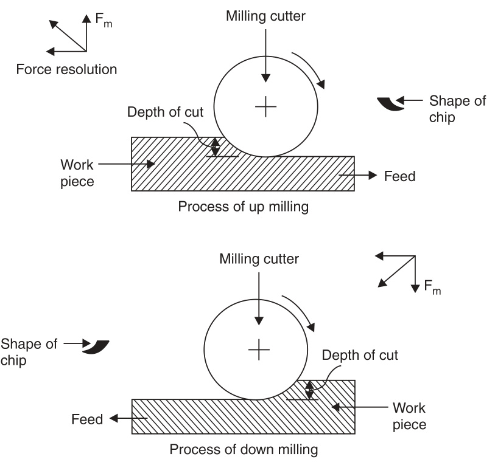
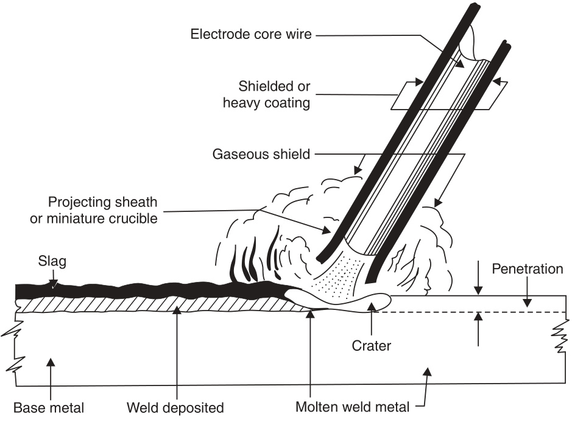

# UNIT II  

# Introduction to Machining and Its Applications  

This page   
intentionally left   
blank  

# Lathe  

# INTRODUCTION  

In previous chapters, we have seen that with the help of forging and casting processes, we can manufacture machine parts of different shapes and sizes. However, parts so manufactured have poor geometry and size control (i.e., tolerance on dimensions) and their surface finish is not very good. Hence, in most cases, castings and forgings undergo machining before these parts can be assembled with other parts to form a complete machine like cycle or motor car etc.  

In machining, we use a machine tool like lathe or shaper and a cutting tool made of a much harder material than the material of the part to be machined. Material removed from the part is achieved by the relative movement between the cutting tool and the part. The cutting tool is given a sharp cutting edge and it is forced to penetrate inside the work piece surface to a small depth. The relative motion between the tool and work piece results in a thin strip of material being sheared off from the work piece reducing the thickness of the work piece. This process has to be repeated several times before the entire surface of the work piece can be covered and reduced in depth. The thin strip of the material sheared from the work piece is called ^chip'. It must be understood that chips are produced by shearing action and not by cutting. Subtantial amount of power is required for machining. The function of the machine tool is to provide this power and the required motion of work piece relative to the tool.  

In some cases of machining, motion is given to the work piece and tool remains stationary. In some other cases, the work piece is stationary and the machine tool provides motion to the cutting tool. In yet other cases, motion is given both to tool as well as the work piece.  

Cutting tools are made of material which can be hardened by suitable heat treatment. During machining, lot of heat is generated and the temperature of the cutting edge of the tool may reach $650{-}700^{\circ}\mathrm{C}$ . The tool must maintain its hardness even at such elevated temperatures. This property of retaining its hardness at elevated temperatures is called red hardness'. Cutting tools develop the property of red-hardness due to addition of tungsten and molybdenum to high carbon steel. These days, cutting tools are made of high speed steel, or tungsten carbide. Tools made of ceramic materials (ike $\mathrm{Al}_{2}\mathrm{O}_{3}{}.$ SiC), and polycrystalline diamonds are also used for special applications.  

Cutting speed: Readers must understand the concept of “cutting speed"'. Cutting speed means the linear speed at which cutting takes place. If the tool is stationary, the speed at which the work material approaches the cutting edge of tool is the cutting speed. It is measured in metres per minute.  

The optimum cutting speed depends upon the tool material, the material to be cut and whether a cutting fluid is being used or not. The purpose of using cutting fluid is to remove heat from the cutting area and to lubricate the tool face so that the friction between chip and tool surface reduces. Use of cutting fluid makes cutting process more efficient. Similarly, cutting at recommended cutting speed results in improved tool life and performance.  

Recommended cutting speed for machining cast iron and mild steel with high speed tools is 35 metres per minute. However, if tungsten carbide tools are used, cutting speeds of 65-70 metres per minute may be used. For non-ferrous material, much higher cutting speeds are permissible.  

# CENTRE LATHE  

A centre lathe is also called an engine lathe or simply a lathe. It is one of the commonest and oldest machine tools. It is also one of the most versatile and widely used machines. Its main function is production of cylindrical profiles.  

A centre lathe is shown in Fig. 1.1.  

  
Fig. 1.1 Centre lathe  

The main parts of a centre lathe are:  

1. Machine bed, usually made of cast iron. It holds or supports all other parts of the lathe. The top of the machine bed is flat and is machined to form guide ways on which the carriage slides along the length of the lathe.  

2. Headstock: It is fixed at the extreme left hand of the bed and contains shafts and gears immersed in lubricating oil. The driving shaft inside is driven by an electric motor. The driven shaft, which is in the form of a hollow spindle can be driven at various r.p.m. by changing gears, projects out of the headstock, A chuck (either three jaw or four jaw), is screwed on this spindle. The work piece can be held in the jaws of the chuck. When the spindle rotates, the chuck as well as the work piece held also rotate about the longitudinal axis of the spindle.  

3. Tailstock: A tailstock is provided at the right hand end of the bed. It can slide along the guide ways provided on the bed and may be brought nearer to the headstock, if so desired. It can then be clamped or fixed on the bed in that position.  

The tailstock has a spindle in the upper part of the tailstock, the axis of which coincides with the axis of the headstock spindle, both being at the same height above the bed. This spindle can be moved forwards or backwards by rotating a hand wheel. The front portion of tailstock spindle carries a ^dead' or ^live’ centre. When a long work piece is held in the chuck at the headstock end, it is supported at the tailstock end by moving forward the tailstock spindle. Of course, there has to be a small conical hole in the centre of the work piece, in which the tailstock centre may be inserted to provide support. If the centre (being carried in its own bearings) rotates along with the work piece, it is called a live centre. However, if the tailstock centre remains stationary and work piece alone rotates, the centre is called ‘dead centre’ and the conical tip of centre has to be lubricated with grease to reduce the friction between the tailstock centre and the work piece.  

A typical tailstock is shown in Fig. 1.2  

  
Fig. 1.2 Tailstock  

4. Carriage: A carriage is shown in Fig. 1.3. The carriage can slide along the length of the machine bed from the tailstock end to the head stock end. This movement is controlled by manually operating the hand traversing wheel. It can also be imparted this traversing motion at different speeds automatically by engaging into the feed rod or feed shaft.  

  
L Hand traversing wheel   
Fig. 1.3 Carriage  

The carriage carries a cross slide, which can independently move in a crosswise direction at right angles to the bed. The cross slide can also be moved either manually through a smaller hand wheel or through an automatic device. Mounted upon the cross slide is another small slide, called the compound rest (or tool post slide) which can be rotated in a horizontal plane. Its normal position at $0^{\circ}$ rotation is parallel to bed. Its angle of rotation can be read off on a protractor. This compound rest is used during taper turning to set the tool for angular cuts. The compound rest can be moved only manually. The cutting tool is clamped in the tool post which is mounted on top of the compound rest.  

The gears, clutches and other mechanism required for giving movement to the carriage and cross slide etc. is hidden from view by means of an apron (thin steel plate) screwed upon the front face of the carriage. Half hidden in the front are two long shafts, (the screwed one is called the lead screw shaft/rod and the plain one is called feed shaft/rod) extending from the headstock to the tailstock end. These two shafts can be engaged one at a time to give longitudinal movement to the carriage. Lead screw is only used during the screw cutting operation. Feed shaft is used in other operations like turning.  

Size of a lathe is specified by the distance between headstock chuck to tailstock centre. This is the length of the longest job which can be accommodated or machined on the lathe. In addition the swing of the lathe (i.e., the vertical distance between chuck centre and the lathe bed) is specified as this is the radius of the largest work piece which can be turned on the machine.  

# CUTTING TOOLSUSED ON THE LATHE  

In a centre lathe, the work piece is held and fastened in a chuck. If a component is manufactured out of a round bar, the bar passes through the hollow spindle of the headstock, and the required length of bar is pulled out and then clamped in the jaws of the chuck, free end of the bar projecting towards the tailstock end. Mostly the movement of tool is from right to left. This is known as right hand working. Sometimes, it becomes necessary to do some work while moving tools from left to right, i.e., left hand working. The tools for right hand lathe operations are quite different than tools for left hand working. In fact they are mirror images of each other.  

Many different kind of operations are carried out on lathes such as   
(i) Turning   
(ii) Facing (ii) Taper turning   
(iv) Profile turning or form turning (v) Parting   
(vi) Boring   
(vii) Threading   
(vi) Knurling.  

The tools used for these operations all different. Some of the right hand tools are shown in Fig. 1.4.  

  
Fig. 1.4 Right hand lathe tools  

# HOLDING THEWORKPIECEINTHECHUCKANDCENTERING  

All jobs have to be securely clamped in the chuck and centred before any of the above listed operations can be performed on a lathe. 3-jaws chuck is a self centering device and is used for clamping round bars etc. A four jaws chuck is for clamping irregularly shaped jobs. In 4-jaws chuck each jaw moves in radially independent of other jaws. Centering means that the centre line of the work piece should nearly coincide with centre line of machine spindle. It is not enough to hold the job centrally in the chuck, the portion of work piece projecting out of chuck should also be centrally placed. Collet chuck, face plates etc. are some other holding devices for the work piece.  

Turning: In this operation, the work piece is rotated at a suitable r.p.m., so that metal cutting may take place at the recommended cutting speed. If ^d’ is the diameter of work piece and $N$ the r.p.m., the cutting speed can be calculated as $\pi.\mathrm{d.N}$ . A cutting tool is clamped in the tool post taking care that the tip of the tool is at the same height as the centre of job. In the turning operation, the job rotates and the cutting tool is inserted in the surface of work piece by moving the cross slide, starting at the right hand end of the work piece. The depth of cut of $1{-}1.5\ \mathrm{mm}$ may be taken and then the tool is steadily moved from right to left by sliding the carriage on the machine bed. The operation of turning is shown in Fig. 1.5.  

  
Fig. 1.5 Turning operation  

Feed is given to the tool. Feed is measured in mm/rev of work piece. Since work piece r.p.m. is $N_{s}$ feed per minute will be $N\times$ feed/revolution (mm).  

Obviously, it may not be possible to achieve the desired reduction of diameter in one pass of the tool, the tool will have to be brought back to the right side, again advanced by $1{-}1.5\;\mathrm{mm}$ bymoving the cross slide and then traversed again from right to left side. This process will have to be repeated several times until the desired diameter is reached.  

In the process of turning, a cylindrical shape is generated as a result of the combined movement of the work piece and the tool.  

Facing: In this operation, the work piece is rotated as before, but the tool is moved across by cross slide. The carriage remains fixed in one position. The result is production of a flat circular section at one end of the cylinder. All lengths can be measured taking this surface as datum during further machining operations.  

# TAPER TURNING  

Taper turning means production of a conical surface by gradual reduction in diameter as we proceed along the length of the cylinder. A conical surface will be produced, if the cutting tool moves along a line which is inclined to the longitudinal axis of the work piece instead of moving parallel to it. A taper is defined by the half angle (o) of the cone as shown in Fig. 1.6.  

  
Fig. 1.6 Taper turning calculation  

Following methods are used for taper turning on lathe:  

1. By swivelling the compound rest.   
2. By offsetting tailstock.   
3. By using a taper turning attachment.   
4. By using a form tool.  

# Taper turning by swivelling compound rest  

In this method the compound rest is swivelled i.e., rotated in a horizontal plane by half cone angle $(\upalpha)$ The work piece is rotated as usual, but instead of using the carriage to traverse the tool, the tool is moved forward by the compound rest slide handwheel. Since the compound rest has been swivelled to an inclined position with respect to the longitudinal axis of lathe, the tool moves at an angle to the longitudinal axis of lathe generating a conical surface accurately.  

# By setting over the tailstock centre:  

In this method, the tailstock centre is shifted in a direction at right angles to the longitudinal axis of the machine. The tailstock base guide ways have some clearance and it can be shifted laterally by a limited amount on the machine bed. The calculation of the taper angle can be understood from Fig. 1.7.  

  
Fig. 1.7 Offsetting tailstock  

If length of job is $L$ and set over of tailstock is $\mathcal{I}$ then half taper angle, $\alpha=\sin^{-1}{\frac{f}{L}}$ . It will be appreciated that in this case tool will traverse parallel to machine centre line but the work piece has taken an inclined position with respect to the longitudinal centre line machine. This method can only be used, if taper angle is small. Since the set over cannot be accurately measured, this method is not accurate, but in this case, work pieces with long length can be tackled, which is not possible with compound rest method.  

# By using taper turning attachment  

This method allows accurate production of a wide range of tapers. A taper turning attachment is used on the backside of the cross slide. In this case the cross slide moves a certain distance for a given amount of longitudinal traverse by the carriage. That is the tool gets a simultaneous movement in two perpendicular axes. The angle of taper cut will depend upon the ratio of movement of tool in the two axes.  

# Taper turning by form tool  

In this case, tapers of only very short length are cut. The front profile of the form tool is such that when the tool is pushed against the work piece, the taper is produced. This method is illustrated in Fig.1.8.  

  
Fig. 1.8 Taper by form tool  

# PROFILEORFORMTURNING  

The basic principle of this lathe operation has become clear from the example of taper turning with the help of a form tool. Various other forms like a specified radius, semicircular shape etc. can be generated in a similar manner with a suitably shaped form tool and taking a plunge cut (i.e., only cross slide will be used while carriage will remain locked in position).  

Form tools should have a short profile, otherwise the work piece and the tool tend to vibrate and chatter.  

Parting off: This operation is performed with a parting tool. This also requires a plunge cut. Gradually the diameter of work piece at the tool contact surface will reduce and will become smaller and smaller as the tool is fed in. Ultimately as the tip of tool will reach the centre line of job, the job will be parted in two pieces, the left hand piece will remain clamped in the chuck, while the right hand piece of requisite length will separate out.  

Boring: Boring means enlarging an existing hole. For initial drilling of a hole on the lathe machine, tailstock centre is removed and in the tailstock spindle a drill is inserted. The tailstock is brought closer to the work piece, which is held in the chuck and rotated. Now using the handwheel of the tailstock, the drill is advanced.  

The advancing drill comes in contact with end face of the work piece and drills a hole through it. After the hole has been drilled to required depth, the drill is withdrawn. This hole can then be enlarged in diameter by using a boring tool.  

The operation of boring is shown in Fig. 1.9. It is a delicate operation. The diameter of the boring tool or boring bar fitted with a tool bit has to be smaller than the hole in the work piece. The boring operation is really an internal turning operation but not being able to see the actual cutting, makes the operation tricky and delicate.  

  
Fig. 1.9 Boring  

Threading: Threading is an operation of cutting threads or helical grooves on the external cylindrical surface of the job. In this process, the carriage is connected to the lead screw. The pitch of threads to be cut equals I·p.im. or leau sclew $\times$ Pitch of lead screw. Thus there should be an arrangement r.p.m. of workpiece to change the ratio of r.p.m. of work piece and the r.p.m. of lead screw. This is done by a system of gears, which give the required ratio.  

Threads have a standard profile. The cutting tool profile should match with this profile. Now the threads can be cut in the usual manner by traversing the tool by engaging the clutch between carriage and lead screw. Such screw cutting lathes are provided, with reversible motors. The r.p.m. of spindle is kept very low for thread cutting.  

Knurling: For providing better grip, some work pieces are provided with a shallow diamond shaped pattern on its circumference. Knurling rollers, which have a similar pattern cut on their surface are hardened. When a work piece surface is required to be knurled, the work piece is held in a chuck and rotated and the knurling roller is clamped in the tool post and by moving the cross slide, the roller is pressed into the surface of the work piece. As the roller and work piece surface rotate together, the pattern is etched into the surface of the work piece.  

Conclusion: There are many accessories and fittings, which, if provided greatly improve the performance and range of work which can be carried out on a lathe.  

# QUESTIONS  

1. Make a sketch of a centre lathe and label its main parts.   
2。 List the various operations which may be performed on a centre lathe.   
3. Describe at least three methods of taper-turning on a centre lathe.   
4. Sketch some tools commonly used on a lathe.  

# Shapers and Planers  

# INTRODUCTION  

Both shapers and planers are machine tools which produce a flat surface. They are capable of machining a horizontal, vertical or inclined flat surface. They employ single-point cutting tools which are essentially similar to single-point cutting tools used on lathe. In both these machine tools, the cutting tool is subjected to interrupted cuts, the tools cuts in forward direction and is idle in the return direction.  

# SHAPING MACHINES OR SHAPER  

# Principle of Working  

Principal parts of a shaper are shown in Fig. 2.1.  

  
Fig. 2.1 Principal parts of a shaper  

Shaper consists of a hollow machine bed made of cast iron which rests on the ground. Inside the hollow portion the machine drive mechanism is housed. This mechanism is called slotted lever quick return mechanism and it drives a horizontal ram which reciprocates in the guide ways provided on the top surface of the machine frame. In the front face of the ram, a tool post is fitted. This is a very special kind of tool post. It carries a slide which can be operated by a hand wheel and the entire tool post can be lowered or raised. Besides, the tool slide can be swivelled in a vertical plane and its inclination to the vertical (amount of swivelling) can be read off on a scale marked in degrees. The tool is inclined, when an inclined surface has to be machined.  

In the front portion of the base, a table is fitted. The table can be raised or lowered to vary its height. It can also be moved horizontally to left or right. A vice to hold the work piece is provided on the table top.  

The tool does useful work i.e., cutting only in the forward stroke of the ram. It does not cut i.e., it is idle during the return stroke of ram. In order that while returning, the tool may not rub and spoil the strip of the metal machined in the forward stroke, a special device called the “clapper box” is provided in the tool post. It lifts the tip of the tool during the return stroke.  

# DRIVE  

Since useful work is done only during the forward stroke of ram, the mechanism driving the ram is so designed that the return stroke is completed in much less time than the forward stroke. The slotted lever quick return mechanism is illustrated in Figs. $2.2(a)$ and $2.2(b)$  

  
Fig. 2.2 Quick return mechanism  

The crank $A B$ (of adjustable length $R$ ) rotates with a uniform angular speed. The crank pin $B$ is in the shape of a die block which is free to slide inside the slot in the slotted lever $O B C$ . This slotted lever is pivoted at $O$ and the other end $C$ is connected to the ram by a short link arm as shown in Fig. 2.2 (a). When the crank $A B$ rotates clockwise from position $A B_{1}$ to $A B_{2}$ , the ram moves forward from left to right and when it rotates from position $A B_{2}$ to $A B_{1}$ the ram returns back to its original position.  

Clearly the time taken to complete forward stroke is proportional to angle $\upalpha$ (refer to Fig. 2.2 $(b)$ and the return stroke is completed in less time which is proportional to angle $\upbeta$  

# CUTTING TOOLS USED IN SHAPING  

The cutting tools for shapers are generally made of H.S.S., either solid or with brazed tips. Due to interrupted cuts, tungsten carbide tools are not preferred for shaping work. These tools are made sturdy with fairly generous size for shank and tip. Various types of tools useful for shaping are shown in Fig. 2.3.  

  
Fig. 2.3 Cuting tools used in shaping work  

# OPERATIONSPERFORMEDONSHAPERS  

On a shaping machine, relatively small jobs can be machined. The size of a shaper is denoted by the maximum length of stroke of its ram and work pieces longer than the maximum stroke cannot be machined.  

The first step in machining a job is to mount the job on the shaper-table and clamp it tightly in the vice or on the table by means of $T\cdot$ -bolts etc. The second step is to adjust the stroke of ram according to the length of work piece. The ram stroke is kept about $60{-}70\;\mathrm{mm}$ longer than job. The stroke can be reduced or increased by altering the length of the crank $A B$ (refer to Fig. 2.2). Now by changing the position of the location where short link arm is connected to the ram, the stroke is made to overlap the job, so that the stroke starts $30{-}35\ \mathrm{mm}$ before the job and covers the whole length of work piece and ends $30{-}35\ \mathrm{mm}$ beyond it.  

A tool is now selected and clamped in the tool post. The depth of cut is given by rotating the hand wheel and lowering the tool slide. Depth of cut is not given by raising the table height. Table height is adjusted only at the time of fixing the job according to the height of job. Feed is given by shifting the table laterally. The feed to the table can be given either manually or automatically. The feed is given during the return stroke of ram. Operations performed on a shaper can be easily understood from Fig. 2.4.  

  
Fig. 2.4 Various operations performed on a shaping machine  

Contour cutting is a very skilful job as it calls for simultaneous operation of horizontal table feed as well as vertical hand feed of the cutting tool. It can be performed only by a very skilled operator.  

# PLANER OR PLANNING MACHINE  

Planer is used to machine flat surfaces on work pieces, which are too large and heavy to be accommodated on a shaping machine table. The fundamental difference between a planer and shaper is that in a planer, the cutting tool remains stationary and the planer table on which the work piece has been clamped moves past the cutting tool. The feed is given to the cutting tool and not to the table which reciprocates in the guide ways provided in the machine bed.  

A planer can handle much heavier cuts and more than one tool post is provided on one machine so that machining can be done quickly. Sometimes a horizontal surface and a vertical surface are machined simultaneously and the squareness of the surfaces is automatically ensured.  

# PRINCIPLEOFWORKING  

A standard planer is shown in Fig. 2.5.  

  
Fig. 2.5 Schematic diagram of a planer  

The planer consists of a sturdy bed made of cast iron, on the upper surface of which Veeguideways are machined all along the length the bed. The base of bed is grouted in the ground. Table is again made of cast iron having matching guide ways machined at its bottom so that it can slide longitudinally on the machine bed. The table has a long rack machined in the centre of its width which is used for giving reciprocating motion to the table. The table is provided with $T\cdot$ slots on its top surface, so that the work piece may be clamped securely on the table. Two vertical columns, one on each side of the bed and table are located as shown in the figure. A cross rail can slide up and down on the two vertical columns. Usually one or two tool posts (tool heads) are mounted on the cross rail and one side tool head is mounted on each column. Vertical tool heads can move laterally on the cross rail while side tool heads can move up and down on the vertical columns. There is arrangement for advancement or retraction of tools in the tool heads.  

A number of speeds and feeds are available for the tool heads.  

Even on a planer, the tools will cut material only in the forward stroke of the table, its return stroke is idle. To save idle time, the return stroke takes place at higher speed. This is achieved by a variable speed reversible motor drive and a system of limit switches fitted on the bed of the machine, which get actuated when the table reaches the end of its forward and reverse strokes. The length of the stroke can be adjusted to suit the length of the work piece by changing the position of the limit switches.  

Cutting tools used on planers: The planer tools are made of high speed steel, although tipped carbide tools are also used occasionally. These tools are, in general, similar to shaper tools, but are more robust and stronger. Specially shaped tools are used on planers for operations like $T$ slotcutting and dove tail slide cutting.  

In both shapers and planers, the tool or table starts from rest, picks up speed and then again slows down to zero speed during the forward or cutting stroke. It is customary to calculate cutting speed on the basis of average speed during the forward stroke. Feed and depth of cut are both expressed in mm. In case of feed, it is the lateral distance moved by the tool (on the cross-rail) per cutting stroke.  

Some examples of the diverse type of machining operations performed on a planer can be had by referring to Fig. 2.6. The surfaces shown shaded have been machined on planer.  

  
Fig. 2.6 Components manufactured by planning/shaping processes  

# QUESTIONS  

1.  Why quick return motion is provided in shapers and planers?  

2. Sketch the quick return motion mechanism used in shaping machines and explain how stroke is adjusted to suit a particular job.   
3. Make a sketch of a planning machine and explain how vertical and horizontal surfaces of a work piece can be planed simultaneously.   
4. A work piece is to be machined. It has many plain surfaces. How will you decide if the work piece should be machined on a shaper or a planer?  

# Drilling Machines  

The process of drilling means making a hole in a solid metal piece by using a rotating tool called drill  

In the olden days, a flat drill was used for drilling a hole, but these days, a twist drill is universally used. A twist drill is the cutting tool and it is used in conjunction with a drilling machine. A twist drill has two cutting edges, hence it is a multiple point cutting tool. The drilling operation is shown in Fig. 3.1.  

  
Fig. 3.1 Drilling of a hole  

# TWIST DRILL  

A twist drill is shown duly labelled in Fig. 3.2. Twist drills usually have a taper shank, at the end which is fitted into the drilling machine having a tapered sleeve of matching taper. When the tapered sleeve rotates, the twist drill also rotates along with it due to the friction between two tapered surfaces. Sometimes the shank is machined parallel, then a special collet chuck is fitted in the drilling machine, in which the drill is held.  

The drill has two lips at the other end where the cutting takes place, when the drill rotates. The angle between the two cutting lips is usually $118^{\circ}$ . The chips formed at the cutting edges are automatically guided upwards through the helical grooves cut into the body of the drill; these grooves are called flutes. This is necessary, otherwise, the chips will interfere with the metal cutting.  

  
Fig 3.2 Nomenclature of a standard general-purpose twist dril  

For rotating the drill and to overcome the resistance in cutting, a torque is needed to rotate the drill. An axial force is also needed which keeps pushing the drill deeper and deeper into the hole being drilled. This is provided by the machine feed. Machine feed is the downward axial movement of the drill per revolution of drill.  

The drill will not start cutting the metal, if its bottom touches the metal surface superficially. This is on account of the chisel edge which does not allow the cutting edges to come into the contact with metal and start cutting until the chisel edge penetrates the metal surface by about a mm or so. To facilitate the cutting action, a little depression is made by a punch at the centre of the hole to be drilled.  

Twist drills are made of solid high speed steel, hardened and ground to shape. Drills with tungsten carbide inserts are also available.  

# DRILLING MACHINES  

Drilling machines are of the following types:  

1. Sensitive drilling machines,   
2. Pillar type drilling machines,   
3. Radial drilling machines, and   
4. Multispindle drilling machines.  

Sensitive drilling machines: A sensitive drilling machine is shown in Fig. 3.3.  

  
Fig. 3.3 Sensitive or bench drilling machine  

This is a light duty machine and is capable of drilling a hole of $12\ \mathrm{mm}$ dia maximum and its spindle speeds are correspondingly high. This machine can tackle small jobs. The work piece is kept on the table and clamped in the appropriate position and the hole is drilled by lowering the spindle of the drilling head. Feed is given by moving the hand wheel gently which lowers the spindle and the hole is drilled up to the required depth. Remember that the job has to be moved so as to align the centre of hole exactly below the spindle.  

Pillar type drilling machines: These are generally similar to sensitive drilling machines but are meant for heavier work. The vertical column can be either of rectangular or round section; the latter offers the advantage that the table can be swung out and the slightly bigger jobs can be accommodated on the machine base instead of the table. The drilling head can be lowered and hole drilled in the job.  

Radial drilling machine: A radial drilling machine is illustrated in Fig. 3.4. This is really meant to drill holes in bigger and heavier workpieces, which cannot be manipulated so that the centre of the hole may be aligned with the drilling spindle. In this case, the drilling head is mounted on a radial arm. The radial arm can be rotated around the round column and the drilling head can be moved in or out on the radial arm.  

The work piece is kept on the table which is really an integral part of the base and by the combined movement of the radial arm and the drilling head (think of the polar coordinates $\theta,\,r)$ , anypoint on the work piece can be covered and a hole drilled at the required location, without shifting the heavy work piece.  

  
Fig. 3.4 Radial drilling machine  

Multiple spindle drilling machines: On these machines, more than one hole may be drilled at one time. These machine are very useful for mass production work.  

Allied operations performed on drilling machines: Operations closely associated with drilling are shown in Fig. 3.5.  

  
Fig. 3.5 Common operations closely associated with drilling  

Core drilling: Holes made in castings by use of cores, are rough and require a special kind of drill, called core drill to clean up the holes. This operation is called core drilling.  

Step drilling: More than one diameter can be ground on the drill body which saves an extra operation.  

Counter boring: Often a flat surface is needed around a hole to provide a good seating area for washer and nuts/head of a bolt. The counter boring tool has a pilot, which ensures that the counterbore is concentric with the hole.  

Counter sinking: Counter sinking provides a tapered entrance to the hole. A special counter sinking tool with a pilot is used as shown.  

Reaming: Reaming is an operation of sizing and improving the geometry and finish of a previously drilled hole. Hand, machine and shell reamers are used for this purpose. Machine reamers are used with a drilling machine. To work efficiently, proper stock allowance is very important. Reamers cannot remove much material, but at the same time, enough material should be available all round. For holes up to $12.5\ \mathrm{mm}$ in diameter, about $0.38–0.4\;\mathrm{mm}$ of material is left as reaming allowance.  

A reamer follows the original hole and cannot shift its centre.  

Tapping: Tapping is also done on a drilling machine with a special flexible adapter for holding machine taps. Tapping means cutting internal threads in a hole. A machine tap set consists of two tapsrough and finish. Both taps should be used in the same order. During tapping, the spindle r.p.m. is drastically reduced and a good lubricant used.  

# QUESTIONS  

1. Make a sketch of a twist drill with a taper shank. What part of the drill is used for cutting? How is the twist drill fitted in the drilling machine?  

2. Describe the various kinds of drilling machines, you are familiar with.  

3. Write brief notes on:  

(i) Reaming (ii) Core drilling (ii) Counter boring.  

4. Can ‘tapping’ be done on a drilling machine? If yes, describe the process in detail.  

# Milling Process  

# INTRODUCTION  

Milling is a machining process which is performed with a rotary cutter with several cutting edges arranged on the periphery of the cutter. It is a multiple point cutting tool which is used in conjunction with a milling machine. This process is used to generate flat surfaces or curved profile and many other intricate shapes with great accuracy and having very good surface finish. Milling machines are one of the essential machines in any modern machine shop.  

# BASIC MILLING PROCESS  

Generally, there are two types of milling processes. These are called (a) Up milling or conventional milling process, and $(b)$ Down milling or climb milling process. Both these processes are illustrated in Fig. 4.1.  

In upmilling, the direction of rotation of milling cutter and the direction of work piece feed are opposite to each other; whereas in down milling, they move in the same direction at the point of contact of the cutter and the workpiece. In upmilling, the thickness of chip at the start is nil and is maximum when the cutting teeth leave the surface of the work piece. In down milling, it is vice-versa. In up milling, the cutting teeth try to up root and lift the work piece from the machine table, in down milling, reverse happens. Technically, downmilling is a superior process, but up milling is commonly used. Down milling is not used unless the milling machine is fitted with a backlash eliminator.  

From Fig. 4.1, basic milling operation can also be understood. The milling cutter is circular and a large number of cutting edges (or teeth) are arranged along its circumference. The cutter is rotated at aspeed of $N$ r.p.m. If the cutter diameter is $D$ , then cutting speed at the tip of teeth can be calculated as $\pi D N$ metres/minute and it should conform to the recommended values. The depth of cut is clearly shown in the figure and the thickness of the work piece will reduce by this amount in one pass. Usually,. the width of the milling cutter is more than the width of the work piece, hence one pass is all that is required.  

Feed of the work piece is measured in terms of mm/minute. Actually, the correct measure of feed is movement of work piece per revolution of cutter per teeth. If a milling cutter has $\mathcal{Z}$ number of teeth and if the table feed is $^{\ast}f$ mm/minute, feed per rev per teeth will be f/NZ mm. It should therefore be clear that metal removal rate in milling operation is much higher than in shaping or planing operations.  

  
Fig. 4.1 Up and down milling processes  

However, as in shaping or planing operation, the stroke length is always a little more than the length of the job, in milling operation also, the minimum table traverse required is $L+D$ where $L$ is the length of job and $D$ is the milling cutter diameter. $D/2$ is the minimum overlap required on either side of job, so that the cutter becomes clear of the job.  

Unlike turning, the milling process involves intermittent cutting and the chip cross-section is not uniform. The high impact loads at entry as well as fluctuating cutting force make milling process subject to vibration and chatter. This aspect has great influence on design of milling cutters.  

# TYPES OF MILLING PROCESSES  

The milling process is broadly classified into peripheral milling and face milling. In peripheral milling, the cutting edges are primarily on the circumference or periphery of the milling cutter (in Fig. 4.4, cutters shown are peripheral cutters) and the milled surface is generally parallel to cutter axis.  

In face milling, although the cutting edges are provided on the face as well as the periphery of the cutter, the surface generated is parallel to the face of the cutter and is perpendicular to the cutter axis. Refer to Fig. 4.2; in which both these process have been illustrated.  

  

Fig. 4.2 Peripheral and face milling  

The peripheral milling cutters are supported on a long arbor. The deflection of arbor restricts the dimensional and form accuracy of this process. In face milling, the overhang of the cutter is limited resulting in better dimensional control and flatness. Peripheral milling cutters are normally used with a horizontal milling machine whereas the face cutters are used in conjunction with a vertical milling machine.  

Milling cutters are made of solid high speed steel, or have high speed steel inserts. The cutters are also made, with tungsten carbide blades (either brazed or with throw away inserts).  

# PERIPHERAL MILLING  

Peripheral milling is adopted for the following machining operations:  

1. Slab milling to produce flat surfaces.   
2. Slot milling to produce precision slots.   
3. Side and face milling to machine adjacent horizontal and vertical surfaces simultaneously.   
4. Form milling to produce prismatic shape of any form, e.g., involute form in gear cutting.   
5. Straddle milling to machine two parallel vertical faces.   
6. Gang milling to machine a number of surfaces simultaneously with a set of cutters.   
The various peripheral milling operations are illustrated in Fig. 4.3.  

  
Fig. 4.3 Various peripheral milling operations  

A number of milling cutters of peripheral milling type are shown in Fig. 4.4. The hole and the keyway provided in the centre of all peripheral cutters is for mounting them on the arbor of a horizontal milling machine.  

  
Fig. 4.4 Peripheral milling cutters  

# FACE MILLING  

Face milling is widely used for milling operations involving high metal removal rate. The operation of face milling with a face milling cutter having coated tungsten carbide inserts is shown in Fig. 4.5.  

  
Fig. 4.5 Face milling  

Face milling is a combination of up cut and down cut milling operation. The points discussed earlier about up and down milling operations in peripheral milling, apply equally well to the facemilling operation (refer to Fig. 4.6)  

  
Fig. 4.6 Down and up cut in face milling  

In face milling, the position of the cutter with respect to the workpiece is of considerable significance. Three possibilities are there. Either the cutter may be symmetrically placed on the work piece or it may be asymmetrically placed, offset slightly towards the entry side or it may be asymmetric, offset slightly towards the exit side. All three positions are shown in Fig. 4.7.  

  
Fig. 4.7 Symmetrical vs asymmetrical milling  

Asymmetric milling with larger chip thickness at entry and smaller chip thickness at exit (Fig. 4.7 (b) is ideal and should be adopted.  

# END MILLING  

End mills perform a combination of peripheral as well as face milling operations simultaneously. It has got cutting edges on the bottom face as well as on its periphery. End mills are extremely useful and are used for machining edges, shoulders, grooves, slots and keyway pockets. They are also widely used for die-sinking and generation of sculpted surfaces.  

Today, end mills are available in many tool materials:   
1. Cobalt high speed steel (super H.S.S.)   
2. Coated H.S.S.   
3. Solid carbide   
4. Micrograin solid carbide   
5. Indexable inserts of cemented carbide or coated carbide.  

A solid carbide end mill and its applications in shoulder and pocket machining are shown in Fig. 4.8. End mills have a taper shank which fits into a taper sleeve provided in the spindle of a vertical milling machine.  

  
Fig. 4.8 Solid carbide end mills (a) short series (b) long series  

# MILLING MACHINES  

All the milling cutters described above are used in conjunction with milling machines, which provide rotary movement to the cutters, and feed to the workpiece and arrangement for clamping, automatic feed etc. Milling machines come in three basic models:  

1. Horizontal milling machines,   
2. Vertical milling machines, and   
3. Universal milling machines (This is also of horizontal type with a few special features).  

Other configurations of the milling machine have been developed for special applications, but above three are most common.  

# HORIZONTAL MILLING MACHINE  

The most common type of milling machine is the horizontal knee type; so called, because of the overhanging “knee” which can slide up and down the front of the machine and which carries the cross slide and the table. A diagram of the horizontal milling machine is given in Fig. 4.9.  

Horizontal milling machines may be either plain or universal type. The main difference between the two is that the table of the universal type is mounted on a turn table and may be swivelled in a horizontal plane. This feature permits the cutting of helix. In addition, the standard accessories provided on the universal machine include a ^dividing head’ for indexing. There are some other minor refinements, which make the universal horizontal machine very useful for tool room work.  

The plain version of the horizontal machine is much more robust and more suitable for production work. In the diagram, the arbor on which peripheral cutters are mounted is not shown. It is fitted in the spindlenose $^\bullet C^{\bullet}$ and extends a little beyond arbor supporting bracket $"B"$  

Even end mills, face milling cutters and drills etc. can be used with this machine. In such a situation, arbor is removed and the taper shank of these cutters is fitted into the hollow spindle $^\bullet C^{\bullet}$ With such an arrangement the vertical faces of the workpiece may be milled without any difficulty.  

The table of the horizontal milling machine can be given either hand feed or autofeed. It is also capable of being traversed at high speed.  

With these features, the machine proves really useful.  

  
A. Overarm; B. Arbor supporting bracket; $C.$ Spindle nose; $D_{\cdot}$ Hand cross feed; E. Hand vertical feed; $\boldsymbol{F}.$ Speed change levers; G.Feed driving shaft (enclosed); $H.$ Feed change levers; J. Table feed actuating lever; $\kappa.$ Feed trip; L. Rapid power feed control; M. Hand table feed; N. Starting lever; P. Wheel for moving overarm; R.Feed reversing lever; S. Tube to deliver cutting fluid to reservoir in base.  

# Fig. 4.9 Horizontal milling machine  

Vertical milling machine: The application and technique of this machine differ from that of a horizontal milling machine. It does not have an arbor and instead has a vertical spindle into which the taper shank of end mills and facing milling cutters and drills etc. can be fitted. The arrangement and movement of table are similar to the table of a horizontal milling machine.  

A vertical milling machine is shown in Fig. 4.10.  

  
Fig. 4.10 Vertical milling machine  

This machine used for making, flat surfaces, grooves, slots, pockets and guideways etc. in workpieces using end mills and facing mills etc.  

Universal milling machine: Its features have already been described under the heading of horizontal milling machine.  

# QUESTIONS  

1. What is the difference between “up milling"” and “down milling"?   
2. How can a keyway be machined on a shaft?   
3. Make a sketch of a slab milling cutter, a face mill and an end mill.   
4. Describe a horizontal milling machine. How is a milling cutter fixed in this machine?  

# Grinding Process  

# INTRODUCTION  

In grinding process an emery or corundum wheel is used as the cutting tool. Emery and corundum are naturally found abrasives and are impure form of aluminium oxide $\mathrm{Al}_{2}\mathrm{O}_{3}$ . A grinding wheel is made up of thousands of tiny abrasive particles embedded in a matrix called the “bond’ An abrasive is an extremely hard material second in hardness only to diamond. The edges of the abrasive particles project out of the periphery of the grinding wheel, and when grinding wheel rotates, each one of the particles acts like a tiny cutting tool machining away the material from the surface of the work piece. To the naked eye the cut material looks like metal dust mixed with powder from the grinding wheel. However, seen under magnifying lens, the metal dust shows all the characteristics of metal chips produced in other machining processes. The grinding process is truly a chip producing machining process.  

The grinding process is capable of producing very accurate sizes, equally accurate geometry like flatness or circularity and extremely good surface finish. The grinding wheel is capable of machining hardened steel and even hardened high speed steel, which cannot be done by other machining processes.  

When a grinding wheel is applied to the workpiece, the sharp edges of the abrasive grains which are cutting, will eventually loose their cutting effect and become dull. At that stage, the abrasive grain should either split and form new edges or it should break away from the wheel exposing the next layer of grains to do their work. If the dulled grains stay in the wheel, they simply keep on rubbing on work without actually cutting. This defect is known as 'glazing'. If on the other hand, the abrasive grains break away from the wheel or split prematurely, before becoming dull, it causes reduction in life of grinding wheel.  

# CHOICE OF ABRASIVES  

Emery and corundum, are no longer used in modern grinding wheels. Instead artificially manufactured abrasives are used due to their high purity. These abrasives are $(a)$ silicon carbide, and $(b)$ aluminious Oxide, $\mathrm{Al}_{2}\mathrm{O}_{3}^{-}$ Silicon carbide is greenish black in colour, whereas aluminous oxide is reddish brown. Silicon carbide is harder and more brittle than alumina. For this reason, it is used for grinding materials of low grinding resistance like cast iron, brass, copper etc. Aluminium oxide abrasive is more suitable for grinding most steels because of its greater toughness to cope with increased grinding resistance offered. The code for silicon carbide is $C$ and for $\mathrm{Al}_{2}\mathrm{O}_{3}$ Wheels it is $A$  

Apart from the abrasive, the performance of a grinding wheels also depends upon many other factors. It is important that a suitable grinding wheel is selected for a particular application. The basis of some factors are discussed under the heading “classification of wheels".  

# CLASSIFICATION OFWHEELS  

Classification of wheels is based on the following characteristics:  

# GRIT  

Grit indicates, the size of abrasive grain. It is indicated by a number. Higher the number, smaller the size of grains. Abrasives finer than 200, are called “flours” designated as $F,F F$ and $F F F$ Theseand finer abrasive “flours’ are used by jewellers. For fine finish of ground surface, smaller grit size abrasive wheels are used. But their metal cutting capacity is limited. With larger size abrasive wheels, finish is rough but metal removal rate is higher.  

# BOND AND GRADE  

Bond refers to the substance of which the matrix of the grinding wheel is made. The degree of hardness possessed by the bond is called the grade of the wheel and indicates the strength of the grip with which the abrasive grains are held in the bond.  

The following bonds are generally employed in manufacture of grinding wheels:  

1. Vitrified bond: It is denoted by letter $V$ and about $80\%$ of the wheels used in the industry are of this bond.  

2. Silicate bond: It is denoted by letter $S$ and silicate of soda (commonly known as water glass) is the main constituent of this bond.  

3. Shellac bond: It is denoted by letter $E$ and shellac (a naturally available material) is the main constituent of the bond.  

4. Rubber bond: Here the abrasive in kneaded in rubber and the wheels are moulded from this material. Denoted by letter $R$  

5. Resinoid bond: These wheels are made from bakelite and other resinous material. It is denoted by letter $B$  

The bond hardness or grade is usually represented by the letters of English alphabet. A represents very soft grade, while $Z$ is very hard $M$ and $N$ represent medium grade hardness.  

# WHEEL STRUCTURE  

The proportion of bond material in a wheel varies from about $10\%$ to $30\%$ of its total volume. Structure of wheel depends upon this percentage. If abrasive grains are too tightly packed, the percentage of bond material will be on the lower side. This is called a closed structure. If the abrasive grains are less tightly packed in the same volume, the wheels are said to have an open structure. The structure is indicated by a number varying from 1 (very closed structure) to 15 (very open structure).  

On every grinding wheel, the manufacturers are obliged to give the following information, in specified sequence about the  

$(a)$ Abrasive used (A or $C$   
$(b)$ Grit number (e.g., 46)   
(c) Grade (A to Z)   
(d) Structure (1 to 15)   
(e) Bond Type (by specified letters).  

In addition, the manufacturer is free to supply some additional information as prefix or suffix to the above information.  

# WHEEL SHAPES  

Grinding wheels are made in a wide variety of shapes to suit the immense range of work and special features of machine tools on which the wheels shall be put to use. Many common shapes are shown in Fig. 5.1.  

  
Fig. 5.1 Grinding wheel shapes  

Wheels from $(a)$ to $(h)$ are disc wheels and grinding is to be done on the periphery of the wheel. Wheels $(j)$ to $(l)$ are mostly used on cup wheel grinders. Wheels $(m)$ ，$(n)$ and $(p)$ are used for tool and cutters grinding. The thin wheel shown at $(r)$ is used on abrasive cutters for slitting and parting off.  

Wheel selection: It means choosing the most appropriate wheel for a particular grinding operation. Obviously, wheel selection would depend upon what abrasive is required, and other characteristics of the wheels. But it also depends upon many operating conditions like wheel and workspeed, relative diameters of wheel and jobs, type and condition of machines etc. Therefore it is best to refer to a wheel manufacturer and go by his recommendations. Thumb rule is to use a hard wheel for soft material and soft wheel for hard material. A hard wheel retains the abrasives as they do not get dulled easily on soft material.  

# MOUNTING A WHEEL ON MACHINE, BALANCING, TRUING AND DRESSING  

A grinding wheel is a delicate and fragile tool. Unless it is used properly, it may not give optimum service or may even result in accidents. In this respect correct mounting and balancing is of utmost importance. Balancing is needed as wheels revolve at many thousand r.p.m. and any unbalanced centrifugal forces may crack the wheel or spoil the bearing.  

As soon as a fresh wheel has been fitted on a grinding machine spindle, it will be necessary to true its face and perhaps, its sides for a short distance down so that the wheel may become, square to the work piece. Truing or dressing also become necessary after the wheel has been in use for sometime, to correct for non uniform wear on its face or for opening up its face to obtain efficient cutting conditions.  

The truing or dressing up of grinding wheels is done by a diamond tool. Being harder, it is able to cut through, the abrasive grains and the bond material.  

# GRINDING OPERATIONS ANDGRINDINGMACHINES  

The common grinding operations are  

(a) Cylindrical grinding: This operation is carried out on a cylindrical grinding machine which is made in two varieties “plain" and the “universal’ type. The fundamental design is the same in both cases, but the universal machine can be adopted for internal grinding operation as well.  

In cylindrical grinding operation, the work is mounted between two centres and is rotated. A grinding wheel is mounted on a spindle and revolves at much higher r.p.m. than the work. The work centres are mounted on a table which can traverse at various feeds so that the entire length of the work passes to and fro in front of the wheel. The depth of cut is very small, about $0.015\;\mathrm{mm}$ .When the entire length of work has passed infront of the wheel, the wheel advances forward by another $0.015\;\mathrm{mm}$ athe end of the traverse and so the cycle of machining goes on, until the desired daimeter of the work piece is reached. The result is a long cylinder of perfectly circular profile with very fine surface finish.  

A schematic diagram of the plain cylindrical grinder is given in Fig. 5.2.  

  
Fig. 5.2 Block diagram of a plain cylindrical grinder  

$(b)$ Internal grinding: Internal grinding operation means, grinding of internal holes or bores. The principle of internal grinding is shown in Fig. 5.3.  

  
Fig. 5.3 Principle of internal grinding  

Internal grinding is designed to grind the surface of bores; whether plain or tapered with the help of a small grinding wheel mounted on a long slender spindle which can enter in the bore. It is capable of giving improved geometry of the hole as well as the surface finish. This operation is performed on specially designed internal grinding machines. For internal grinding, a softer wheel is generally preferred.  

(c) Surface grinding: A flat surface can be ground in many ways with a grinding wheel. Some possible configurations are illustrated in Fig. 5.4.  

Recently surface grinding has emerged as a very important operation. Flat surfaces may be ground either by using the periphery of a disc wheel or by grinding with the end of a cup-shaped wheel. These methods can be further sub classified according to the method of feeding the work to the wheel. The method of using disc wheels entails the use of a horizontal spindle grinding machine. The cup wheels may be used in conjunction with either a horizontal or vertical spindle machine.  

  
Fig. 5.4 Methods of surface grinding  

Wheel speeds: The wheel manufacturer specifies a maximum safe r.p.m. for the wheel. In actual operation, this speed should never be exceeded. Like conventional machining methods, the concept of cutting speeds applies to grinding wheels also. The average recommended wheel speeds in metres per minute for different grinding operations are given below.  

Cylindrical grinding 2000 metres/minutes Internal grinding 700-1000 metres/minutes Surface grinding 1200-1600 metres/minutes Cutting off with rubber, shellac and bakelite wheels 3000-4000 metres/minutes.  

In cylindrical grinding operation, work is made to rotate at a r.p.m. which works out to about 20-25 metres/minutes speed.  

# COOLANT  

In the grinding operation, lot of heat is generated. This heat must be carried away. Hence an effective coolant is used. The most common coolant for grinding operation is water in which same soda ash has been dissolved. There should be a copious flow of coolant at the work-wheel interface. The coolant also washes away the ground chips and swarf. The coolant must not have lubricant in it, otherwise, it may lead to glazing of wheels.  

# QUESTIONS  

1. What do you understand by grit, grade, bond and structure of a grinding wheel?   
2. Justify the popular adage that hard wheels should be used for soft material and vice-versa.   
3. Describe the cylindrical grinding operation. Give an idea of the grinding wheel and work speeds   
recommended for this operation.   
4. Describe the surface grinding operations with disc as well as cup type wheel.  

# Welding Process  

# CLASSIFICATION  

Welding means the process of joining two metal parts together to give a sound and strong joint. The welding process is subdivided into two main classes.  

1. Fusion welding, which involves heating the ends of metal pieces to be joined to a temperature high enough to cause them to melt or fuse and then allowing the joint to cool. This process is somewhat similar to casting process. The joint, after the fused metal has solidified will result in a strong joint.  

2. Pressure welding, which involves heating the ends of metal pieces to be joined to a high temperature, but lower than their melting point and then keeping the metal pieces joined together under pressure for sometime. This results in the pieces welding together to produce a strong joint.  

There are many subclassifications of welding under each head. Subclassification is done according to the source of heat required for fusion or pressure welding. We shall deal with but three of them $(a)$ Gaswelding $(b)$ Electric arc welding, and (c) Electric resistance welding.  

# GAS WELDING PROCESS  

In this process, the heat source is combustion of acetylene gas. Chemical reaction of acetylene and oxygen produces a great deal of heat and the oxyacetylene flame burns with temperature exceeding $3250^{\circ}\mathrm{C}$ , enough to melt most metals and alloys. Two systems are in vogue for oxyacetylene welding:  

(i) High pressure system: In this system, both oxygen and acetylene gases are drawn from cylinders in which these gases are stored at high pressure.  

$(i i)$ Low pressure system: In this system, oxygen gas is drawn from a cylinder as before, but acetylene gas is produced at site at low pressure. Acetylene gas is produced in a sealed container in which water falls drop by drop on calcium carbide. This acetylene gas is drawn for oxyacetylene welding as per requirement.  

# EQUIPMENTNEEDEDFORGASWELDING  

High pressure oxyacetylene welding equipment consists of two large steel cylinders. One which is conventionally painted black and is a long thin cylinder contains oxygen filled in at a high pressure of $125{-}140~\mathrm{kg/sq}$ . cm. The other cylinder which is painted maroon and is shorter but of slightly larger diameter contains acetylene gas dissolved in acetone at a pressure of $16{-}21\ \mathrm{kg/sq}$ . cm. One should handle the D.A. cylinder with great care as acetylene is an inflammable gas and this cylinder should be kept vertical, as far as possible. Both these cylinders are fitted with valves which are normally kept in "closed position". D.A. means dissolved acetylene gas.  

In order to draw gas from the cylinder, each cylinder is fitted with a pressure regulator with two gauges. The function of the pressure regulator is to reduce the pressure of the gas before delivering it. The two gauges indicate the pressure inside the cylinder and the reduced pressure of gas after the pressure regulator stage. The gases are carried from the pressure regulator to the welding torch (also called blow pipe) by means of rubber hose pipes. The pressure regulator and the hose pipe connected to oxygen cylinder are of black colour while those connected to acetylene cylinder are of maroon colour, so that there is no mix up.  

A welding torch consists of different passages for oxygen and acetylene gases. Supply of these gases is controlled by pin valves. These two gases are then allowed to mix in a mixing chamber before being drivenout through the orifice of the blow pipe. These orifices are of different sizes and can be screwed on to the blow pipe. The complete assembly of the cylinders, regulator etc. is shown in Fig. 6.1. Normally the two cylinders are carried in a trolley, which is not shown in Fig. 6.1.  

A gas welding operator uses the following safety apparel: (i) Wears blue coloured goggles to protect his eyes, (ii) Wears a leather or canvas apron to protect his person, (ii) Wears leather gloves to protect his hands.  

He carries metal welding rods and a supply of flux. He also carries a chipping hammer, a wire brush and a spark lighter. The procedure of lighting a flame is to open the pin valve controlling the flow of acetylene gas in the welding torch and to use spark lighter to burn the gas. The acetylene gas burns with lot of smoke. The oxygen supply valve is then opened and adjusted to get the desired kind of flame.  

  
Fig. 6.1 High pressure welding equipment  

# TYPES OF FLAMES  

Three kinds of oxyacetylene flames can be produced with the gas welding equipment. The chemical reaction between acetylene gas and oxygen is represented by the equation  

$$
2\,\,\mathrm{C}_{2}\mathrm{H}_{2}+5\,\,\mathrm{O}_{2}\longrightarrow4\,\mathrm{CO}_{2}+2\,\,\mathrm{H}_{2}\mathrm{O}
$$  

For complete combustion of one volume of acetylene, $2\%$ volumes of oxygen gas is required. Out of $2\%$ volumes of oxygen, one volume is drawn from the cylinder and $1\%$ volume, is supplied by the atmosphere, when the flame burns. When the oxygen is supplied in this proportion, the flame is called neutral flame. If however, oxygen supply is less, the flame is termed reducing flame as it contains some unburnt carbon. If there is excess supply of air (i.e., oxygen), the flame becomes oxidising flame. These three kind of flames can be distinguished from each other by careful observation. These flames are shown in Fig. 6.2.  

  
Fig. 6.2 Types of oxyacetylene flames  

A carburising or reducing flame has three distinct zonesinner cone, intermediate feather and outer envelope. When oxygen supply is increased the intermediate feather gradually disappears and only two cones are left the inner cone and the outer envelope. At this point the acetylene and oxygen gases are in chemical balance and the flame is neutral flame. If the supply of oxygen is further increased, the inner cone reduces in length, looses its shape and a sharp hissing sound is produced. The flame has now become oxidising. Such flames have highest flame temperature.  

Neutral flame is used for welding of all kinds of steel and cast iron products. Slightly oxidising flame is used for welding brass, bronze and copper products or for welding chromium-Ni and manganese steels. Slightly carburising flame is used in welding of high carbon steel, aluminium and Nickel products.  

# WELDING OPERATION  

Setting of the job: Parts to be welded are cleaned and the joint prepared. Joint preparation depends upon the thickness of work pieces. Thin sheets can be joined by an edge or flange-joint. Sometimes, a lap or fillet joint can be used. A sheet of higher thickness but not exceeding $4.5~\mathrm{mm}$ maybewelded with a butt joint without any joint preparation. Different kind of joints commonly used in welding are illustrated in Fig. 6.3.  

  
(e) Tee joint or Fillet joint   
Fig. 6.3 Different types of joints  

For sound welding of plates thicker than $4.5\;\mathrm{mm}$ , detailed joint preparation is needed. The edges of the two plates to be welded are bevelled resulting in formation of V-shaped groove between them. The edges of the two plates are not allowed to touch each other, instead they are separated by a gap of about $2{-}3\ \mathrm{mm}$ . If plates are thicker still, instead of a single V-joint, a double V-joint is resorted to. A single $\mathrm{v}$ and a double V-joint is shown in Fig. 6.4.  

  
Fig. 6.4 V groove joints  

Gas welding techniques are classified as: 1. Left ward welding or forehand welding technique, and 2. Right ward or backhand welding technique.  

The position of welding torch, filler rod and direction of welding for these techniques is shown in Fig. 6.5.  

  
Fig. 6.5 Welding techniques  

It will be noticed that in the left ward welding technique, the flame from the torch preheats the material yet to be welded, whereas in the right ward welding, the flame postheats the weld-bead. This has certain metallurgical significance.  

# USEOFFILLERRODSANDFLUXES  

Whenever, welding is done, some extra metal may have to be added to the molten metal pool. In gas welding, the extra metal comes from filler rods, the ends of which keep getting melted. Ideally, the composition of filler rod should be identical with the metal of the work piece.  

During the process of welding, some metal may get oxidised. Flux is used to dissolve and remove these metal oxides. Flux like borax or a mixture of flourides and chlorides of sodium, potassium and lithium are most commonly used. The flux reacts with metallic oxides to yield slag, which being lighter floats on top of molten metal pool. After solidification, the welder removes the flux using a chipping hammer and wire brush.  

# OXYACETYLENE CUTTING  

The oxyacetylene flame can also be used for cutting a stel plate. This is done through a special “cutting torch", which has an extra passage for high pressure oxygen in addition to the usual two passages for oxygen and acetylene gas.  

The process of oxycutting (or flame cutting) is essentially an oxidation process. The place, where a cut is to be made is heated with the welding flame and when it is red hot, high pressure oxygen is allowed to impinge on it. Steel is oxidised and the iron oxides having a lower m.p., melt easily. The jet of oxygen blows away the molten iron oxides exposing further layer of steel. This is turn gets oxidised and soon the steel plate gets cut throughout its thickness. The oxyacetylene flame is slowly moved. In this manner, any profile may be cut from the steel plate.  

There is one limitation in this process. The cut has to start either from the edge of the steel plate or a pilot hole has to be drilled in the plate from which the cut can start.  

# ARC WELDING  

In arc welding, the source of heat is an electric arc. The temperatures reached in an electric arc may be as high as $5500^{\circ}\mathrm{C}$ . A spark is produced in an electric circuit carrying current, if the circuit is broken accidentally. An electric arc is a sustained spark created intentionally by a gap between welding electrode and the work piece. Because of larger heat output and less oxidation, the quality of weld produced by electric arc is much better than gas-weld.  

Either A.C. or D.C. power supply may be used for arc welding. For A.C., a transformer type machine is used to supply current. For A.C., an open circuit voltage of about $75{-}80\ \mathrm{V}$ is required. The current requirement is however very heavy and the welding machine should be capable of delivering 100-300Amperes.  

D.C. supply is charaterised by the $+\mathbf{v}\mathbf{e}$ and -ve terminals. With D.C., a slightly lesser open circuit voltage of 70-75 volts will be adequate to strike the arc. Normally the electrode is connected to -ve terminal and the work piece to $+\mathrm{ve}$ terminal. Such an arrangement is called D.C. straight polarity (DCSP). In this arrangement about 2/3rd of the heat is produced on the work piece end and 1/3rd at the electrode end. Under certain circumstances like overhead welding, D.C. reverse polarity (DCRP) arrangement is preferred. In this arrangement, the electrode is connected to $+\mathbf{V}\mathbf{e}$ terminal and the workpiece to -ve terminal.  

  
The process of electric arc welding with coated metal electrode is shown in Fig. 6.6.   
Fig. 6.6 Welding action of a cellulosic-coated stick electrode  

# STRIKING AN ARC  

To strike an arc, the electrode should be shorted by touching the work. At the moment of contact, a very heavy current starts flowing through the circuit, while voltage drops. Now, the electrode is lifted slowly so that a gap of $2{-}3\ \mathrm{mm}$ between the tip of the electrode and the work piece is maintained. The voltage across the arc rises to about 15-20 volts and the amperage drops. Due to heat generated in the arc, the tip of the metal electrode starts melting and the gap increases. Unless the electrode is slowly moved towards the work at the same rate at which the tip of the electrode is melting maintaining the gap at $2{-}3~\mathrm{mm}$ , the arc will extinguish. If the gap increases too much the machine voltage will not be able to maintain the arc.  

A great amount of heat (and intense light) is generated by the arc. It not only melts the electrode tip, but also melts the work piece at the location of the arc maintaining a pool of molten metal as shown in Fig. 6.6. Without some manner of shielding, this metal will oxidise. The metal electrodes are therefore, given a layer of coating throughout its length (except for about $35{-}40\;\mathrm{mm}$ at the stub end, where the metal core of electrode is exposed and held in the electrode holder). Under the action of heat, this coating at the tip of the electrode vaporises and creates a gaseous shield around the molten metal pool and saves it from oxidation. The electrode coating also contains flux (which reacts with impurities to form slag) and other ingredients which help stabilise the arc. Many types of coatings are in use.  

As the electrode is slowly moved over the joint, the molten metal pool solidifies creating a joint. The joints produced by this process are often stronger than the parent metals being joined.  

Electrodes are available in many sizes. The size of electrode is specified by the diameter (in mm) of the core metal wire. Size of electrode depends upon the thickness of parts to be joined. Thicker electrodes are required to weld thick plates. The current depends upon the size of electrode used. Thus fora $3.15~\mathrm{mm}$ dia electrodes, the recommended value of current is $100{-}120\ \mathrm{Amp}$  

# HEAT AFFECTED ZONE  

In the arc welding process, a great amount of heat output takes place resulting in formation of a molten pool in the arc area. The heat is also conducted into the vicinity of the joint on either side. The temperature of the material on both sides of the weld bead may not be as high as the melting point of the metal, but, is very close to it. As we move away from the joint or weld bead, the metal may be heated to lesser and lesser temperature. As the electrode travels over the joint and moves away, the heated metal cools as quickly as it was heated. Thus, we can conclude, that the metal adjacent to the weld bead has been subjected to a heat treatment. If steel is being welded, this heating and quick cooling may result in formation of martensitic and other structures which may be prone to cracking and hardness.  

The area so affected by welding is called "heat affected zone".  

# ARC BLOW  

A difficulty associated with D.C. welding is arc blow. Arc blow means that arc is deflecting from its intended path making the job of welding difficult due to shifting of arc. We know that when a conductor carries D.C., a magnetic field is set up whose strength is proportional to the value of the current. In D.C. welding, heavy currents are passing through the electrode and the magnetic fields set up deflect the arc to one side or another. This phenomenon is called arc blow and it becomes particularly serious, when welding is being done at the start of the metal pieces or at their end.  

The ways in which arc blow may be reduced are:   
1. Switch over to A.C. welding, if possible. Changing polarity of A.C. does not cause arc blow.   
2. Reduce current, as practicable,   
3. Use as short an arc as possible, and   
4. Wrap the ground cable around the work piece several times.  

# WELDING POSITIONS  

These are four welding positions from the point of view of the welder. These affect execution of sound welding.  

These positions are:  

1. Downhand welding position: This is the most comfortable position for welder to work in and he is able to produce welds of a good quality. 2. Horizontal welding position (on a vertical surface). 3. Vertical welding position (on a vertical surface).  

4. Overhead welding position (say on the ceiling of a room): This is the most difficult welding position. Not only the operator has to crane his neck upwards and raise his arm to maintain arc, it is also difficult as molten metal tends to fall down due to gravity.  

For important jobs, manipulators are used, which are capable of turning over the jobs and as much welding is done in down hand welding position as possible.  

# ARC WELDING DEFECTS  

Improper welding procedure and lack of skill on the part of welder may result in many welding defects. The major welding defects are described below:  

(i) Incomplete fusion and lack of penetration: Incomplete fusion can be avoided by proper weld joint preparation, using adequate current and travel speed of electrode should not be too high.  

(ii) Porosity: Molten metal has a tendency to absorb gases. The entrapped gases cause porosity or blow holes in the weld bead. Remedy lies in cleaning the work piece surface of all oil, grease and paint etc. before welding and ensuring that electrode coating is free from dampness. If necessary, electrodes can be dried in an oven before use.  

(ii) Slag inclusion: It refers to slag or other non-metallic inclusions getting entrapped in the weld bead. The most common reason for slag inclusion is that between two electrode runs, the slag, has not been completely removed by chipping and wirebrushing.  

$(i\nu)$ Undercut: Undercutting is often caused due to high amperage used. It denotes the melting away of the base metal at the line where the final layer of weld bead merges into the surface of the base metal. The undercut portion must be rectified by depositing weld metal on it.  

(v) Cracking: Cracks can take place either in the weld bead itself (called hot cracks) or in the heat affected zone (cold cracks). Hot cracks may take place due to narrow deep welds and are caused due to shrinkage of weld metal, particularly if impurities like sulphur are present in the weld metal. Excessive joint restraint can also cause such cracks. Cold cracks occur due to inadequate ductility or presence of hydrogen in hardenable steels. Preheating and post heating of base material will help in avoiding cold cracks.  

# ELECTRICRESISTANCEWELDING  

In electric resistance welding (ERW) methods, a high current is passed through the metal pieces to be joined together and the heat is produced due to the resistance in the electric circuit. This heat energy is utilized to increase the temperature of a localised spot of the work pieces to produce coalescence, and then applying pressure at this spot till welding takes place. Electric resistance welding process is a pressure welding process and not a fusion welding process. The output of heat, in this process can be easily calculated. Heat generated is proportional to $\mathrm{I}^{2}\mathbf{R}{\cdot}t$ where I is value of current, R is resistance and $t$ is the time during which current flows.  

The following ERW processes are in vogue:   
1. Spot welding process,   
2. Seam welding process,  

3. Butt welding process, and   
4. Flash butt welding process.  

# 1. Spot Welding Process  

Spot welding process is shown in Fig. 6.7.  

  
Fig. 6.7 Spot welding process  

Spot welding consists of joining two pieces by placing them between two electrodes and passing a heavy current through them for a very short duration. This causes the material just below the electrodes to heat up quickly due to the intervening resistance to the flow of electric current. When coalescence temperature is reached, the current is switched off and a pressure is applied on the two electrodes. The pressure is released when the spot weld cools off. The portion of the material just below the electrodes gets pressure welded. The weld joint is usually in the form of a round spot (if the electrodes have circular tips), hence the name spot weld.  

The electrodes are usually made of copper and are water cooled. One of them may be fixed and the other one is movable. Normally A.C. power is used along with a step down transformer. The two terminals of secondary winding of transformer are connected to the two copper electrodes to complete thecircuit.  

Usually spot welding (as also other ERW machines) are automatic and work on the following weld cycle:  

1. Squeeze the two metal pieces together with a light pressure.   
2. Pass heavy electric current for a very brief time to obtain coalescence temperature,   
3. Apply pressure and hold for sometime.   
4. Remove pressure.  

The whole cycle takes just a few seconds. Welding current may heat up the spot in less than a second.  

This process is extremely suitable for mass production work and is extensively used for fabrication of automobile bodies, railway coaches, steel furniture etc.  

One variation of spot welding process is called “Projection welding” process. In this process, at least one metal part has projections or depressions (made by some previous pressing operation). The other part and these projections contact each other. If welding is required to be done at these projected locations, an arrangement of electrodes such as shown in Fig. 6.8 may be used.  

  
Fig. 6.8 Projection welding  

The weld cycle remains same and on passing current all projections will heat up and get welded. Projections need not be round; they can be of any shape. Projection welding is extremely suited for massproduction work, where a number of spot welds are required close to one another.  

# 2. Seam Welding Process  

A seam is produced by overlapping spot welds. The seam welding machine is, therefore, similar to a spot welding machine. But in the seam welding machine, the electrodes are in the form of copper rollers. The two work pieces which are to be joined pass between the rollers. The rollers exert a pressure on the work piece and also rotates the same time. This helps in automatic feeding of the work pieces. The rollers are connected to the secondary winding of transformer but the current passed through the rollers is a pulsed or intermittent one. This results in a successive series of spot welds being made. If the spot welds are overlapping, a seam weld is created.  

By seam welding, a leak proof joint is made  

# 3. Butt Welding Process  

Welding two pieces of metal together, end to end, is called butt welding. In butt welding the ends are cleaned and made square so that the two pieces touch each other over the entire cross-section. One piece is held in stationary clamps (Refer to Fig. 6.9) and the other piece in movable clamp.  

  
Fig. 6.9 Butt welding (ERW)  

The movable clamps bring the two pieces to be welded together end to end. Then the current is switched on heating the ends quickly. Then the movable be clamps close in with pressure and hold the two pieces together under pressure until the butt weld is made. Obviously, the material around the joint upsets and has to be cut and thrown away.  

# 4. Flash Butt Welding Process  

In this process, the end preparation is not so detailed as in upset butt welding process described above and the ends need not be dead square. In this case, the current is switched on before bringing the two ends to be welded, close together. This results in flashing as the two ends almost touch each other but have a little gap between them. This flashing or arcing generates heat and the two metal end heat up to coalescence temperature. Current is then switched off and the two ends are brought together under pressure to complete the pressure weld. In this case also, a little upseting of material around the joint surface will take place which may be get rid off by grinding.  

# SOLDERINGANDBRAZING  

Soldering and brazing are allied joining processes. The main difference between welding on one hand and soldering and brazing on the other is that, in either soldering or in brazing process, the temperatures used are not high enough to cause melting of parent metals to be joined. The difference in soldering and brazing is again based on temperature considerations. In soldering temperatures up to $427^{\circ}\mathrm{C}$ are used and in brazing process, temperatures above $427^{\circ}\mathrm{C}$ are employed. Strengthwise soldered joints are weakest, while welded joints are strongest. Brazing produces joints with intermediate strength.  

# SOLDERING PROCESS  

Soldering is a process of joining two metal pieces by means of a low temperature fusible alloy called solder applied in molten state. Solders are alloys of low melting point metals like lead, tin, cadmium and zinc. Of these tin-lead alloys are most common and are called soft-solders. A combination of $62\%$ lead and $38\%$ tin produces the lowest melting point and is called 60-40 solder. This corresponds to the eutectic composition of $\mathrm{Pb-Sn}$ series and has a fixed m.p. of $183{}^{\circ}\mathrm{C}$ Increasing tin content produces better wetting and flow qualities. Hard solders are also available and have higher melting points.  

Before applying solder, the surfaces to be joined are cleaned and a flux like ammonium chloride is used. Then the solder is melted and spread upon one surface, while the other surface is applied to it under pressure. When the solder solidifies, the two pieces get joined. The process of soldering does not call for any joint preparation. A common example of soldering can be seen in joining electrical wires of P.C.B. circuits.  

# BRAZING PROCESS  

Brazing is a process of joining metals with a non-ferrous filler material. The filler material has a meltingpoint above $427^{\circ}\mathbf{C}$ but below the melting point of the parent metals to be joined. The filler material is called “spelter” in case of brazing and it must wet the surfaces to be joined.  

In brazing, the joint has to be carefully designed and joint prepared with due care. When spelter is molten, it flows into the joint clearances by capillary action and fills up all vacant spaces. Since higher temperatures are involved in brazing, a light alloying action at the surface layers of parent metal takes place. This lends considerable strength to the brazed joints.  

Brazing may be done with the help of oxyacetylene brazing torch, or the heat may be produced by induction/eddy currents. Sometimes electric furnaces are also used.  

Common brazing filler materials are silver, copper, copper-zinc, copper phosphorous, aluminium silicon and copper-gold alloys. These alloys are avaiable as wires, rods, preformed rings and in powder form. Brazing temperatures usually range from $427^{\circ}{-}1200^{\circ}\mathrm{C}.$ Fluxes commonly used are borax, flourides and chlorides of potassium, sodium and lithium.  

Most common example of brazing can be seen in brazing of H.S.S. and tungsten carbide tipped tools.  

# QUESTIONS  

1. Describe the principle of oxyacetylene gas welding. How many types of flames are used for Welding?   
2. Distinguish between welding, brazing and soldering. Which process produces the strongest joints and why?   
3. Describe the arc welding process. What role does electrode coating play in producing a satisfactory weld?   
4. Distinguish between fusion and pressure welding processes.   
5. What is arc blow? How can it be avoided?   
6. Describe the principle of spot welding with the help of a neat diagram.   
7. Differentiate between butt weld (plain) and flash butt ERW welding processes.   
8. What is heat affected zone? What is its importance in producing a crack free weld?   
9. Describe some common welding defects.   
10.  Write a brief note about welding positions.  

# Objective Type Questions  

# UNIT III  

# MACHINING ANDWELDING ANDITS APPLICATIONS  

# Pick out the most appropriate option:  

1. What is ‘swing' of a centre lathe? (a) It is the length of the bed $(b)$ It denotes the diameter of the job being machined (c) It is the length of cross slide movement $(d)$ None of these.  

2. Cutting speed for turning on a lathe depends upon $(a)$ the material of work piece $(b)$ the tool material (c) whether or not cutting fluid is being used $(d)$ all of these.  

3. What is the difference between right hand and left hand turning operations?  

(a) Right hand turning is done by a right handed operator (b) Right hand turning means that the cross slide is moved forward (c) When turning is done from right to left and left to right respectively (d) Right hand turning means when job is supported on the right end by tailstock.  

4. Cutting tools are made of (a) tungsten carbide (b) chromium carbide (c) nickel nitride (d) none of these.  

5. Function of cutting fluid in machining is to (a) keep the tool cool $(b)$ lubricate the cutting point (c) assist in chip removal by flowing them away $(d)$ all of these.  

6. A shaper cannot produce $(a)$ a horizontal plane surface $(b)$ a vertical plane surface (c) an inclined vertical surface $(d)$ a cylindrical surface.  

7. Which gases are used in gas welding process?  

(a) Oxygen and hydrogen (b) Acetylene and oxygen (c) Acetylene and LPG (d) Helium and oxygen.  

8. Low pressure OAW is the name given to the welding process in which (a) oxygen is supplied at low pressure $(b)$ acetylene is supplied at low pressure (c) both oxygen and acetylene are supplied at low pressure.  

9. In grinding wheels, which of the following abrasives are used? (a) Silicon oxide $(b)$ Aluminium oxide (c) Cubic boron nitride.  

10. Cutting speed in milling operation is given by rDN, where N and D indicate (a) RPM and dia of the work piece (b) RPM and dia of milling cutter (c) RPM of milling cutter and dia of work piece (d) RPM of work piece and dia of milling cutter.  

Indicate, if following statements are True or False:  

11. The lips in a twist drill are also known as cutting edges.   
12. Cutting tools are usually made of H.s.S.   
13. Soldering is carried out at temperatures above $427^{\circ}\mathrm{C}$   
14. In brazing, the parent metals fuse under the action of heat.   
15. In pressure welding, welding is done under the action of heat and pressure.   
16.  Arc welding requires only direct current supply.   
17. Function of electrode coating is to protect the core of electrode from rusting.   
18. .A slotting machine is used for sheet metal work.   
19. A twist drill can be used to enlarge a hole.   
20. Boring is the process of enlarging a hole.  

# ANSWERS  

1. (d) 2. (d) 3. (c) 4. (a) 5. (d)   
6. (d) 7. (b) 8. (b) 9. (b) 10. (b)   
11. T 12.T 13. F 14.F 15. T   
16.F 17.F 18. F 19.F 20. T  

  

This page   
intentionally left   
blank  

# UNIT IV  

# Miscellaneous Topics  

This page   
intentionally left   
blank  

# Importance of Materials and Manufacturing  

# INTRODUCTION  

We all know how important a role materials play in our daily lives. From the house, in which we live (which requires bricks, mortar, cement, stel, wood, plastic, brass taps, glass and other materials to build), modern man cannot do without a host of these and other materials. The cooking vessels are made of stainless steel with copper bottoms, pressure cookers are of aluminium with a rubber gasket, cutlery is made from silver covered brass, and the plates from which we eat our food are made of ceramic materials. This list could go on and on; because man requires an endless array of materials; and the choice of materials available today is also very wide.  

# PROPER SELECTION OF MATERIAL  

Though the list of materials from which a material may be selected for a particular application is very long, only one or two materials may fulfill the criteria for selection. The selected material should meet:  

(i) Service requirements,   
(ii) Fabrication or manufacturing requirements, and (ii) Economic requirements.  

Service requirements: For the component to give successful service, it must have suitable mechanical properties like strength, hardness, impact strength, rigidity, specific gravity etc. In addition, it should also have the desired electrical, magnetic, optical and thermal properties. It must have suitable corrosion, fatigue and creep resistance. All these factors narrow the choice of a suitable material.  

Pure metals normally cannot fulfill all these requirements. Alloys offer a much greater choice and their properties could be altered by changing their composition or by suitable heat treatment. Here the role of synthetic material (material created by man) also offers a choice in selecting a suitable material.  

Manufacturing requirements: A component has definite shape and size. The material selected should be capable of being cast or worked to the required shape and size. If the tolerances or surface finish demand that the material may be finish machined, it should be possible to do so. Sometimes, weldability of material is a major requirement. The material selected should meet all the requirements of manufacturing.  

Economic requirements: Finally, the component has to pass the criterion of cost. The raw material and the manufacturing cost should not be prohibitive, otherwise there will be no demand for the component or that item.  

The above are some considerations which govern the selection of material for a specific job.  

# IMPORTANCE OFMATERIALS  

The most revealing insight about the importance of material is brought home by studying prehistory. i.e. the progress of mankind before the era of recorded history. This prehistorical period is divided into following five ages on the basis of the materials which the mankind had learnt to use:  

(i) Old stone age (paleolithic age),   
(i) New stone age (neolithic age),   
(iii) Copper age,   
(iv) Bronze age, and   
(v) Iron age.  

In the old stone age, man employed stone for making rough tools for his use. He would chip off small stone pieces from granite or flint rocks and select suitably shaped pieces with sharp edges for use as knives or scrapers. He was also familiar with use of bones and animal hides. In the new stone age, man learnt to make polished stone tools, and sharpening their edges by rubbing them against other rocks.  

Gradually, man became familiar with noble metals like gold and silver probably because they were found in nature in native (that is in pure form) state. He used them for jewellery and decorative purposes, but being soft, such metals could not be used to make tools. In ancient Egypt, beautiful funerary masks of gold were buried along with “mummies"’'.  

Next important discovery by man was of copper. Melting point of copper is $1083^{\circ}\mathrm{C}$ and that of its ores lower still. Man must have discovered copper by sheer accident as bonfires must have been lit and a lump of copper ore must have got reduced to copper. With discovery of copper, man could now make axes and other tools of copper. The “mummy'’ of a hunter, who fell into an alpine ditch between the borders of modern Italy and Austria some 5 to 6 thousand years ago (but did not decompose being buried in snow) was found recently. Among his possessions, a copper axe was found in almost pristine condition. In India, in the vedic text, copper has been treated as a sacred metal, the implements/vessels used to perform a ‘Yagna² are of copper.  

Bronze was the next metallic alloy to be discovered, again by sheer accident. This time the ore contained copper as well as some tin. Bronze is much harder and stronger than copper and soon tools as well as weapons were fashioned out of bronze instead of copper. Tribes having access to bronze weapons could subjudicate others who did not possess bronze weaponry.  

Iron was the last to be discovered, because the high melting point of iron needed a very effective furnace which could generate temperature of $1500–1600^{\circ}\mathrm{C}$ . The discovery of iron is generally attributed to the race of Hittites, who lived in what is today called asia minor. Hittites kept the secret of making iron to themselves (members of tribe were warned on the pain of death not to divulge this secret to others). With swords made of iron, they could cut the weapons of their enemies. Hittites defeated even the powerful Egyptian army.  

The above brief description should convey to the reader the importance of materials in no uncertain terms. The fate of kingdoms depended upon their knowledge of materials and metallurgy in the same way as today, power of nations comes from their possession of nuclear weapons.  

# HISTORICALPERSPECTIVE  

If one looks at the history of human civilization it is noticed that there have been primarily three revolutions which have contributed significantly in improvement of the life style of society. The three revolutions are (i) “Agriculture’ revolution (ii) “Industrial revolution (ii) “Electronics and Computer’ revolution. Thousands of years ago, people were nomads moving from place to place. Some how they learned to grow crops which itself was, in a way, revolution. Agriculture ultimately forced people to live near their fields/crops and that lead to formation of society, village, town and city. Though agriculture-revolution occurred thousands of years ago, however, it could not further improve the life style of the society. It was the industrial revolution which began in England 200-250 years ago which gave real, significant and substantial a impetus to the improvement of socioeconomic development of individual, society and nation. Appreciation for industrial revolution automatically comes out, if one imagines life without electricity, vehicles or modern day to day amenities to which we are used to now. Life style has further improved and changed through modern-age electronics and computer revolution. Though the impact of modern electronics/computer is more visible in developed countries but it is making its impact in developing countries too. TV, computer and mobile phones have penetrated into every corner of the world. What agriculture revolution could not achieve in a thousand years, industrial revolution did in a couple of centuries. Now electronic revolution is doing the same in decades only. The real technological revolutions are the industrial revolution and the electronic/computer revolution; though modern-age green revolution of mechanized-agriculture is no less technological.  

# MATERIALS AS DRIVING-FORCE BEHIND TECHNOLOGICAL DEVELOPMENTS  

It is jokingly, but most probably rightly, said that behind every successful man there is a woman; similarly behind every technological revolution there must have been certain material(s). History reveals that the driving force behind a successful technological revolution has been some material. There would have been in fact (i) no industrial revolution without steel, and (i) no electronics/computer revolution without semiconductor. What would be the material of the next technological development? If it is imagined that, there is a contest among the materials to be chosen for next revolution, then the nominees for such an award are: ceramics, plastics, composites, aluminium alloys and superconductors, as can be seen from the following:  

(i) Ceramics, which had been usually considered quite unimportant and suitable only for manufacture of ceramic-jar, wash-basin and toilet-seat etc., now have changed completely. Ceramics have now found several new applications ranging from electronics industry to aero-space industry. Variety of ceramics, including glass have been developed which find numerous applications.  

(ii) Plastic seems to be the strongest contestant. Slowly but surely, plastic products are seeping into our house and finding more and more applications in every walk of our life. Some people make a hue and cry regarding environmental problems, but mostly these are baseless, as most of the plastics can be recycled and reprocessed. Moreover, history tells that ^no one can stop the progress of science and technological development; it comes into our life and is accepted in due course of time after initial hesitation'. Plastic is such a scientific development, and plastic products are replacing almost everything around us- be it ceramic (glass), wood, fabric or even iron and steel. It is said that gold is the metal for kings and iron is the king of metals. Iron and gold have grown old. The new king seems to be the non metal, that is Plastic; and the new king's regime is wide ranging from bath-room to the operation-theatre. Plastics come in large variety of varying properties ranging from soft-polythene to strongTeflon. Light-weight, availability in various shapes and colours at low-cost are its added advantages. If there is any environmental problem, it can be solved.  

(ii) Composites are also coming in a big way and find applications ranging from a badminton racket to automobile and aircraft industries. The base materials for the light weight composites are plastics (polymers) in which high strength fibres are used as reinforcement.  

$(i\nu)$ When aluminium was first discovered and extracted chemically, it was costlier than gold; Napoleon used gold-cutlery everyday but aluminium-cutlery on special occasions only. Mass production of aluminium through electrolysis-process, brought its cost down drastically. Though usually materials affect the technological development, this is an example how technology can influence the material and its cost. However, aluminium-alloys were found to be much better than aluminium itself in many ways. Various aluminium-alloys find numerous applications ranging from cold drink cans to aircraft body and engines. For example, duralumin is such a material which is almost as strong as steel but light as aluminium. Thus aluminium is also a contestant.  

(v) One of the strong contestants for the award of material for next technological revolution is superconductor. Superconductor was discovered in 1911 when it was found that mercury is superconductor (i.e. resistance is zero) at extremely low temperature of about $4^{\circ}\mathrm{K}\left(-269^{\circ}\mathrm{C}\right)$ Since then various other (better) superconductors have been found up to critical temperature $T_{c}=150^{\circ}\mathrm{K}$ which is still much below room temperature. Superconductors find many applications ranging from electrical and electronic applications to super-magnets for magnetically levitated trains. One such application of superconductor is Josephson Junction (JJ) which works as high speed switching device, which can increase the computer speed a thousand times. Problem is that of the $T_{c}$ . Efforts are on, for the search of room-temperature high $T_{c}$ superconductors; and if such a search succeeds, then this can bring about a real revolution. Interestingly, such a high $T_{c}$ superconductor is likely to come from a class of ceramics which are non-conductors.  

# Manufacturing as the Master-Key for Socioeconomic Development  

The million dollar question is ‘where and how wealth can be produced. Printing money by reservebank does not produce wealth. It only devalues the currency. Someone may say that God has already produced wealth in form of oil, gold, diamond and minerals which are hidden beneath the ground. That is true; but the said question refers to human beings. In fact, money (wealth and profit) can be produced in only two places: (i) Farms (through agriculture) and (i) Factories (through manufacture). In both cases, there are certain inputs which after-transformation lead to the desired output. This transformation adds to the value, and the difference in value of output and input is the wealth created.  

  

Fig. 1.1 Farms and Factories as Job-creator and Generator of wealth (output-input)   

  

Wealth is generated, though in less amount, through agriculture wherein variety of crops can be grown to yield money. But agriculture depends on so many natural factors that its success becomes uncertain. Pure agriculture is less profitable, but agriculture based industries are quite profitable.  

More value is added through manufacturing in factories. It is said that in America, $97\%$ land is used for agriculture and only $3\%$ for industry. The return to national income is just the reverse, i.e., $3\%$ and $97\%$ respectively. A simple calculation shows that about 1oo0 times more money is produced in industry than in agriculture. That is why, industrialists are richer and farmers are poor, specially in India. The present-day industrial revolution is the electronics and computer revolution which is yielding even more profit.  

The most important revolution is the industrial revolution (which includes the present-day electronics and computer revolution) through ‘manufacturing'. Historically, industrial revolution started in England. It generated wealth which accelerated the pace of it. But it needed a market to sell the products. This resulted in the desire for colonization of, say, Africa and India. In fact, colonization was a result of industrialization. The prosperity of England as compared to other European countries, was inherent reason for jealousy and rivalry between them. The jealousy and rivalry finally resulted in the World-Wars. In modern age, however, the industrialists and governments want economic-colonization in place of real physical colonization. Global scenario of multinationals ventures and outsourcing across countries are a few examples of this doctrine.  

For industrial development, the basic infrastructure facilities such as transportation and communication are a must. Moreover, steel industries are said to be the base industry for other industries to grow. Steel and electricity consumption have been considered as yardsticks of socioeconomic development. Bismarck famously said ^for development of a Nation, you don't need lectures and meetings, but you need blood (enthusiasm) and steel', the reason being that steel is the basic material for machines which do manufacturing.  

# DIRECT AND INDIRECT LINKAGES AMONG MATERIALS, MANUFACTURING, TECHNOLOGICALDEVELOPMENTANDSOCIOECONOMICIMPROVEMENT  

Technological development directly depends upon certain material e.g., steel for industrial revolution, and semiconductor for electronic and computer revolution. Socioeconomic development directly depends upon manufacturing; examples are manufacturing in the era of industrial revolution (including the current era of electronic and computer revolution); as the manufacturing, which is not only the wealth-creator but job-creator also, leads to socioeconomic improvement in many ways. There are indirect dependencies among these too, as shown in the block diagram. The inverse-dependence, inter-dependence and crossdependence all are indirect dependence, shown in Fig. 1.2 with dashed-lines in horizontal, vertical and diagonal-directions respectively. The example of inverse-dependence is that technological development such as nano-technology can lead to newer (nano) materials and products. The example of interdependence is that the technological progress such as in bio-technology can lead to socioeconomic development and improvement. The example of cross-dependence is that the technology development via new technology can lead to better manufacturing (such as micro-miniaturization manufacturing of electronic chips through new technological developments). Examples for other lines of dependence can also be traced easily, but this is left to readers to think upon and find out. In nutshell, all the four things viz., materials, manufacturing, technological development and socio-economic development are interlinked or related to each other in one way or the other either directly or indirectly.  

  
Fig. 1.2 Diagram showing the Direct dependence and the various Indirect dependences (Inverse, Inter and Cross) among Materials, Manufacturing, Technological and SocioeconomicDevelopment  

# CONCLUSION  

For ‘socioeconomic development? of society and nation, manufacturing is most important. Manufacturing is not only a wealth-generator but a job-creator too. Better, up-to-date and competitive manufacturing is possible with the ‘technological development', wherein ‘materials', play an important role. In fact all the four elements discussed: (i) Materials, (i) Manufacturing, (i) Technological Development and $(i\nu)$ Socioeconomic Development are interlinked to each other in one way or the other. Emphasis should be on ‘materials’ and ‘manufacturing', which are the driving force and the key for success of 'technological’ and ‘socioeconomic’ development. In the current scenario of advancement, globalisation and competitiveness, these have become even more important.  

# QUESTIONS  

1. What role has been played by materials in raising the standard of living of mankind?   
2. What are the main factors in choosing a material for a particular application?   
3.  Write a note about importance of manufacturing in modern society.  

# Location and Layout of Plants, Production and Productivity  

# INTRODUCTION  

The standard of living of mankind depends upon efficient manufacture of goods. Efficiently manufacture implies that the cost of manufacture of an article should be as low as possible, so that many people can afford to buy it. Cost of manufacture per unit also reduces, if there is a large demand for the item in question. Such considerations have led to modern manufacturing philosophy of ‘mass production', which is organised in a large workshops or plants. Such workshops employ a large number of suitably trained workers, and the workshops themselves are located at convenient locations in order that goods may be manufactured as efficiently and as cheaply as possible.  

# LOCATION OF PLANTS  

What factors should be considered in choosing a suitable or convenient location for a workshop or plant? Some important factors are:  

1. Adequate land should be cheaply available. The area should be free from water logging and flooding and should not be in an earthquake-prone zone. Provision should include land for any possible future expansion also.  

2. Enough rail and road transport should be available, so that the transport of incoming raw material and outgoing finished products is not a problem. 3. Enough power and water should be available in the area. 4. Markets for the finished products should be available nearby. It is for this reason that lot of industry comes up near metro cities. 5. Enough skilled manpower should be available locally. Availability of residential, schooling and health facilities will help in retaining manpower employed in the plant. 6. If the plant is located near a developed industrial area, maintenance of plant becomes relativelyeasy. 7. The chosen location of the plant should be such that getting environmental clearances is not difficult.  

8. Availability of raw material—Steel Mills are always located near iron ore and coal mining areas.  

# LAYOUT OF PLANTS  

It is not sufficient to choose a proper location for the plant. Lots of machinery and other production facilities are provided in a plant. If such machines and facilities are not provided with planning and foresight, there will be lot of criss-cross movement of semiprocessed material. The production will not go on smoothly and cost will go up.  

Plant refers to the factory or production facility as a whole. A large plant must be divided into departments or “shops". A simple example of a “food processing plant" (say a pickle manufacturing company) will be considered here. The plant will have a receiving department, where the raw materials (like mangoes, lemons etc.) will be received in bulk, weighed and stored before being sent to the "cleaning” department or shop. In this department, the incoming material may be washed, graded and dried. Next the washed and dried mangoes, lemons etc., may be sent to “machine department/shop", when the fruit may be peeled, sliced, squeezed etc. There will be, of course, several more departments orshops.  

Plant layout refers to a systematic and functional arrangement of different departments, plant and machinery provided so that the production takes place most efficiently with economy of cost and time. It includes interconnecting roads and material handling inside a plant as well as water and power supply arrangements etc.  

# ADVANTAGESOFAGOODLAYOUT  

1. Material movement is simplified, orderly and is reduced to a minimum. It helps in reducing "inventory'.  

2. There is smooth and orderly flow of the product through various stages of manufacture.   
3. Effective utilisation of space is achieved. Provision of extra space is a costly proposition.   
4. Layout provides for inherent safety of workers and boosts their morale.   
5. It provides for effective supervision.  

# TYPES OF LAYOUTS  

Basically, there are three types of layout. They are:  

(i) Process or functional layout, $(i i)$ Line or product layout, and (ii) Combination or group layout.  

In process or functional layout, all similar machines or operations are grouped together. For example, in a machine shop, all shaper, big and small will be installed at one side, all milling machines on another side and all lathes separately in another corner etc.  

In product or line layout, the machines are provided in the sequence, in which the product is to be processed. If milling is the first operation, a milling machine will be installed first, if shaping is the second operation required, then next to the milling machine, a shaper will be installed and so on. In this scheme of things, the raw material is taken in at one end of the line and the furnished product, after undergoing several operations in specified sequence comes out at the other end of the line.  

It is clear that in process type of layout fewer machines will be required. If one machine is under repair, work can be done on another machine. This flexibility is not available in line layout. Breakdown of a single machine in the line will jeopardise the functioning of the entire line. Supervision is easy in process layout but the quantity of material under process at anytime is more. In process layout, more time cycle is required to complete the product. Several other advantages and disadvantages could be cited in favour of each kind of layout.  

Combination layout was evolved as a mixture of the above two types of layouts, so that the advantages in the line and process layouts could be maximised and disadvantages reduced to a minimum. Most of the modern day industries adopt a combination or group layout.  

Sometimes, when a very large product like a ocean going ship or a Boeing Aircraft is manufactured, it is not practical to shift the product from place to place which would be required if either a functional, line or a combination layout were adopted. Hence, in such cases, the product remains at one fixed location and all operations are carried out at that location. Such type of working is called a fixed location layout.  

# TYPES OF PRODUCTION  

Depending upon the scale of production and the kind of product, the production can be classified as:  

1. Piece or job lot production,   
2. Batch or medium size production, and  

3. Mass (or bulk) production.  

This classification is important, because depending upon the scale of production, different manufacturing strategies are adopted by plant managers for efficient production.  

1. Piece or job lot production: Here the parts are produced in small quantities and repeat orders are not likely. Therefore, the plant does not invest in buying any special kind of machinery. The work is managed with general purpose machines only and as far as possible, standard tools are used. The workers have to be more skilled as they have to tackle different kinds of jobs from day to day. Typical examples are parts required for maintenance of machinery and replacement of wornout parts. These are one off requirements.  

2. Batch production: Here the orders are for small quantity only but orders are repeated again after an interval of time. Machinery and plant used is general purpose type only, but greater use of jigs and fixtures is made to reduce cycle-time and ensure accuracy of parts. Some common examples of this type of production are-printing of books, production of machine tools, pumps, compressors etc.  

3. Mass production: Here very large quantities of products have to be manufactured month after month. The quantity may be 10o,0o0 a year or more. Common examples are manufacture of sewing machines, scooters, cycles, cars, electric switches, electric fans etc.  

Here the manufactures relies upon specialised machinery to cut down manufacturing time, use of special gadgets etc. The management normally resorts to a line or product type of layout for the plant and relies upon semi skilled or even unskilled labour to do the job, as most jobs are repetitive in nature. Even robots are used in plants to perform repetitive jobs.  

# PRODUCTIONAND PRODUCTIVITY  

Production and productivity are two different words with different meaning. Production refers to quantity of production while productivity means the efficient use of resources consumed for achieving that production. Resources are of several types—material, men, machine hours, energy consumed, space utilised etc. Lesser is the consumption of such resources per unit of production, higher is the productivity. Let us take the example of two motor cycle manufacturers who produce similar motorbikes same design, same HP etc. If one manufacturer uses 1.5 tonnes of steel per motorcycle and the other uses 1.4 tonnes of steel, the latter's material productivity is higher. Productivity should not be confused with cost of manufacture, although a plant with higher productivity will use less resources and its product is likely to be cheaper. Another example will make the difference between production and productivity clear. If one steel maker uses 6 tonnes of coke per tonne of steel produced, its productivity is higher as compared to another steel maker who uses 6.8 tonnes of coke per tonne of steel produced. The fact that the first steel maker produces only $1.5~\mathrm{m.t.}$ of steel per year, whereas the second steel makerproduces $4.5~\mathrm{m.t.}$ of steel per year is of no consequence, when we talk about productivity.  

Productivity of plants or any other manufacturing activity is a very important concept. Recent growth of Japan is attributed to the high productivity levels achieved by their manufacturing concerns. Productivity alone will make the products competitive, production alone will not help a nation become great.  

# QUESTIONS  

1. Differentiate between production and productivity. Why is productivity important? Can you suggest some indices for measurement of productivity?   
2。 What are the major considerations which should be taken into account for deciding a suitable location for a factory?   
3. What are the different philosophies behind plant layout?  

# Non-Metallic Materials  

# COMMON TYPES AND USES OF WOOD  

Wood is a natural material and, it has been used for diverse applications. It is said that Pataliputra, the capital of Magadh empire had a rampart made of wood. The famous Roman machine of war “the catapult'’ was made of wood. In olden times, ocean going vessels were made of cedar wood. In India, bullock-carts are still made of wood.  

The source of wood is stem or trunk of a tree. A tree with trunk of adequate girth is felled and the main stem is cleared of all branches. The resulting log is sawn and converted into different commercial sizes (known as plank, board, batten, scantlings etc.). All wood must be “seasoned'’ before it is used. The object of seasoning is to remove sap from the wood and to stabilise its moisture content. If the excess moisture is not removed, the articles made of unseasoned wood will be subject to shrinkage and warping during service. Non removal of sap will attract termites and other bugs.  

A properly converted and seasoned wood of good quality suitable for use in industry is called timber. Timber or wood is of two types (i) soft wood, and (i) hard wood. This classification is based on the species of tree from which the wood has been taken. Usually, the evergreen trees (which grow in the hilly region in India) yield soft wood, while the wood extracted from deciduous-trees growing in tropical rain forest is hard wood. Examples of soft wood are chir (pine), blue pine (also called Kail), deodar, cyprus etc. Examples of hard wood are teak (local name: Sagwan, botanical name: Tectona grandis), mahogany, rosewood, andaman paduk, shisham, saal etc.  

Soft wood is light in colour, light in weight, has a distinct resinous aroma and is easily worked. Very often, packing crates are made of this wood and fruit grown in hills is carted in these crates.  

Hard wood is dense, heavy and dark in colour. It is stronger and much more durable than soft wood. It has no characteristic odour and cannot be easily worked. Its fibres are close and compact. This is the timber used in construction of furniture and door frames etc. Teak wood, by far, is considered the best hard wood. It can take high polish and retains its size and shape even after many years.  

Wood can also have several defects. Timber selected for use should be free from knots, shakes (i.e. cracks) and fungus and should be free from insect attacks (like borer-holes).  

Another classification of wood is possible. If the trunk of a tree is cut, the cross-section consists of two types of wood. The heart or central section of wood appears darker and more dense, while the wood surroundings the central portion appears lighter in colour. As most trees grow outwards, the wood in the central portion of the stem, which is known as “Heart wood'’ is more mature and aged. The wood surrounding the heart wood is relatively new and less strong. This wood is called “Sapwood". Heart wood yields better quality and stronger timber and should be used in preference to sapwood.  

The strength of wood along its grains and across the grains is different.  

# USES OF WOOD  

With cutting down of forests, wood has become very costly. This has restricted the use of wood. In modern times, wood is used in construction of houses, door and window frames. Furniture is made of wood. In industry, wood is extensively used for making patterns for castings, and as a packing material. Thick pieces of wood are also used along with screw jacks and other lifting tackles as packing. Wood is a bad conductor of electricity and this fact enhances its utility. Wooden sleepers are used in railway tracks.  

Since good quality wood has become very costly, wood is often converted into plywood. Plywood is nothing but thin veneers or layers of wood glued together by adhesives in such a way that its strength is enhanced. The inners layers can be made from cheaper woods and only the outer layer, which will be visible, is made from high quality woods. Thus use of plywood becomes an economical proposition and has replaced use of solid wooden planks for table tops or door frames etc. Wooden articles have to be protected by giving them a thin coat of varnish or paint.  

# CEMENT CONCRETE  

Everyone is familiar with cement. Cement is a material used for bonding solids. Two main types of cements are in use. These are Portland cement and high alumina cement. The cement used in civil engineering construction is called Portland cement or Simply cement. It is sold as a grey-green powder but has no fixed composition.  

Cement is made by pulverising together certain raw materials. A typical composition of the raw feed from which cement is prepared is given below:  

$\mathrm{SiO}_{2}$ $15{-}16\%$   
$\mathrm{CaO}$ $42\%$ as CaCO3 (limestone)   
$\mathrm{MgO}$ 2.5% as MgCO3   
$\mathrm{Al}_{2}\mathrm{O}_{3}$ 2.5%   
Fe2O3 2%  

The percentage will not ad up to $100\%$ , because $\mathrm{CaO}$ and $\mathrm{MgO}$ are added as $\mathrm{CaCO}_{3}$ and $\mathrm{MgCO}_{3}$ in the form of rocks mined in stone quarries. All the above material is ground to 200 mesh size in a pulverising mill and then it is heated in a kiln either in dry condition or in the form of a slurry. After burning in the kiln, the clinker (i.e. the residue after burning) is ground to a very fine powder (about 325 mesh size) and blended with up to $5\%$ Gypsum $\mathrm{(CaSO_{4})}$ . Then it is bagged in standard $50\;\mathrm{kg}$ bags.  

Portland cement sets when mixed with water. It is actually a hydrated calcium silicate and calcium aluminate.  

Cement concrete is prepared by mixing cement powder with water, sand and aggregates (stone pieces, pebbles etc.) in the proportion recommended. Usually about three fourth of the total volume is made up of aggregates and sand. The mixture is thoroughly mixed in a mechanically rotated drum called concrete-mixer. Cement concrete delivered by the concrete mixer should be used without delay. It sets in about 24 hours into a hardened mass, although the process of complete curing takes about a week. During this period, some water should be sprinkled on the surface of the cement concrete mass everyday to keep it for drying completely.  

Cement concrete is economical to use. It has got good compressive strength (about $28\;\mathrm{MPa})$ but is poor in tensile strength $\left(2-3\ \mathrm{MPa}\right)$ hence when used in construction of buildings (for beams, pillars and roofs), it should be reinforced by using steel rods. It is then called reinforced cement concrete or R.C.C. If cement concrete is used in road construction or construction of runways etc. in airports, no reinforcement is necessary. R.C. concrete is very durable and fire resistant. It is almost maintenance free. Bond between steel and cement is also good.  

# CERAMICS  

The word “ceramics” is derived from the Greek word “Keramos", which means “burnt material'. Ceramics are inorganic non-metallic materials which have undergone or will have to undergo during service very high temperatures. Ceramics include a wide variety of materials with which the reader is already familiar. The list includes glass, chinaware, enamels, cement, refractories, abrasives, electrical porcelain insulators, electronic ceramics etc.  

The nature of chemical bond in ceramics is “ionic' in nature and anions affect the property of ceramics. Some anions which are important part of ceramics are carbides, borides, nitrides and oxides.  

Properties of ceramics: Ceramics are very hard and brittle. They can withstand compressive forces to some extent but are poor in tension. Being hard, they are abrasive or wear resistant, they are also heat resistant (i.e., refractory) and are corrosion and acid resistant. They are chemically inert even at high temperatures.  

Some common types of ceramics are:  

(i) Glass, $(i i)$ chinaclay products, $(i i i)$ refractories like fire clay, magnesite etc., (iv) abrasives like silicon carbide, $\mathrm{Al}_{2}\mathrm{O}_{3}$ , (v) cements, $(\nu i)$ cutting tool material like tungsten carbide, CBN and $(\nu i i)$ advanced ceramics.  

Ceramics are used in missile and rocket technology. Alumina ceramics are used for missile and rocket nose cones. Enriched uranium dioxide, a ceramic material is used as nuclear fuel. Laser beam is produced by a specially doped single crystal or ruby. Piezo-electric crystals like barium-titanate are made up of ceramic material. Some of the new advanced ceramics are being used in protection systems for military jawans and military vehicles against ballastic projectiles.  

# RUBBERS  

According to American Society for Testing Materials (ASTM), rubber (elastomer) is a polymeric material, which at room temperature, can be stretched to at least twice its original length and will quickly return to its original length when the stretching force is withdrawn.  

Plastics are also polymeric material, but rubbers are different from them on account of this property of stretching to this extent and returning to original length. Rubbers are both “natural”’ and "'synthetic". Natural rubber oozes out as a milky liquid if a cut is made on the stem of a rubber tree. Until World War II, almost all rubber used was natural rubber. During that war, synthetic elastomers were developed due to the scarcity of natural rubber. Synthetic rubbers have better properties than natural rubber and are widely used now.  

Natural rubber is soft and has poor resistance to abrasion. Its properties can be improved by "vulcanizing". Vulcanization consists of heating 100 parts of natural rubber with 1 to 5 parts of sulphur by weight. Vulcanization improves the modulus of elasticity, tensile strength and resistance to oxidation of natural rubber. It also hardens the rubber and makes it useful for industrial application. Useful temperature range of natural rubber is $10{-}60^{\circ}\mathrm{C}$ the same for vulcanized rubber is - 40 to $100^{\circ}\mathrm{C}$ The tensile strength improves from $70~\mathrm{kg}/\mathrm{cm}^{2}$ to $700~\mathrm{kg}/\mathrm{cm}^{2}$ . Vulcanized natural rubber is used in manufacture of tyres, tubes, rubber soles of shoes and gaskets. Apart from sulphur, other additives are also added to rubbers to improve their properties or to develop a specific property. Automobiles tyres contain about $15{-}30\%$ by volume of carbon black.  

# Characteristics of Rubbers  

The rubbers are noncrystalline. They are poor conductors of heat. They are non conductors of electricity. They have relatively low softening temperatures. They have high resistance to oily, chemical and corrosive atmospheres. However they show signs of ageing showing hardness and cracks and a lowering of properties. They have good vibration damping characteristics.  

Synthetic Rubbers. Main synthetic rubbers used in industry are described below briefly:  

(1) Neoprene: It is the first commercial synthetic rubber which was developed in 1930. Generally its properties are similar to that of natural rubber, but in compression particularly in elevated temperature conditions, it is superior to natural rubber. However it has excellent weathering and heat resistance, good oil resistance, excellent flame resistance but its dielectric strength is lower than that of natural rubber.  

Its main uses are for manufacturing heavy duty conveyer belting, V-belts, hoses and gaskets.  

(2) Butyl rubber: It is also similar to natural rubber. It however is not costly. It shows high resistance to abrasion, tearing and flexing. It has low gas and air permeability. It have good weathering resistance and good chemical resistance. It has very good dielectric strength.  

Their main application is for cable insulation, high pressure steam hoses, machinery mounting pads and suspension bushes.  

(3) Nitrile rubber: Main property is excellent oil resistance whether oil is vegetable or mineral oil. Typical application is for manufacture of gasoline, chemical and oil hoses, o-rings, seals, and sole Ofshoes.  

(4) Isoprene rubber: It is more or less like natural rubber. But its good electrical properties and low moisture absorption make it a very good insulation material.  

(5) Silicone-rubber: It has excellent resistance to high and low temperatures, although its mechanical strength is low. Silicone elastomers are one of the most stable elastomers and have high resistance to oils and chemicals.  

Typical applications are for seals, gaskets, o-rings, insulation for wires and cables and tubing for food and medical uses.  

# PLASTICS  

A plastics is an organic material which, at some stage in its existence is capable of flow and which, upon application of heat and pressure, can be made to flow and acquire the desired shape. This desired shape will be maintained even when heat and pressure are removed. Plastics are composed of long molecular chains which produce many of the properties the plastics have.  

Plastics can be broadly classified into:  

(i) Thermoplastics, and (ii) Thermosetting plastics.  

Thermoplastics: Plastics of this types can be softened by application of heat and pressure and reformed into another shape. This shape can be resoftened and converted into yet another shape. This process can go on indefinitely, provided the plastic material is not heated to too high a temperature causing decomposition of material.  

The structure of a thermoplastic material is shown in Fig. 3.1.  

M represents a molecule of a “monomer”'. A monomer is a substance which has the ability to join up with other monomers to form a long chain. Formation of a long chain is effected by a process called polymerisation or condensation. In actual materials, these chains of monomers lie in a tangled state. Occasionally, the chain may consist of two or three different kinds of monomers. In this case, the first kind is called monomers and the other monomers in the chain are called copolymers.  

Depending upon which particular monomer (M) forms the basic building block of a plastic (or polymer), a different plastic results and the resulting plastic is often named after that particular monomer  

HHe.g., polythene is based on the monomer ^"ethylene"'; $\mathbf{\Psi}_{|}^{\mathrm{C=C}}$ and is represented by the following chain HH  

(ref. Fig. 3.2)  

  
Fig. 3.1 A thermoplastic chain   
Fig. 3.2 Polythene chain  

The rigidity of thermoplastic depends upon the structure of the basic material used and the other materials which are added to it during its processing. Plastics are never used alone. The basic plastic material like polythene is called “binder” and the materials which are added to the plastic are called "fillers". Apart from these, some “colouring material" may be added to lend colour to the plastic. Lastly, but not the least, some “plasticiser'’ is also added; the plasticiser acts as an internal lubricant which helps the polymer chains to slide over each other and take up new positions under the action of heat and pressure.  

Thermoplastics do not melt but flow at suitable temperatures and pressures and are available in the market as plates, thin sheets, tubing, rods and moulding materials. Thermoplastics can be processed by injection moulding, extrusion and blow-moulding techniques.  

Thermosetting plastics: Thermosetting plastics undergo an irreversible chemical change when they are subjected to heat and pressure. Therefore, once an article has been made of thermosetting plastic, it cannot be recycled into another shape by applying heat and pressure. Since plastics are not biodegradable, thermosetting plastics offer an environmental challenge.  

The structure of a thermosetting plastic is illustrated in Fig. 3.3.  

  
Fig. 3.3 Structure of a thermosetting plastic  

In the above figure M represents a monomer as before. However, in thermosetting plastics, the long monomer chains, which lie tangled in a mass of material develop cross linkages between chains as heat and pressure is applied to it. The material therefore becomes rigid and chains are prevented from sliding past one another. The process of application of heat and pressure which develops cross linkages is called “curing” and once cured, the material cannot “flow' or change its shape again.  

Thermosetting plastics are available as moulding powders, resins, or as paper or cloth impregnated with resin—all in uncured condition. As before, plastics contain, besides the basic material, a filler, colouring matter, a plasticiser and a hardening agent (to develop cross linkages on curing). Sometimes, an accelerator to speed up the curing process is also added.  

Some common thermoplastics and their applications:  

(i) Polythene or polyethylene: It is very common plastic made by polymerisation of ethylene. This material is available as low density polyethylene (L.D.P.E.), high density polyethylene (H.D.P.E.) and in high molecular weight variety. L.D.P.E. is used for making thin sheets, thin walled flexible tubing (such as used to water lawns), cable insulation and blown forms such as bottles etc. H.D.P.E. is more rigid and is used for making water storage tank (like syntex tanks), petrol and paraffin containers etc.  

HH(ii) Polyvinyl chloride (P.V.C.) is made from vinyl chloride monomer, which is C - HH  

This polymer is used to make thin sheets, bottle like shapes and is a leather substitute. It is also used to provide insulation for electrical wiring, window curtain material, flooring material and toys.  

HH(ii) Polystyrene: This is made by polymerisation of éstyrene’ monomer, which is $\subset\neg\subset$ HCH5 Polystyrene has excellent properties and optical clarity. It is used for wal tiles, indoor lighting panels, and toys.  

$(i\nu)$ Polytetrafluoroethylene (P.T.F.E.): If in polyethylene, all the hydrogen atoms are replaced  

FFFF by fluorine atoms, we shall get P.T.F.E. Thus the structure of P.T.F.E. is - FFFFF F  

Polytetrafluoroethylene is non-inflamable and possesses good resistance against chemicals and solvents. But its most important property is its low friction. It is used for making bearing-bushes, ignition cable sheathing and acid plant gaskets.  

(v) Polymethyl methacrylate: This material is available in sheetform, which are known as perspex. It has good light transmission and good weathering quality. It is therefore used as a replacement for glass and for making transparent enclosures.  

(vi) Polyamides (Nylon): Nylon is used for making small gears and self-locking nuts. Nylon filament is used for brush bristles.  

(vii) Polyesters: Polyesters are reaction products of acids and alcohols. They have good electrical insulation properties. Terylene, the most popular polyester is used as filament for making cloth in conjunction with cotton. It is used in capacitors, printed circuits, magnetic recording tape and ribbons.  

Some common thermosetting plastics and their applications:  

(i) Phenolic plastics: These are made from phenol and formaldehyde either in the form of a moulding powder or as a resin. By changing the procedure and the filler material, a range of phenolic plastics can be produced. It is relatively inexpensive and is sold under the name of bakelite. It is used for making telephones, automobile distributors and electrical fixtures.  

(i) Aminoplastics: Starting raw material for one type of amino plastics is urea formaldehyde. Thin walled articles such as cups and tumblers etc. are made out of the resulting plastic. Melamine formaldehyde is another aminoplastic which is used for making dinner plates and tableware.  

(ii) Epoxy resins: (Trade name Araldite) have excellent combination of mechanical properties and corrosion resistance. It is dimensionally stable and has good electrical properties. It is used for adhesives, protective coating and is used for making laminates.  

$(i\nu)$ Polyurethanes: Polyurethanes are used as foam in cushions, arm rests and mattresses etc. It has all but replaced rubber foam.  

(v) Polyesters: Polyesters can be produced both as thermoplastics and thermosetting plastics. Thermosetting polyesters have trade names like paraplex or laminac etc. It has excellent electrical properties and is cheap. It can also be fibre-reinforced and is used for helmets, fibreglass boats, chairs, fansetc.  

# COMPOSITE MATERIALS  

Due to recent advances in technology, a demand has been felt for materials with extraordinary combination of properties. A material should have the strength of steel but lightness of magnesium. It should have hardness of tungsten carbide but should have toughness of steel. Obviously such combination of properties cannot be satisfied by ordinary materials available. This is specially true for materials needed for aerospace, marine and transportation industries.  

Material scientists and engineers have found a way to solve this problem by devising composite materials. Consider Portland cement concrete with which we have already dealt with. It can be considered as aggregate composite whereas reinforced concrete can be regarded as a prototype of a composite material.  

A composite material is often made up of two phases. One is called the matrix phase and the other is the dispersed phase. In reinforced cement concrete, cement concrete is the matrix and the steel rods which are used for reinforcement form the dispersed phase.  

The matrix phase or the constituent is commonly a polymer material, whereas the reinforcing agents are carbon fibre, glass fibre or ceramics depending upon the properties which are required in the finished composite material.  

# Classification of Composite Materials  

A simple method to classify composite material is shown in Fig. 3.4.  

  
Fig. 3.4 Classification of composites  

An example of particle reinforced composite is CERMET. One of the well known cermet contains extremely hard particles of tungsten carbide and titanium carbide embedded in a matrix of cobalt. The name cermet comes from a combination of words ceramic (WC) and metal (cobalt). This cermet is used as a cutting tool material.  

Fibre reinforced composites are well known e.g. fibre glass. Fibre glass is a composite consisting of glass fibres laid in a matrix of a plastic material (resin). Glass is easily drawn into high strength fibres when in molten state. These glass fibres when used as reinforcement add strength to this composite. Sometimes in addition to glass fibres, carbon fibres are used, which are even stronger but stiff.  

Fibre glass reinforced plastics are used in making small boats, car-bodies, acid containers/tanks, and specially papers. Carbon fibre composites are used to make tennis and badminton racquets, other sports equipment and light weight orthopaedic components.  

An example of structural composites is sunmica or formica sheets which we use in house hold furniture and cabinets. Structural composite is made by using two dimensional sheets which are cemented together. While stacking the sheets together, it is ensured that the orientation of high strength direction (such as in aligned fibre-reinforced plastics) varies with each successive layer.  

Very often, a protective coating which is hard and inert is given on the top surface of a structural composite so as to increase it service-life.  

# Advantages and Disadvantages  

Composites provide exceptional strength to weight and stiffness to weight ratios. They can provide great heat resistance, improved fatigue resistance, improved toughness and reduced notch sensitivity composites are generally non-corrosive.  

The main disadvantage is the high cost of composites.  

# QUESTIONS  

1. Mention two important uses of wood in industry. Why cannot another material replace use of wood for these applications?   
2。 .What is “composite material"? Why is the use of composite material increasing day by day?   
3. Mention some important uses of rubber. Mention any four of its important properties.   
4.  What do you understand by “"vulcanisation of rubber'’′? What are the different kinds of rubbers youknow?   
5. Write a brief note about “"polymers"'. How are plastics categorised?   
6. What are “ceramics"? What are their properties?   
7. What is “cement concrete"? How is R.C.C. different from cement concrete?  

# Miscellaneous Processes  

# POWDERMETALLURGYPROCESS  

# Basic Process  

In powder metallurgy process (PM), fine powders of metals and alloys are compacted together by pressing the powder in a mould or die to control the shape of the finished product. The pressure used for compaction are high so that the metal or alloy particles get mechanically interlocked. The part also develops enough strength, so that it may be taken out of the die or mould cavity without damage or crumbling back to powder form. The product of this compaction process is known as “green compact'. Its strength is low, and its density is below that of corresponding solid metal or alloy. It is also somewhatporous.  

To produce useful strength level, the green compact is sintered at a high temperature but below the melting point of the powder-metal in a neutral or reducing atmosphere. An exchange of atoms between individual particles welds them together into a slightly porous piece of metal of the approx. shape and size of the die or mould cavity.  

The sintered component may be used as such or may undergo some secondary operations before being used.  

Now we shall discuss, in some detail, the various steps involved in making PM components:  

1. Metal powder production: Metal powders can be produced in several ways of which atomisation is the most important. In this process, metal or alloy is heated until it melts. The molten metal is then gravity fed through a nozzle where it is impinged with a high velocity stream of water, air or nitrogen atomising it. Upon solidification, the atomised particles of metal or alloys are of various shapes and sizes. These may have to be pulverised to a fine powder of size below 100 microns.  

2. Blending: Blending means agitation of powder for homogenizing the particle sizes. While blending some lubricants are also added so that during the next operation of compacting, the die wear and the friction between the metal particles may be reduced. Usual lubricants used are powdered graphite or lithium stearate. Blending is usually done dry-—-no water is added.  

3. Compacting: After blending, the powders are placed in a die and compacted by pushing a punch in under pressure. The dies are usually made of tungsten carbide to reduce wear of the die. The use of lubricants is necessary to reduce wear of dies and to reduce compacting force and in order that the density of “green compact'" is almost as high as the density of solid metal. Ejection of green compact from the die also becomes easier with the use of lubricants. Compacting requires high pressures oftheorderof $700\;\mathrm{MPa}$ to cause mechanical interlocking in particles.  

Before sintering, however, the lubricant must be driven out by a low temperature heating cycle.  

4. Sintering: This is the next step in PM process. The green compacts are heated in a muffle type furnace in a controlled atmosphere. For ferrous metals, a dissociated ammonia atmosphere is used to control carburization or decarburization of the powder compact. Temperatures are maintained between $60–80\%$ of the melting point of metal or alloy concerned. Sintering time may range from 20 minutes to 60minutes.  

Sintering raises the ultimate strength of the product. It results in diffusion bonding of particles.  

5. Secondary operations: Many PM parts are used in as sintered condition. Others may require some secondary operations like infiltration, sizing, coining, impregnation or heat treatment before use.  

The object of infiltration is to increase strength, density and hardness. It is done by placing a slug of copper alloy on top of PM parts during the sintering process. Copper alloy melts and infiltrates the small pores in PM part by capillary action.  

In sizing and coining operations, the sintered part is repressed in the die to increase its strength and density by cold working. In addition the tolerance on the size becomes closer and the size of part becomes more accurate.  

In impregnation, the sintered parts (if required) are impregnated with grease or oil by heating themto about $100^{\circ}\mathrm{C}$ in oil etc. for 10-15 minutes. Such oil or grease impregnated parts provide self lubricating properties.  

PM parts can also be heat treated like wrought or cast metal parts to improve their grain-structure, strength and hardness.  

Advantages of powder metallurgy process: The main advantage of PM process is that accurate control over powder can be exercised permitting variation in physical and mechanical properties. If so desired a part can be made with different densities in different portions of the same part. Parts can be made in different shapes accurately so that no subsequent machining is required. Small gears, parts with spline or irregular shapes can be produced cheaply and accurately. PM process is metal and energy efficient. PM parts are also relatively free from defects. Main disadvantage is that initial tooling costs are high and it cannot produce parts with weak thin sections.  

# PLASTIC PRODUCTS MANUFACTURING PROCESSES  

Though there are a wide variety of plastic product manufacturing processes in use, the discussion of all of them is beyond the scope of this book. We shall describe three common methods. These are  

(i) Injection moulding, (ii) Extrusion, and (iii) Blow moulding.  

Injection moulding: This is the method used for large scale production of thermoplastics components. The plastic-powder is filled into a hopper connected to a cylinder-piston mechanism. As the piston withdraws, some plastic powder is inducted into the cylinder and the piston then moves it forward by exerting pressure on it. The cylinder is heated so that the plastic powder gets heated to a temperaturebetween $175{-}275^{\circ}\mathrm{C}.$ Under the action of heat and pressure, the plastic softens and is forced through a nozzle into a water cooled die. Refer to Fig. 4.1.  

  
Fig. 4.1 Injection moulding of plastics  

After the plastic part has cooled and solidified, it is ejected out of the die and the cycle starts all over again.  

Extrusion: This process is also called extrusion moulding. This method is also suitable for thermoplastics, thermosetting plastics are generally not suitable for extrusion. By extrusion, solid rods, pipes, tubing and different sections can be made.  

A hopper feeds polymer material into a chamber, which is kept heated. A screw rotates in the centre of this chamber feeding the polymer material forward. Under the action of heat and pressure, it starts flowing. In the front portion of the chamber, a (heated) die is fitted, which provides the only exit for the material. As more and more material is screw fed, a continuous stream of material is squeezed out from the die, its cross-section acquiring the shape of the die. The material coming out of the die is cooled and carried off by a suitable belt conveyer. The scheme of extrusion process is shown in Fig. 4.2.  

  
Fig. 4.2 Extrusion of plastics  

Blow moulding: This process has been used for making plastic bottles, toys, hollow dolls and similar other items. The blow moulding begins with a heated tubular piece of plastic, which is called PARISON. The parison is positioned in between a two piece mould as shown in Fig. 4.3.  

  
Fig. 4.3 Blow moulding process  

The bottom opening of the parison gets pinch closed and sealed as the two piece mould closes. Air is then injected into the parison under pressure $(0.7{-}10\,\mathrm{kg}/\mathrm{cm}^{2})$ thereby forcing the plastic to acquire the shape of the mould. The mould is opened and the part formed inside the mould is removed after it hascooled sufficiently.  

The above process is similar to making articles of glass by blowing air into a mass of molten glass.  

# GALVANISING PROCESS  

Galvanising is the name given to the process of coating steel sheets with a layer of zinc. The layer of zinc protects the steel item from corrosion and rusting by sacrificing itself. Over the years, when all zinc has been depleted due to atmospheric action, the steel surface will get exposed and begin to rust. Galvanised metal sheets, pipes and wires are used very extensively as the process of galvanising is a low cost process, but adds a lot of value to the item.  

The main techniques for galvanising are: (i) Hot dip galvanising,   
(ii) Cold dip galvanising, and   
(ii) By electroplating.  

Hot dip galvanising: The part to be galvanised is cleaned thoroughly. The idea is to remove all grease, paint, rust and dirt etc. from the surface. If a steel sheet is to be galvanised, the sheet is annealed and cooled in an oxygen free atmosphere. When it has cooled sufficiently, it is dipped into a bath of molten zinc. The sheet is then drawn through two rollers, when all excess zinc is removed from the surface and the zinc layer becomes uniform in thickness.  

Cold dip galvanising: Cold dip galvanising process is cheaper but more time consuming. The first step is thorough cleaning of surface as in hot dip galvanising. Then the part or sheet to be galvanised is made to hang in a cold zinc bath consisting of zinc chloride, tin chloride and some other salts. The parts remain dipped or suspended in cold bath for 3 to 12 hours depending upon thickness of coating required. Bath, however has to be periodically stirred.  

The process requires no power for heating the bath. Besides zinc has a tendency to sublimate and in hot dip process, lot of zinc gets wasted due to sublimation. Hence cold dip process proves ultimately cheaper and better.  

By electroplating: This process is used only for depositing a layer of zinc on intricately shaped items. It is not a popular process for mass production. The basic principle of zinc electroplating is to use an electrolyte made by dissolving zinc chloride, zinc sulphate, ammonium chloride and ammonium sulphate in distilled water. The zinc metal is used as anode and the article to be plated is used as cathode. Upon using a suitable low voltage and direct current, zinc gets deposited on the cathode.  

# ELECTROPLATING PROCESS  

Principle of electroplating process: In the process of electroplating, a thin layer of a metal is deposited on another metal part with the object of corrosion prevention, or to ensure that the electroplated part looks nice and aesthetic. The part is usually electroplated with gold, silver, chromium or nickel because these platings look nice and do not tarnish.  

The principle of electroplating is simple. If two electrodes are immersed partially in a suitable electrolyte and a direct current is passed by joining the two electrodes in an external circuit, the metal from the anode gets transferred through electrolyte-action on the cathode. A simple arrangement for electroplating is shown in Fig. 4.4.  

  
Fig. 4.4 Electroplating process  

Electroplating is a metal deposition process. The amount of metal deposited can be calculated easily, it is remembered that 96500 coulombs of electrical charge (1 coulomb $=1$ ampcurrent $\times\ 1$ second) deposits one electrochemical equivalent of the substance at the electrode, irrespective of what the substance is. Electrochemical equivalent of a substance is equal to  

For example, if copper is being deposited from ${\mathrm{CuSO}}_{4}$ solution, electrochemical equivalent of copper is atomic weight of copper $\div2$ (valency of copper). Atomic weight of copper is 63.5, and its equivalent will be $=31.75$ gms.  

# FARADAY'SLAWSOFELECTROLYSIS  

The process of electrolysis or electroplating is governed by two laws called Faraday's laws of electrolysis. These laws are:  

First law: The amount of substance liberated (or deposited) at a electrode during electrolysis is directly proportional to the total electrical charge passed in the electrolyte.  

Second law: When the same quantity of electric charge is passed through different electrolytes connected in series, the masses of substances liberated (or deposited) at the electrodes are directly proportional to their electrochemical equivalent weights.  

The net result of these two laws is that 96500 coulombs of electric charge will release or deposit one electrochemical equivalent in grams (called one gram equivalent) of the substance concerned. A numerical will make this clear. An electric current is passed through two cells connected in series and containing $\mathrm{CuSO_{4}}$ and $\mathrm{AgNO}_{3}$ solutions. The masses of copper and silver deposited are $0.424~\mathrm{gm}$ and 1.44 gms respectively. Find the equivalent mass of silver, if that of copper is 31.75.  

According to Faraday's second law, (since cells are connected in series)  

$1.44:0.424={\frac{\mathrm{equivalent~mass~of~silver}}{\mathrm{~\omega~}_{o n i v a l e n t~m o c c\;o f~}{\mathrm{connence}}}}$ equivalent mass of copper $\therefore\quad{\mathrm{Equivalent~mass~of~silver}}={\frac{1.44}{0.424}}\times31.75={\bf107.8}.$  

# QUESTIONS  

1. Describe, step by step, manufacture of a component by powder metallurgy process.  

2。 Why is galvanising done? Describe the “hot-dip” process of galvanising a steel sheet.   
3. What is injection moulding? Describe the process briefly.   
4。 What is the object of electroplating? How is it done?   
5. State Faraday's laws of electrolysis. What is electrochemical equivalent?   
6. What is blow moulding process? What kind of products are made by this process?  

# Objective Type Questions  

# UNIT IV MISCELLANEOUS TOPICS  

# Pick out the most appropriate option:  

1. In paleolithic times, man made tools of (a) rough stone (b) polished stone (c)timber (d) metal.  

2. Hittites are credited with discovering (a) Gold(b) Copper(c) Iron (d) Glass.  

3. A good location for a factory should be governed by (a) availability of water $(b)$ proximity to a city (c) availability of power $(d)$ all of these.  

4. The disadvantage of “line’ layout is (a) breakdown of one machine stops the functioning of entire line $(b)$ some high capacity machines remain idle for part of the time (c) supervision is difficult $(d)$ all of these.  

5.Hard woods are superior to soft woods because $(a)$ they are heavier and stronger $(b)$ they are more durable $(c)$ they retain their sizes over period of time $(d)$ all of the above.  

6. What is a green compact? $(a)$ Rough shape produced by forging $(b)$ A casting made in green sand  

(c) A semifinished component made by powder metallurgy process (d) All of the above.  

7. What is galvanising? (a) Tin plating (b) Coating with zinc (c) Coating with a corrosion resistant material (d) None of the above.  

8. In electroplating, the object to be electroplated acts as (a) anode $(b)$ cathode (c) electrode (d) all of these.  

9.  Plastic components are manufactured by (a) forging process (b) moulding process (c) drawing process (d) none of these.  

10.  In what category of material will you classify R.C.C.?  

(a) Ceramic (b) Composite (c) Refractory (d) Plastic.  

Indicate, if following statements are True or False:  

11. Manufacturing is the key to socio-economic development.   
12. . Combination layout is a combination of product and group layouts.   
13. By increasing production, productivity also increases.   
14. .Plywood is made by gluing together veneers of wood.   
15. Ceramics have good dielectric properties.   
16. Bakelite is thermoplastic material.   
17. Vulcanising is a process associated with polymers.   
18. Sintering is a process associated with powder-metallurgy process.   
19. . Fibre reinforced plastic is a composite material.   
20. Fibres can be made from graphite.  

# ANSWERS  

1. (@) 2. (c) 3. (d) 4. (d) 5. (d)   
6. (c) 7. (b) 8. (b) 9. (b) 10. (b)   
11. T 12.F 13. F 14. T 15.T   
16.F 17.F 18.T 19.T 20.T  

This page   
intentionally left   
blank  

# Question Paper B.Tech. (Sem. 1) Examination, 2008-09  

(Only for the candidates admitted/readmitted in the session 2008-09)  

Time : 2 hours]  

[Total Marks : 50  

Note: Be precise and scientific in writing.  

# SECTION A  

Attempt all the questions: 1. This section-contains 10 questions. (Objective/fill in the blanks types). Choose/Fill the correct answer. $(a)$ Manufacturing is the process of converting raw material into ... $(b)$ The ductility of a piece of chalk is .... (c) The $\%$ of carbon in medium carbon steel varies (i) Less than 0.20 (i) 0.10 to 0.30 (ii) 0.30 to 0.60 $(i\nu)$ More than 0.60 (d) Stainless steel comes under the categorty of (i) Non ferrous metal and alloy (i) Ferrous metal and alloy (ii) Polymer (iv) Composite (e) Bronze is an alloy of (i) Aluminium and zinc $(i i)$ Aluminium and nickel (ii) Copper and tin $(i\nu)$ Copper and zinc $(f)$ Forging of metal is a (i) Machining process (ii) Welding process (ii) Joining process $(i\nu)$ Metal forming process  

# 178  

(g) Metal forming is the process in which (i) Removal of metal takes place $(i i)$ Shaping of metal by forces applied through various dies and tools (ii) Some additional materials are joined to the raw material $(i\nu)$ ) Material addition, through melting and pouring   
(h) Blow holes are the common defects found in (i) welding (i) machining (ii) forming (iv) casting   
(i) Finishing is the operation best done by (i) Milling machine (ii) Shaper machine (iii) Planer machine (iv) Grinding   
Gi) Swing is the one of specifications of (i) lathe machine $(i i)$ shaper machine (iii) drilling machine $(i\nu)$ grinding machine  

# SECTION B  

2. Attempt any three questions. All questions carry equal marks: (a) Explain the following terms: (i) Ductility (i) Stiffness (iii) Brittleness (iv) Fatigue (v) Malleability (b) Draw rough sketch of the stress strain diagrams of (i) Ductile material, and (ii) Brittle material Briefly explain, what do you understand by Toughness. (c) Explain (i) Mould, and (ii) Pattern Describe the two important pattern allowances.  

(d) With the help of sketch, explain the basic components of lathe machine and various operations performed on it.   
(e) With the help of sketch, define the following operations: (i) Forging (i) Rolling (ii) Drawing (iv) Extrusion.  

# SECTION C  

Note: Attempt any four questions. All questions carry equal marks.  

3. Answer any one part of the following: $(a)$ Basedon $\%$ of carbon, classify carbon steels. How do stainless steel become stainless? $(b)$ What are the major uses of copper? What are the alloying elements in brass and bronze, respectively and also write its uses.  

4. Answer any one part of the following: $(a)$ Differentiate between hot and cold working of metals. Bring out the advantages and disadvantages of each of these techniques. Explain with beat sketch the rolling of steel bar. $(b)$ Define the following terms with sketch as used in sand casting: (i) Core (ii) Core-Prints (ii) Sprue (iv) Runner (v) Riser  

5.Answer any one part of the following: (a) With the help of schematic sketch, describe the basic working principle and important parts of shaper machine. Also describe the difference in operation between shaper and planer. (b) Explain fusion as it relates to welding operations. How will you classify the welding processes? Explain the features of neutral, reducing, and oxidizing flames.  

6. Answer any one part of the following: (a) Discuss the role and importance of materials and manufacturing for the growth of any nation. Explain the production and productivity. (b) Explain briefly the following with suitable examples: (i) Electroplating (ii) Galvanizing (ii) Plant layout $(i\nu)$ Ceramics.  